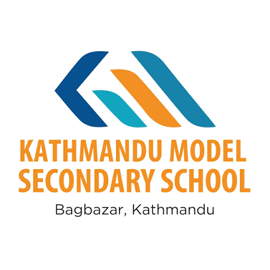
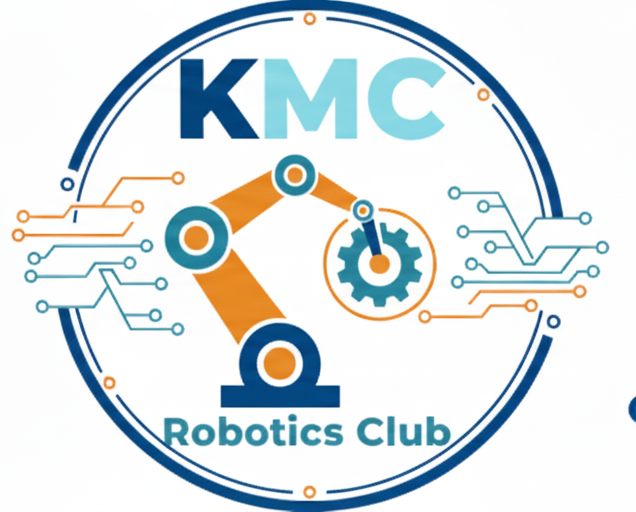
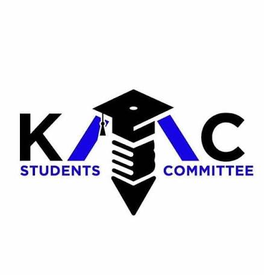

# PROJECT FUNDING PROPOSAL

<div align="center">

|  |  |  |
| :---: | :---: | :---: |
| **Kathmandu Model Secondary School** | **KMC Robotics Club** | **KMC Student Committee** |

---

### **PROJECT FUNDING PROPOSAL**
## **PROJECT PRAYAS — A multi functional humanoid robot**

---

</div>

**Date:** August 10, 2026  
**Ref. No.:** KMC-RC/2026/PROP-005  

**Submitted To:** ECA/CCA Department  
**Submitted By:** KMC Robotics Club & Student Committee  
**Institution:** Kathmandu Model Secondary School  
**Requested Amount:** NPR 50,000 (Fifty Thousand) [Total Component Bill: NPR 57,600 | Team Co-Funded: NPR 7,600]  

---

## 1. FORMAL COVERING LETTER

**To,**  
**The Department of Extra-Curricular Activities (ECA / CCA),**  
Kathmandu Model Secondary School (KMC), Kathmandu, Nepal  

### **Subject: Request for Grant Funding of NPR 50,000 for Project PRAYAS V1 (Modular AI Humanoid Assistant Robot — Total Component Bill: NPR 57,600)**

Respected Sir/Madam,

With due respect, the **KMC Robotics Club**, in collaboration with the **KMC Student Committee**, submits this formal project funding proposal for **PRAYAS (A multi functional humanoid robot)**.

Over the past academic year, our club members have dedicated hundreds of hours to mastering embedded electronics, microcontrollers, mechanical fabrication, and artificial intelligence. Through rigorous research and prototyping, our team has engineered **PRAYAS** — an ambitious, indigenous humanoid assistant robot combining real-time natural language voice AI, edge vision intelligence, 7-degree-of-freedom gestural arm manipulators, and a differential motorized mobility chassis controlled via a distributed 6-node ESP32 architecture.

To fabricate the functional prototype, the total estimated component bill is **NPR 57,600 (Fifty-Seven Thousand Six Hundred Nepalese Rupees)**. Through team fundraising and club co-funding, we are absorbing **NPR 7,600**, and respectfully request grant financial assistance of **NPR 50,000 (Fifty Thousand Nepalese Rupees)** from the ECA/CCA Department. This funding will directly cover essential high-torque DC motors, metal gear servo joint actuators, lithium battery power management packs, sensor arrays, and precision structural fabrication materials.

### Our Determination & Courage to Build PRAYAS
Building an AI-powered humanoid assistant in a high school environment is a pioneering endeavor. Our team possesses the courage, technical capability, and resilience required to overcome complex engineering challenges. Despite working out of temporary classrooms and managing delicate components under tight constraints, we have already engineered the full distributed firmware architecture, circuit schematics, and mechanical CAD frames. We are fully determined to demonstrate that KMC students can design and build state-of-the-art robotics comparable to university-level engineering projects.

We assure the school administration that all requested funds will be managed responsibly, audited with complete transparency, and used solely for component procurement and project execution.

We respectfully request your kind consideration and support for this grant. We firmly believe that backing Project PRAYAS will inspire our student body, demonstrate KMC’s leadership in technological innovation, and proudly represent our institution across Nepal.

Thank you for your valuable time and continuous encouragement.

Respectfully submitted,

---

## 2. EXECUTIVE SUMMARY

**Project Title:** PRAYAS (A multi functional humanoid robot)  
**Submitted To:** ECA/CCA Department  
**Submitted By:** KMC Robotics Club & Student Committee  
**Institution:** Kathmandu Model Secondary School  
**Requested Amount:** NPR 50,000 (Fifty Thousand) [Total Bill: NPR 57,600 | Club Co-Funding: NPR 7,600]  

```
   ┌──────────────────────────────────────────────────────────┐
   │                       PRAYAS V1                          │
   ├────────────────────────────┬─────────────────────────────┤
   │    Humanoid Upper Body     │    Motorized Lower Body     │
   ├────────────────────────────┼─────────────────────────────┤
   │  - 3D Printed PETG Torso   │  - 12mm Plywood Deck Base   │
   │  - 7x MG995 Metal Servos   │  - 4x Johnson 12V Motors    │
   │  - I2C PCA9685 PWM Node    │  - 2x BTS7960 Motor Drivers │
   │  - 70cm Torso (4" PVC)     │  - Sunboard Outer Shroud    │
   └────────────────────────────┴─────────────────────────────┘
```

**Project PRAYAS** bridges static smart voice assistants and high-cost industrial humanoid platforms. Designed for indoor utility, reception assistance, and educational research, PRAYAS combines high spatial mobility with dextrous human-like interaction.


### Key Functional Capabilities:
1. **Interactive Voice AI**: Natural language processing via cloud LLM and edge speech nodes (STT/TTS) with real-time audio playback.
2. **7-DOF Upper Body Gestures**: Dual multi-joint robotic arms and pan-tilt head for expressive pointing, greeting, and physical support.
3. **High Traction Drivetrain**: 4-wheel independent Johnson 12V motor drive with zero-radius differential turning capability.
4. **Wireless Distributed Master-Slave Control**: Ultra-low latency communication across 6 specialized ESP32 microcontrollers using ESP-NOW and MQTT protocols.

---

## 3. SYSTEM ARCHITECTURE & TECHNICAL INNOVATION

PRAYAS eliminates single-processor bottlenecks by utilizing a **Distributed Multi-Node ESP32 Architecture**. Workloads are segmented across dedicated nodes:

.png)


### Core Node Breakdown:

*   **Node 01 — Motor Drivetrain Node**:
    *   *Hardware:* ESP32, 2x BTS7960 43A High Power Drivers, 4x Johnson 12V 200RPM Geared Motors, INA219 Current Monitor.
    *   *Function:* Precise differential speed profiling, obstacle safety stopping, emergency motor isolation.
*   **Node 02 — Servo Joint Manipulator Node**:
    *   *Hardware:* ESP32, PCA9685 16-Channel 12-Bit I2C PWM Driver, 7x MG995 High Torque Servos.
    *   *Function:* 3-DOF per arm (Shoulder, Elbow, Wrist) + 1-DOF Head movement for physical posture generation.
*   **Node 03 — Environmental Sensor Node**:
    *   *Hardware:* Arduino Nano, MPU6050 6-Axis IMU, DHT11 Temperature & Humidity Sensor, 16x2 LCD Display.
    *   *Function:* Vehicle tilt detection, ambient environmental logging, local telemetry.
*   **Node 04 — Master Control & Display Node**:
    *   *Hardware:* ESP32-WROOM-32, 3.5" SPI Color TFT Touch Display, Rotary Input Controls.
    *   *Function:* Master ESP-NOW packet routing, system state engine, live diagnostic dashboard UI.
*   **Node 05 — AI Voice & Vision Node**:
    *   *Hardware:* ESP32-S3-CAM, INMP441 I2S Digital Microphone, MAX98357A I2S Audio Amplifier, 8Ω 10W Speaker, MicroSD Storage.
    *   *Function:* Edge speech capture, cloud LLM connectivity, vision snapshot capture, audio response playback.
*   **Node 06 — Isolated Power Distribution Node**:
    *   *Hardware:* 12x 18650 High-Discharge Li-ion Cells (3S4P configuration), 3S 40A BMS, Heavy Duty 5V 20A Buck Converter (Servos), 5V 3A Logic Bucks.
    *   *Function:* Clean, noise-isolated power rail management for heavy motor surges and sensitive logic components.

---

## 4. ITEMIZED FINANCIAL BUDGET (GRANT REQUEST: NPR 50,000)

The total estimated component bill for PRAYAS V1 is **NPR 57,600**. The KMC Robotics Club will contribute **NPR 7,600** through member contributions and internal fundraising, bringing the net requested grant from the ECA/CCA Department to **NPR 50,000**.

| S.N. | Category & Component Description | Qty | Unit Cost (NPR) | Total Cost (NPR) |
| :--- | :--- | :---: | :---: | :---: |
| **1** | **Microcontrollers & Processing Nodes** | | | |
| 1.1 | ESP32-WROOM-32 Microcontroller Boards (Master, Motor, Servo) | 3 | 1,100 | 3,300 |
| 1.2 | ESP32-S3-CAM AI Node + INMP441 Microphone + MAX98357A DAC + 10W Speaker | 1 | 7,000 | 7,000 |
| 1.3 | ESP32-CAM Board with External Antenna (Video Node) | 1 | 1,100 | 1,100 |
| 1.4 | 3.5" SPI TFT LCD Touch Display Module (Dashboard Node) | 1 | 3,200 | 3,200 |
| 1.5 | Arduino Nano ATmega328P (Sensor Node) | 1 | 600 | 600 |
| **2** | **Motors, Drivers & Servo Actuators** | | | |
| 2.1 | Johnson 12V 200RPM Heavy Duty Metal Geared DC Motors | 4 | 1,850 | 7,400 |
| 2.2 | BTS7960 43A High Power H-Bridge Motor Driver Modules | 2 | 1,400 | 2,800 |
| 2.3 | MG995 High Torque Metal Gear Servos (Arms & Neck Joints) | 7 | 850 | 5,950 |
| 2.4 | PCA9685 16-Channel 12-Bit I2C PWM Servo Driver Module | 1 | 700 | 700 |
| **3** | **Power System & Electrical Management** | | | |
| 3.1 | High-Capacity 18650 Li-ion Cells (3S4P Pack - 11.1V 10.4Ah) | 12 | 350 | 4,200 |
| 3.2 | 3S 40A Balanced Li-ion BMS Protection Board + Holders | 1 | 1,100 | 1,100 |
| 3.3 | Heavy Duty 5V 20A Buck Step-Down Converter (Servo Power Rail) | 1 | 1,600 | 1,600 |
| 3.4 | 5V 3A Dual Buck Voltage Regulators (Logic Rails) | 2 | 400 | 800 |
| 3.5 | XT60 Connectors, Heavy Duty Gauge Wire, 20A Inline Fuses & Switches | 1 Set | 1,100 | 1,100 |
| **4** | **Chassis Materials & Hardware Fabrication** | | | |
| 4.1 | 3D Printer PETG/PLA+ Filament Spools & Custom Fabrication Services | 6 | 1,650 | 9,900 |
| 4.2 | 12mm High-Density Plywood Base Deck & Aluminum Structural Rods | 1 Set | 2,200 | 2,200 |
| 4.3 | Heavy-Duty 10cm Rubber All-Terrain Wheels + Motor Shaft Couplers | 4 | 450 | 1,800 |
| 4.4 | Sunboard Outer Shroud, 4" PVC Torso Column, Hardware & Fasteners | 1 Set | 2,850 | 2,850 |
| | **TOTAL ESTIMATED COMPONENT BILL** | | | **NPR 57,600** |
| | **LESS: ROBOTICS CLUB & TEAM CO-FUNDING CONTRIBUTION** | | | **-NPR 7,600** |
| | **NET GRANT REQUESTED FROM ECA/CCA** | | | **NPR 50,000** |

---

## 5. INSTITUTIONAL BENEFITS FOR KATHMANDU MODEL SECONDARY SCHOOL

Supporting Project PRAYAS yields high tangible and promotional value for KMC:

> [!TIP]
> **1. Flagship Technological Representation**  
> PRAYAS will enter KMC into premier technology competitions including Trinity Tech Fest, YSS (Youth Science Summit), LOCUS (IOE Pulchowk), KU HackFest, and national robotics exhibitions, demonstrating KMC's academic and technological excellence.

> [!NOTE]
> **2. Campus Reception & Open Day Ambassador**  
> The robot can welcome guests, parents, and prospective students during KMC Open Days, Exhibitions, and Annual Ceremonies, providing interactive voice guidance and gestures.

> [!IMPORTANT]
> **3. Peer Mentorship & Practical STEM Learning Platform**  
> The modular architecture developed during this project will form the foundation for hands-on robotics workshops conducted by KMC Robotics Club for junior students.

---

## 6. PROJECT TIMELINE & MILESTONES

Execution timeline over a **6-week period** upon fund release:

```
Week 1: Material Procurement & Power System Assembly
Week 2: Base Mechanical Chassis Fabrication & Motor Drivetrain Testing
Week 3: 3D Printing Upper Body Torso & 7-DOF Servo Joint Mounting
Week 4: Distributed ESP-NOW Firmware Flashing & Master Node Routing
Week 5: AI Voice/Vision Integration & Web Dashboard Calibration
Week 6: Final Outer Shroud Finishing, Safety Testing & KMC ECA Demonstration
```

---

## 7. RECOMMENDATION & APPROVAL SECTION

We respectfully request your favorable consideration and approval of NPR 50,000 for Project PRAYAS V1.

<br/>

| Recommended By: | Approved By: |
| :---: | :---: |
| <br/><br/>_______________________ | <br/><br/>_______________________ |
| **Coordinator / Incharge** | **Principal** |
| ECA / CCA Department | Kathmandu Model Secondary School |
| Kathmandu Model Sec. School | Kathmandu, Nepal |

---
