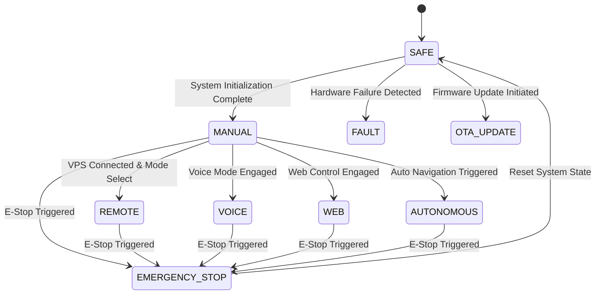
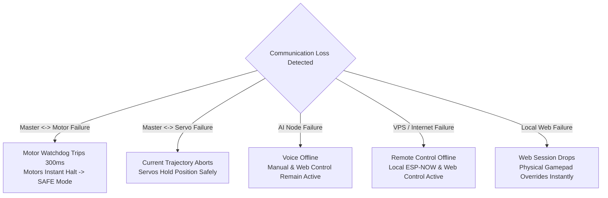

# PRAYAS Master Document — Communication Architecture

## Purpose
This document specifies the complete, modular, and fault-tolerant communication architecture for the **PRAYAS V1 Humanoid Robot**. It details the distributed networking protocol stack, command abstractions, multi-source input arbitration, and local safety mechanisms coordinated by the central **Master ESP32 Node**.

---

## 1. Core Communication Architecture

PRAYAS utilizes a **layered distributed communication architecture**. System responsibilities are decentralized across dedicated microcontrollers to ensure deterministic real-time control, high safety margins, and zero CPU contention.

### Core Operating Principles

> [!IMPORTANT]
> 1. **MASTER DECIDES WHAT**: The Master ESP32 acts as the central command manager, arbitrating inputs, validating system state, and issuing targeted subsystem commands.
> 2. **NODE DECIDES HOW**: Subsystem nodes (Motor, Servo, Sensor) execute low-level physical control, kinematic calculations, and local trajectory execution based on high-level directives from Master.
> 3. **SAFETY REMAINS LOCAL**: Subsystem hardware nodes independently enforce hardware limits, obstacle overrides, and thermal/current safety stops without waiting for master or cloud round-trips.

### Layered Node Topology

```
                         +-----------------------+
                         |     PRAYAS MASTER     |
                         |         ESP32         |
                         +-----------+-----------+
                                     |
                                  ESP-NOW
                                     |
          +--------------------------+--------------------------+
          |                          |                          |
          v                          v                          v
  +---------------+          +---------------+          +---------------+
  |  MOTOR NODE   |          |  SERVO NODE   |          |  SENSOR NODE  |
  |     ESP32     |          |     ESP32     |          | Arduino Nano  |
  +-------+-------+          +-------+-------+          +-------+-------+
          |                          |                          |
       4 Motors                  PCA9685                     MPU6050
       BTS7960                  7x MG995                      DHT11
      IR Sensors
       INA219
```

*   **PRAYAS Master ESP32**: Central coordination and command management node.
*   **AI Node (ESP32-S3-CAM)**: Communicates with Master to provide natural language command generation, vision intelligence, and voice feedback.
*   **Target Subsystems**: Master converts incoming high-level directives into standardized ESP-NOW frames for target execution nodes.

---

## 2. Control Sources

PRAYAS supports **five distinct control modalities**. To prevent race conditions, conflicting commands, or hazardous unauthorized motion, **all control sources must feed into the Master Control Manager**. No individual control source is permitted to directly bypass the Master or independently manipulate motor/servo nodes.

```
 VOICE / AI      REMOTE INTERNET     GAME CONTROLLER     LOCAL WEB     AUTONOMOUS SYSTEM
     |                  |                   |                |                 |
     +------------------+-------------------+----------------+-----------------+
                                            |
                                            v
                                 +--------------------+
                                 |  PRAYAS MASTER     |
                                 |  CONTROL MANAGER   |
                                 |  (ESP32)           |
                                 +---------+----------+
                                           |
                                  COMMAND VALIDATION
                                           |
                                  PRIORITY MANAGEMENT
                                           |
                                      SAFETY CHECK
                                           |
                                       ESP-NOW
                                           |
                                   ROBOT SUBSYSTEMS
```

| Control Source | Communication Medium | Primary Operating Target | Bypass Permitted? |
| :--- | :--- | :--- | :--- |
| **A. Voice / AI Control** | I2S / UART / ESP-NOW | High-level natural language actions & gestures | **NO** |
| **B. Remote Internet Control**| MQTT over Cloud VPS | Long-range teleoperation & telemetry monitoring | **NO** |
| **C. Physical Controller** | Bluetooth / ESP-NOW Direct | Low-latency manual joystick locomotion & gestures | **NO** |
| **D. Local Web Control** | HTTP / WebSockets over Wi-Fi | Local browser dashboard teleoperation & status | **NO** |
| **E. Autonomous Control** | Internal Master Logic / Sensors | Obstacle navigation & autonomous behaviors | **NO** |

---

## 3. Master Control Manager

The **PRAYAS Control Manager** is a dedicated software subsystem executing on Core 0 and Core 1 of the Master ESP32.

### Core Responsibilities
*   **Multi-Source Command Reception**: Aggregates command streams from Wi-Fi (MQTT/WebSocket/HTTP), ESP-NOW (AI Node), and local hardware inputs.
*   **Command Normalization**: Translates raw input strings, joystick payloads, and AI tool calls into a unified `PRAYAS_Command_t` structure.
*   **Source & Destination Resolution**: Tags every command with a unique source identifier (`SourceID`) and targets specific hardware nodes (`DestID`).
*   **Mode & Priority Validation**: Evaluates current robot operating mode and checks command priority against active locks.
*   **Safety Pre-screening**: Rejects out-of-bound requests or commands issued during active fault/emergency states.
*   **ESP-NOW Dispatch**: Encapsulates validated commands into binary ESP-NOW payloads and transmits them to targeted nodes.
*   **Node Heartbeat & Response Monitoring**: Tracks node acknowledgements, workflow completions, and execution timeouts.
*   **Emergency Stop & Fail-safe Cascade**: Instantly triggers high-priority stop sequences upon error detection.
*   **Global Robot State Machine**: Maintains centralized state of battery, joint poses, drivetrain velocity, and operational modes.

---

## 4. Command Abstraction

To ensure decoupling and modular replacement of control hardware, control sources generate **standardized high-level PRAYAS commands** rather than transmitting direct pin voltages, duty cycles, or raw servo microsecond values.

### Abstraction Examples

#### Example 1: Locomotion Request
```
[VOICE INPUT] "Move forward slowly"
       |
       v
[AI NODE INTENT] COMMAND = MOVE, DIRECTION = FORWARD, SPEED = 80
       |
       v
[MASTER CONTROL MANAGER] Validates Priority & Mode -> Transmits ESP-NOW Packet
       |
       v
[MASTER -> MOTOR NODE] TARGET_NODE = 0x02, CMD = MOVE, DIR = FWD, PWM = 80
       |
       v
[MOTOR NODE EXECUTION] Calculates BTS7960 PWM duty cycles & checks local IR sensors
```

#### Example 2: Head Gesture Request
```
[VOICE INPUT] "Look left"
       |
       v
[AI NODE INTENT] COMMAND = HEAD_LEFT
       |
       v
[MASTER CONTROL MANAGER] Validates Priority & Routing -> Target: Servo Node
       |
       v
[MASTER -> SERVO NODE] TARGET_NODE = 0x03, CMD = WORKFLOW, VALUE = HEAD_LEFT
       |
       v
[SERVO NODE EXECUTION] Executes local multi-step interpolation trajectory on PCA9685 Channel 0
```

---

## 5. Voice / AI Communication

The **AI Node** operates on a dedicated **ESP32-S3-CAM** hardware platform integrated with an INMP441 I2S microphone, MAX98357A I2S audio amplifier, 3W speaker, and a 2.4" SPI TFT display.

### AI Node Responsibilities
*   Local wake-word detection & audio sampling.
*   Bidirectional audio streaming over WebSockets to cloud LLM / Xiaozhi server.
*   TTS speech output synthesis and display animation rendering.
*   Parsing natural language intents into structured PRAYAS high-level command frames.

> [!WARNING]
> The AI Node is strictly forbidden from driving motors, servos, or power relays directly. All action intents MUST be transmitted to the Master ESP32.

```
USER  --->  MICROPHONE  --->  AI NODE (ESP32-S3)  --->  HIGH-LEVEL COMMAND
                                                                |
TARGET NODE  <---  ESP-NOW  <---  COMMAND MANAGER  <---  MASTER ESP32
```

### Communication Sequence: "Turn your head left"
1. **User**: "Turn your head left."
2. **AI Node**: Processes STT/LLM response, matches intent to `HEAD_LEFT`.
3. **AI Node -> Master**: Transmits `PRAYAS_Cmd{Source: 0x05, Cmd: HEAD_LEFT}` via ESP-NOW/UART.
4. **Master**: Command Manager verifies active mode, arbitrates priority, and forwards `HEAD_LEFT` payload to Servo Node (`0x03`).
5. **Servo Node**: Executes local smooth interpolation workflow `HEAD_LEFT` and sends `WORKFLOW_COMPLETE` back to Master.

---

## 6. Remote Internet Control

PRAYAS supports global remote operation over internet connections using an off-robot **Virtual Private Server (VPS)** as an external relay.

```
REMOTE USER  --->  INTERNET  --->  VPS BROKER (MQTT)  --->  MASTER ESP32  --->  ESP-NOW  --->  ROBOT NODES
```

### Infrastructure Responsibilities
*   **VPS MQTT Broker**: Provides secure public endpoint for bidirectional control messaging and telemetry aggregation.
*   **MQTT Topics**:
    *   `prayas/telemetry/state`: Robot battery, node health, orientation, sensor values.
    *   `prayas/command/remote`: Inbound directional, speed, and pose commands.
    *   `prayas/command/estop`: High-priority global emergency stop override.
    *   `prayas/status/alerts`: Hardware faults, obstacle warnings, system events.

> [!IMPORTANT]
> The VPS/MQTT layer is explicitly excluded from critical motor safety loops. In the event of internet disconnection, packet loss, or VPS server outage, the Master ESP32 and Motor Node local safety loops continue operating autonomously without degradation of local safety.

---

## 7. Local Physical Controller

PRAYAS supports low-latency direct manual control using a local gamepad / physical controller (communicating via Bluetooth or 2.4 GHz RF receiver connected directly to the Master Node or local physical controller port).

```
PHYSICAL CONTROLLER  --->  MASTER ESP32  --->  ESP-NOW  --->  MOTOR / SERVO NODES
```

### Supported Physical Controller Actions
*   **Locomotion**: Differential Forward, Backward, Left, Right, Rotation.
*   **Speed Modulation**: Dynamic linear speed capping (0–255 PWM).
*   **Servo & Joint Poses**: Preset upper-body pose triggers (Rest, Greeting, Wave, Hands Up/Down).
*   **Head Control**: Direct pan/tilt joystick mapping.
*   **Instant E-Stop**: Dedicated physical key assignment for instantaneous system halt.

Local physical control operates entirely on local radios and maintains **zero dependency on external internet or VPS infrastructure**.

---

## 8. Local Web Control

The Master ESP32 hosts an onboard HTTP/WebSocket web server over Wi-Fi (operating in Access Point `PRAYAS-AP` or Station mode).

```
PHONE / LAPTOP  --->  Wi-Fi (AP/STA)  --->  MASTER ESP32 (Local Web Server)  --->  ESP-NOW  --->  ROBOT NODES
```

### Protocol Partitioning
*   **WebSocket (`ws://<master-ip>:81/ws`)**: Utilized for real-time bidirectional teleoperation joysticks, continuous motor speed streaming, real-time battery voltage monitoring, and latency diagnostics.
*   **HTTP/HTTPS REST API (`http://<master-ip>:80/api/v1/*`)**: Utilized for system configuration, node mode updates, diagnostic logs retrieval, and non-real-time operational requests.

### Dashboard Controls Provided
*   Virtual directional joystick & speed slider.
*   Individual joint angle adjustments & pose triggers.
*   Subsystem node status indicators & telemetry readout.
*   Manual Mode Selection & Emergency Stop button.

---

## 9. Remote Web Control

For operations originating outside the local Wi-Fi range, web control transitions to a dual-tier remote architecture.

```
REMOTE BROWSER  --->  HTTPS  --->  VPS WEB APP  --->  WebSocket  --->  MQTT BROKER  --->  MASTER ESP32  --->  ESP-NOW  ---> NODES
```

### Protocol Responsibilities
*   **HTTPS**: User authentication, web application static hosting, SSL encryption, REST API endpoints, user management.
*   **WebSocket**: Low-latency bidirectional link between browser client and VPS server for live telemetry rendering and joystick events.
*   **MQTT**: High-reliability messaging bridge between VPS server and Master ESP32.

---

## 10. Autonomous Control

Autonomous behaviors (obstacle navigation, wander mode, environmental monitoring) run as integrated control routines coordinated by the Master Node.

```
SENSORS  --->  SENSOR NODE  --->  MASTER ESP32 (Autonomous Decision Engine)  --->  MOTOR NODE / SERVO NODE
```

### Operational Architecture
1. **Sensors**: MPU6050 IMU, DHT11, and front/rear IR proximity sensors poll environmental conditions.
2. **Sensor Node**: Aggregates data and streams periodic telemetry to Master ESP32.
3. **Master Decision Engine**: Processes sensor inputs combined with vision triggers from AI Node to calculate trajectory paths.
4. **Motor Safety Interlock**: Issued autonomous movement commands pass through the Motor Node's local IR safety check before motor activation.

---

## 11. Motor Node Communication

The **Motor Node** (ESP32) is dedicated to real-time drivetrain control and local hardware safety.

### Hardware Managed
*   4 × Johnson 12V 200 RPM DC Gear Motors.
*   2 × BTS7960 43A High-Power H-Bridge Motor Drivers.
*   4 × E18-D80NK IR Proximity Obstacle Sensors (Front-Left, Front-Right, Rear-Left, Rear-Right).
*   1 × INA219 Current and Voltage Monitor (I2C).

### Master-to-Motor Command Set
`FORWARD`, `BACKWARD`, `LEFT`, `RIGHT`, `FORWARD_LEFT`, `FORWARD_RIGHT`, `BACKWARD_LEFT`, `BACKWARD_RIGHT`, `STOP`, `SPEED_CONTROL`, `MODE_CHANGE`, `OBSTACLE_MODE`, `EMERGENCY_STOP`.

---

## 12. Local Motor Safety

To guarantee zero-latency response to physical hazards, **obstacle detection and motor emergency stopping are executed locally on the Motor Node**.

```
MASTER ESP32  ---(FORWARD / SPEED 180)--->  MOTOR NODE
                                                |
                                        Check IR Sensors
                                                |
                       +------------------------+------------------------+
                       |                                                 |
                  [CLEAR]                                           [OBSTACLE]
                       |                                                 |
                 Execute Motion                                     STOP MOTORS
                                                                         |
                                                            Report STATUS -> MASTER
```

> [!CAUTION]
> While the Master issues macroscopic directional requests, the Motor Node possesses absolute local authority to override commands and halt motors instantly upon IR sensor trip or INA219 over-current detection. This eliminates wireless latency hazards.

---

## 13. Servo Node Communication

The **Servo Node** (ESP32) manages upper-body humanoid kinematics using a PCA9685 16-channel 12-bit PWM driver and 7 × MG995 high-torque metal gear servos.

### Command Paradigm
To conserve ESP-NOW bandwidth and reduce master CPU overhead, the Master sends **high-level pose IDs and workflow triggers** rather than continuous 60Hz raw servo angle arrays.

### Predefined Poses & Workflows

| Pose / Workflow Name | Type | Target Joint Actuators | Kinematic Description |
| :--- | :--- | :--- | :--- |
| `REST` | Pose | All 7 Servos | Neutral park position, arms down, head center |
| `HEAD_CENTER` | Pose | Servo 0 (Pan), Servo 1 (Tilt) | Centers head orientation forward |
| `HEAD_LEFT` / `HEAD_RIGHT`| Workflow | Servo 0 (Pan) | Smooth interpolated head rotation |
| `HAND_DOWN` / `HAND_UP` | Workflow | Servos 2–6 (Shoulder, Elbow) | Articulated arm lower/raise sequence |
| `GREETING` | Workflow | Arm & Head Servos | Combined wave gesture and slight head tilt |
| `WAVE` | Workflow | Right Arm Servos | Multi-step arm wave trajectory |

---

## 14. Servo Workflow System

A **Servo Workflow** is a multi-step, time-interpolated motion sequence stored in the Servo Node's firmware flash memory.

```
MASTER  ---(WORKFLOW: HAND_DOWN)--->  SERVO NODE
                                           |
                                  Step 1: Move Shoulder Servo
                                  Step 2: Move Upper-Arm Servo
                                  Step 3: Move Lower-Arm Servo
                                  Step 4: Stabilize & Hold
                                           |
MASTER  <---(STATUS: WORKFLOW_COMPLETE)----+
```

Upon completing or aborting a trajectory, the Servo Node transmits a `WORKFLOW_COMPLETE` or `WORKFLOW_ERROR` status frame back to the Master.

---

## 15. Sensor Node Communication

The **Sensor Node** operates on an **Arduino Nano v3** dedicated to continuous telemetry polling.

### Hardware Interface
*   **MPU6050 6-DOF IMU**: Accelerometer and Gyroscope orientation tracking (I2C).
*   **DHT11 Sensor**: Enclosure temperature and relative humidity monitoring.
*   **Interface**: UART Serial / ESP-NOW bridge to Master ESP32.

The Sensor Node acts as a deterministic data provider, streaming 10Hz telemetry packets to the Master for global state tracking.

---

## 16. ESP-NOW Internal Network

ESP-NOW is a connectionless 2.4 GHz IEEE 802.11 physical layer protocol used for low-latency inter-node communication between PRAYAS ESP32 controllers.

### Network Specifications
*   **Operating Channel**: Fixed Wi-Fi Channel 6 (2.437 GHz).
*   **Payload Size**: 250 Bytes max per packet.
*   **Transmission Latency**: < 5 ms (Master to Subsystem Node).
*   **Target Links**: Master ↔ Motor Node, Master ↔ Servo Node, Master ↔ AI Node.
*   **Independence**: Operates completely without Wi-Fi router association or internet access.

---

## 17. Communication Protocol Stack

The PRAYAS architecture separates high-level application messaging from physical peripheral buses across three functional layers.

```
+-----------------------------------------------------------------------------------+
| APPLICATION / REMOTE LAYER    | HTTPS (REST API) | WebSockets (Live) | MQTT (v3.1.1)|
+-------------------------------+------------------+-------------------+------------+
| ROBOT NETWORK LAYER           | ESP-NOW (2.4 GHz Low-Latency Protocol)            |
+-------------------------------+------------------+-------------------+------------+
| HARDWARE PERIPHERAL LAYER     | I2C  |  SPI  |  I2S  |  UART  |  GPIO / PWM       |
+-----------------------------------------------------------------------------------+
```

| Layer | Protocol | Physical Medium | Destination / Hardware Mapping |
| :--- | :--- | :--- | :--- |
| **Application** | HTTPS | Wi-Fi / IP Network | Remote Web App API & Auth |
| **Application** | WebSocket | Wi-Fi / IP Network | Live Web Dashboard Teleoperation & Video Stream |
| **Application** | MQTT | Wi-Fi / Cellular VPS | Cloud Telemetry & Remote Overrides |
| **Robot Network**| ESP-NOW | 802.11 LR 2.4 GHz | Inter-Node Command & Telemetry Bus |
| **Hardware** | I2C | Dual-Wire Serial Bus | PCA9685, INA219, MPU6050 |
| **Hardware** | SPI | 4-Wire Synchronous | 2.4" TFT Display |
| **Hardware** | I2S | Digital Audio Bus | INMP441 Mic, MAX98357A Amp |
| **Hardware** | UART | Full-Duplex Serial | Arduino Nano Sensor Node / AI Serial Link |
| **Hardware** | GPIO/PWM | Direct IO Digital | BTS7960 Motor Drivers, IR Sensors |

---

## 18. Command Priority

The Master Control Manager evaluates incoming control requests against a **strict 7-tier priority hierarchy**. Higher-priority sources immediately preempt lower-priority routines.

```
 [HIGHEST]  1. EMERGENCY STOP (Global Hardware/Software E-Stop)
            2. LOCAL SAFETY / OBSTACLE OVERRIDE (Motor IR / INA219 Trip)
            3. PHYSICAL CONTROLLER (Gamepad Manual Input)
            4. REMOTE CONTROL (MQTT VPS Remote Commands)
            5. LOCAL WEB CONTROL (WebSocket / HTTP Local Dashboard)
            6. VOICE / AI CONTROL (Xiaozhi Natural Language Commands)
  [LOWEST]  7. AUTONOMOUS CONTROL (Internal Pathing / Wander Routines)
```

### Conflict Resolution Examples

*   **Scenario A**: AI Node requests `FORWARD`, but Physical Gamepad issues `STOP`.
    *   *Result*: Gamepad (Priority 3) overrides AI Node (Priority 6). Motors **STOP**.
*   **Scenario B**: Local Web Control issues `FORWARD`, but Motor Node detects front IR obstacle.
    *   *Result*: Local Safety (Priority 2) overrides Local Web (Priority 5). Motors **STOP**.

---

## 19. Robot Operating Modes

The Master Node maintains a global system mode variable that restricts command processing to authorized sources.



| Operating Mode | Active Control Source Authorized | Movement Restrictions |
| :--- | :--- | :--- |
| `SAFE` | System Diagnostics Only | Motors & Servos Disabled |
| `MANUAL` | Physical Gamepad Controller | Full Speed & Gesture Authority |
| `REMOTE` | Cloud VPS / MQTT Broker | Remote Speed Capped (80% Max) |
| `VOICE` | AI Node Intent Parser | Action-based predefined motion |
| `WEB` | Local Web Dashboard | Full Manual Authority |
| `AUTONOMOUS` | Internal Pathing Logic | Dynamic obstacle navigation |
| `EMERGENCY_STOP` | NONE (System Halted) | Drivetrain & Actuators Instant Cutoff |
| `FAULT` | System Diagnostics Only | Locked until hardware check pass |
| `OTA_UPDATE` | Flashing Subsystem Only | Actuators Locked, Wireless Busy |

---

## 20. Heartbeat / Watchdog

To prevent runaway robot conditions caused by radio interference or firmware hangs, all active nodes exchange continuous periodic **Heartbeat Signals**.

### Heartbeat Rules
*   **Transmit Interval**: Every node transmits a 10Hz heartbeat packet (`PRAYAS_Heartbeat_t`) to the Master.
*   **Master Timeout**: If Master fails to receive heartbeats from a node for > **500 ms**, the node is flagged `OFFLINE`.
*   **Local Motor Watchdog**: The Motor Node runs an independent hardware watchdog timer. If valid movement commands or heartbeats are not received from Master for > **300 ms**, the Motor Node automatically **halts all motors** and enters `SAFE` mode locally.

---

## 21. Acknowledgement System

Critical configuration changes, poses, and workflows use a **Sequence-Numbered ACK/NACK protocol**.

```
MASTER ESP32  ---(CMD: WORKFLOW, VAL: HAND_DOWN, Seq: 1042)--->  SERVO NODE
                                                                     |
MASTER ESP32  <---(ACK: RECEIVED, Seq: 1042)-------------------------+
                                                                     |
                                                          [Executes Motion]
                                                                     |
MASTER ESP32  <---(STATUS: WORKFLOW_COMPLETE, Seq: 1042)-------------+
```

If an ACK is not received within 100 ms, the Master initiates retry attempts (max 3 retries) before declaring a node communication fault.

---

## 22. Node Identification & Packet Format

### Master Node Mapping Table

| Node Name | Hardware Platform | Unique Node ID | Primary Bus |
| :--- | :--- | :--- | :--- |
| **MASTER** | ESP32 DevKitC v4 | `0x01` | ESP-NOW Gateway / Wi-Fi |
| **MOTOR** | ESP32 DevKitC v4 | `0x02` | ESP-NOW |
| **SERVO** | ESP32 DevKitC v4 | `0x03` | ESP-NOW |
| **SENSOR** | Arduino Nano v3 | `0x04` | UART / ESP-NOW Bridge |
| **AI** | ESP32-S3-CAM | `0x05` | ESP-NOW / UART |
| **DISPLAY** | Master Integrated OLED | `0x06` | I2C (Internal) |

### Standard Packet Frame Structure (Binary C-Struct)
```c
typedef struct __attribute__((packed)) {
    uint8_t  sourceID;       // Source Node ID (0x01 - 0x06)
    uint8_t  destID;         // Destination Node ID (0x01 - 0x06)
    uint8_t  commandID;      // Command Enumeration
    uint8_t  modeID;         // Active System Mode
    uint8_t  seqNumber;      // Packet Sequence Counter
    uint8_t  payloadLen;     // Payload Byte Count
    uint8_t  payload[64];    // Command/Sensor Data Payload
    uint16_t checksum;       // CRC16 Integrity Check
} PRAYAS_Packet_t;
```

---

## 23. Communication Failure Behavior

The system is designed for **graceful degradation** under partial failure conditions.



---

## 24. Emergency Stop

The **Emergency Stop (E-Stop)** system has supreme authority over all robot operations.

```
 EMERGENCY STOP TRIGGERED (Gamepad / Web / MQTT / IR Safety / System Fault)
                                  |
                                  v
                         +-----------------+
                         | PRAYAS MASTER   |
                         | CONTROL MANAGER |
                         +--------+--------+
                                  |
            +---------------------+---------------------+
            |                                           |
            v                                           v
    MOTOR NODE ESP32                            SERVO NODE ESP32
    - Immediate PWM Duty Cutoff (0%)            - Abort Trajectories Immediately
    - Set Motor Drivers Disabled                - Lock Servos in Safe Neutral Pose
    - Set State: EMERGENCY_STOP                 - Set State: EMERGENCY_STOP
```

---

## 25. OTA Communication

Over-The-Air (OTA) firmware updates are coordinated by the Master ESP32.

1. **Initiation**: Master receives firmware binary stream over Wi-Fi/HTTPS for a target node ID.
2. **Safety Check**: Master verifies robot is stationary (`Speed = 0`) and in `SAFE` mode. Motor/Servo outputs are locked.
3. **Distribution**: Master streams binary chunks to target node over dedicated ESP-NOW flash blocks.
4. **Validation & Flash**: Target node verifies MD5 checksum, writes binary to secondary OTA partition, reboots, and reports update status.

---

## 26. Complete Communication Flow

The overall system communication flow links all five control inputs through the Master Control Manager down to physical hardware actuators.

```
                         +-----------------------------------+
                         |               USER                |
                         +-----------------+-----------------+
                                           |
       +-----------------------------------+-----------------------------------+
       |                                   |                                   |
       v                                   v                                   v
  VOICE / AI                        GAME CONTROLLER                        WEB CONTROL
  (I2S Mic)                           (Direct Link)                      (HTTPS/WebSocket)
       |                                   |                                   |
       v                                   |                                   v
   AI NODE                                 |                               Cloud VPS
 (ESP32-S3)                                |                              MQTT Broker
       |                                   |                                   |
       +------------------+----------------+-----------------------------------+
                          |
                          v
               +----------------------+
               |    PRAYAS MASTER     |
               |        ESP32         |
               |   CONTROL MANAGER    |
               +----------+-----------+
                          |
                       ESP-NOW
                          |
        +-----------------+-----------------+
        |                 |                 |
        v                 v                 v
   MOTOR NODE        SERVO NODE        SENSOR NODE
     ESP32             ESP32           Arduino Nano
        |                 |                 |
    4 Motors          7x MG995           MPU6050
    BTS7960            PCA9685            DHT11
   IR Sensors
    INA219
```

> [!NOTE]
> Autonomous control algorithms execute inside the Master Control Manager processing Sensor Node telemetry, guaranteeing that autonomous directives pass through the exact same priority arbitration and local safety interlocks as external user inputs.

---

## 27. Design Principle

The PRAYAS communication architecture strictly enforces twelve foundational engineering principles:

1. **Multiple Control Sources**: Accepts inputs from Voice/AI, Remote Internet, Physical Gamepad, Local Web, and Autonomous systems.
2. **One Central Command Manager**: All inputs converge into the Master ESP32 for validation and scheduling.
3. **Dedicated Subsystem Nodes**: Microcontroller tasks are isolated to eliminate CPU contention.
4. **ESP-NOW Local Network**: Sub-10ms peer-to-peer radio communication independent of Wi-Fi routers.
5. **MQTT Remote Messaging**: Standardized cloud VPS broker architecture for remote operation and telemetry streaming.
6. **WebSocket Live Control**: Low-latency bidirectional transport for real-time web dashboard joysticks.
7. **HTTPS REST API**: Secure protocol for authentication, web hosting, and static configuration management.
8. **Local Safety Independence**: Motor and hardware safety loops remain fully functional during internet outages.
9. **Zero-Latency Obstacle Override**: IR proximity sensors hardware-trip motor stops directly at the Motor Node.
10. **Watchdog Communication Monitoring**: Automatic motor shutdown if control heartbeats are interrupted.
11. **Strict Priority Arbitration**: Predefined hierarchy resolves input conflicts deterministically.
12. **Modular & Scalable Design**: Subsystem nodes can be updated or expanded without altering core communication pipelines.

```
                 MANY INPUTS
                      ↓
             ONE CONTROL MANAGER
                      ↓
              SAFETY + PRIORITY
                      ↓
               ESP-NOW NETWORK
                      ↓
            SPECIALIZED ROBOT NODES
```

