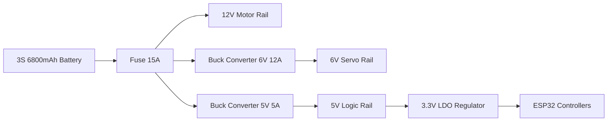

# System Architecture

## Purpose
This document provides a system-level description of PRAYAS V1, outlining the interconnected hardware nodes, their communication paths, and power routes.

## Overview
PRAYAS V1 uses a **Distributed ESP32 Node Architecture**. Rather than centralizing processing, tasks are divided among specialized nodes. The Master Node acts as the central coordinator, connecting to the cloud and dashboard via Wi-Fi/MQTT, and broadcasting commands to the sub-nodes (Motor, Servo, Sensor) using ESP-NOW.

## System Block Diagram

```mermaid
graph TD
    %% Controllers and Nodes
    subgraph Core Base
        Master["Master ESP32 Node<br/>Integrated Status OLED Display"]
        Motor["Motor ESP32 Node<br/>4x 10cm x 4cm Wheels & 4x IR"]
        Sensor["Sensor Node (Arduino Nano)<br/>GPS, MPU6050, Humidity & LCD"]
    end

    subgraph Humanoid Torso
        Servo[Servo ESP32 Node]
        Camera[Camera ESP32-CAM Node]
        AI["AI Node (ESP32-S3 CAM)<br/>Xiaozhi AI & SPI Display"]
    end

    %% External Systems
    Web[Web Dashboard]
    Broker[MQTT Broker on VPS]
    Gamepad[Gamepad Controller]

    %% Communication Links
    Master <-->|ESP-NOW| Motor
    Master <-->|ESP-NOW| Servo
    Master <-->|UART Serial| Sensor

    AI <-->|UART / WebSocket| Master
    Camera <-->|WebSocket Stream| Web
    Gamepad <-->|Bluetooth/WebSocket| Web
    Web <-->|MQTT| Broker
    Master <-->|Wi-Fi / MQTT| Broker

    %% Device Connections
    Master -->|I2C| StatusOLED[0.96"/1.3" Status OLED Display]
    Motor -->|PWM| Drivers[2x BTS7960 Drivers] -->|12V| Motors[4x Johnson Motors & 10x4cm Wheels]
    Motor <--|GPI| IRSensors[4x E18-D80NK IR Proximity Sensors]
    Servo -->|I2C| PCA[PCA9685 PWM Driver] -->|6V| Servos[7x MG995 Servos]
    AI -->|SPI| SPIDisplay[2.4" SPI TFT Display]
    AI -->|I2S| Speaker[3W Speaker / Amp]
    AI <--|I2S| Mic[INMP441 Mic]
    Sensor -->|I2C| SensorLCD[16x2 / 20x4 I2C LCD]
```

## Power Architecture Flow
The battery supplies power to three separate regulation rails to prevent electrical noise from the motors and servos from resetting the microcontrollers:



## Communication Layout
*   **Inter-Node Communications**: Low-latency, connectionless ESP-NOW packets (2.4 GHz).
*   **External Communications**: Wi-Fi 802.11 b/g/n, transmitting JSON messages over MQTT.
*   **Streaming**: TCP WebSockets used for the camera's JPEG video frames.
