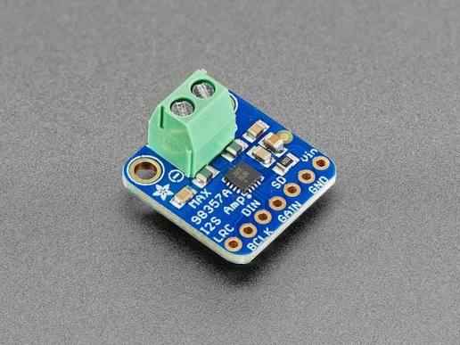

# Audio & Voice Subsystem

## Purpose
This document details the audio hardware configuration used for voice recording and playback on the AI Node.

## Components
1.  **INMP441 Omnidirectional Microphone**: Digital MEMS microphone with a 24-bit I2S interface, providing high SNR (61 dBA) and low power consumption for clear voice input to the ESP32-S3 CAM.
2.  **MAX98357A Low-Power Mono DAC/Amplifier**: Decodes digital I2S audio streams from the ESP32-S3 CAM and directly drives the 3W speaker. This combines the DAC and class-D amplifier into a single high-efficiency module — [MAX98357A Datasheet Reference](https://www.analog.com/media/en/technical-documentation/data-sheets/max98357a-max98357b.pdf).
    
    { style="display: block; margin: 0 auto;" width="300" }

3.  **8-Ohm 3W Speaker**: Compact speaker mounted inside the 3D-printed head.

## Schematic Layout
```
 [ INMP441 I2S Mic ] ───────── I2S In (Digital) ───> [ ESP32-S3 CAM AI Node ]
 [ ESP32-S3 CAM AI Node ] ──── I2S Out (Digital) ──> [ MAX98357A DAC/Amplifier ] ──(Analog)──> [ 3W Speaker ]
```

## Performance Specs
*   **Sample Rate**: 16 kHz (standard for speech recognition).
*   **Bit Depth**: 16-bit.
*   **Audio Delay**: Voice acquisition to transmission buffer delay is < 50 ms.
