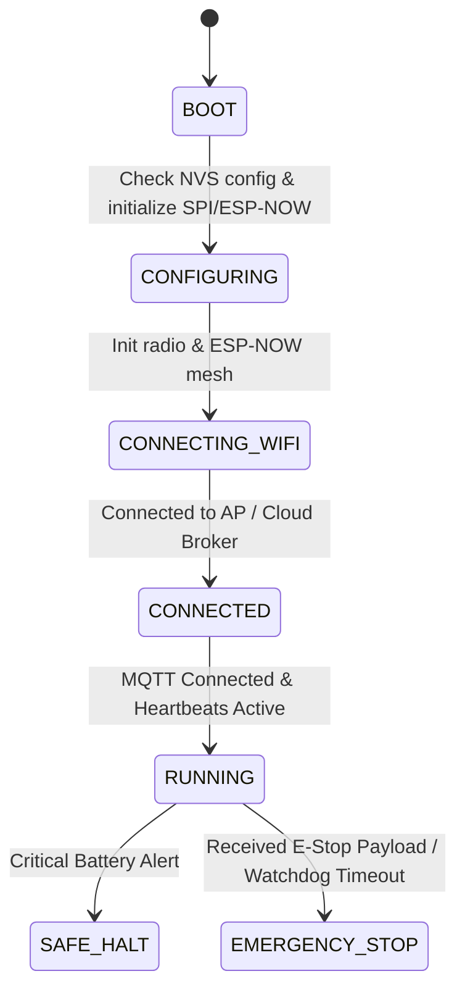

# Master Coordinator Node

## Purpose
The Master Coordinator Node serves as the primary central coordinator of PRAYAS V1. It connects to external systems (MQTT broker, VPS, web dashboard) over Wi-Fi and coordinates all sub-nodes (Motor, Servo, Sensor, and AI Nodes) using ESP-NOW.

## Hardware Breakdown & BOM
According to [`all components.txt`](file:///d:/prayas/main_site/docs/all%20components.txt):
*   **Controller**: ESP32 Dev Module (ESP32-WROOM-32, 38-Pin DevKitC) — [Official Espressif Hardware Reference](https://docs.espressif.com/projects/esp-idf/en/v5.1/esp32/hw-reference/esp32/get-started-devkitc.html).
*   **Integrated System Display**: TFT Display (SPI Interface) for high-resolution status rendering, battery telemetry, network state, and mode indicators.
*   **Communication Protocols**:
    *   **ESP-NOW**: Inter-node communication with Motor, Servo, Sensor, and AI Nodes.
    *   **Wi-Fi / MQTT**: VPS and remote cloud communication.
*   **Power**: 5V Regulated Power Supply from main 5V / 10A Electronics Rail.
*   **Interconnects & Mounting**: PCB Distribution Board, SPI Wires, Jumper Wires, Male Pin Headers, M3 Standoffs, Nuts, Bolts, Heat-Shrink Tubing, and Cable Ties.

{ style="display: block; margin: 0 auto;" width="500" }

---

## GPIO Mapping
*   **GPIO 16**: RX2 (UART Serial input from AI Node TX Pin 43)
*   **GPIO 17**: TX2 (UART Serial output to AI Node RX Pin 44)
*   **GPIO 15**: SPI SCK (Clock for TFT Display)
*   **GPIO 13**: SPI MOSI (Data for TFT Display)
*   **GPIO 14**: SPI CS (Chip Select)
*   **GPIO 21**: SPI DC (Data / Command Select)

---

## Master Node Functions & Control Flow
*   **Central Robot Controller**: Manages robot operating modes (Manual, Remote, Autonomous, Speed Control, Emergency Stop).
*   **Command Routing**: Receives commands from VPS/Web Dashboard and AI Node, routes Motor commands to Motor Node, Servo commands to Servo Node, and requests telemetry from Sensor Node.
*   **Safety & Watchdog**: Continuously monitors node heartbeats and enforces emergency stop priority.

## Failure Cases & Recovery
*   **Loss of Wi-Fi / MQTT Connection**:
    *   *Action*: The Master Node continues local ESP-NOW control, attempting to reconnect to the Wi-Fi AP in the background. If offline for > 30s, falls back to **Local AP Mode** for direct Web Dashboard control.
