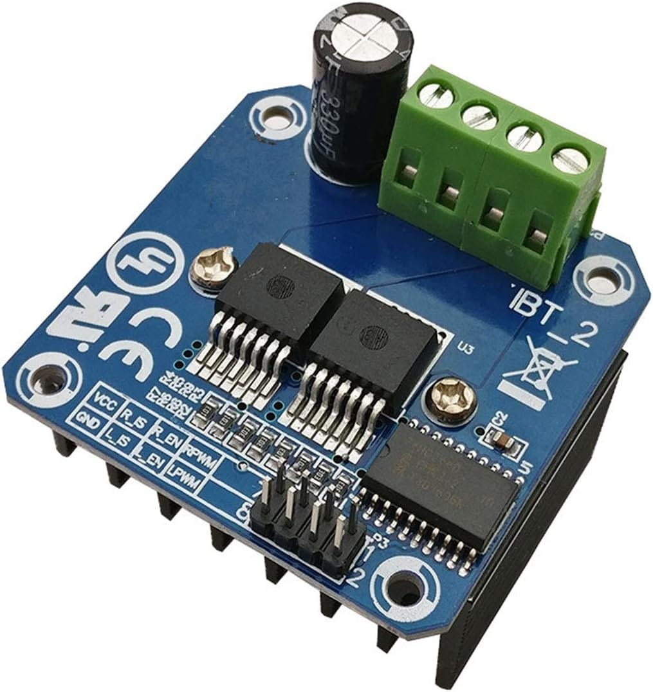
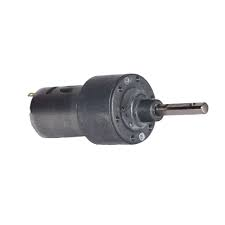
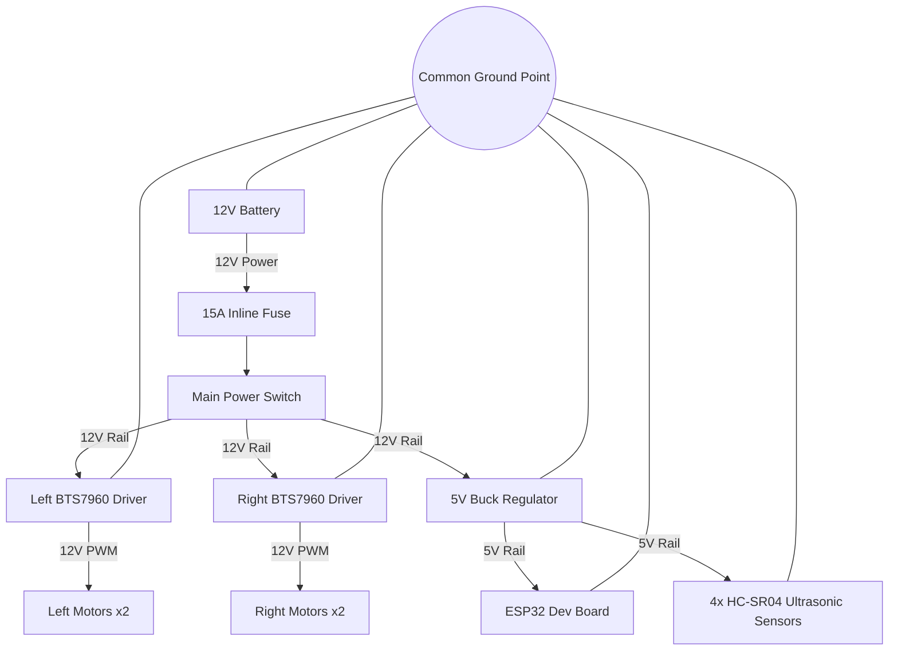
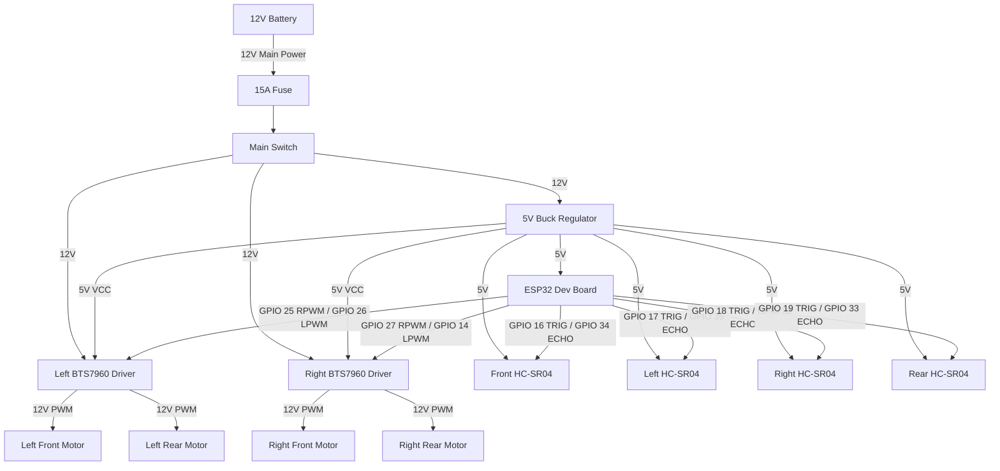

# Motor Controller Node

## 1. Overview

### Purpose of the Motor Node
The Motor Controller Node is the hardware subsystem responsible for driving the locomotion base of the PRAYAS robot. It processes motion directives and drives the wheels accordingly while monitoring localized proximity sensors to prevent physical collisions.

### What this Node Controls
*   **Motors**: Actuates the 4 wheels (10 cm Diameter, 4 cm Width) using H-bridge drivers in a 4x4 differential drive setup.
*   **Sensors**: Interfaces with **4 ultrasonic sensors (HC-SR04 or equivalent)** (Front-Left, Front-Right, Rear-Left, Rear-Right) to monitor 360° proximity around the locomotion base.

### Responsibilities of the Node
*   Receive directional and speed commands.
*   Translate these commands into electrical signals that control motor speed and direction.
*   Sample all 4 ultrasonic sensors continuously.
*   Halt all motion immediately if an obstacle is detected in any direction of travel.

---

## 2. Components Required

The table below lists all components required to assemble the Motor Node:

| Component Name | Quantity | Specification | Purpose |
| :--- | :---: | :--- | :--- |
| **ESP32 Dev Board** | 1 | ESP32-WROOM-32E DevKit (38 Pins) | Microcontroller reading sensors & driving H-bridges. |
| **BTS7960 Motor Driver** | 2 | 43A High-Current Dual H-Bridge Module | Interfaces between ESP32 signals and Johnson DC motors. |
| **Johnson 12V DC Motors** | 4 | 12V Nominal, 200 RPM Geared DC Motors | Electric geared motors driving the 4-wheel chassis. |
| **Robot Wheels (10cm x 4cm)**| 4 | 10 cm Diameter, 4 cm Width, High-Traction Rubber | Wheels mounted to motor shafts via 100mm flange hubs. |
| **HC-SR04 Ultrasonic Sensors**| 4 | Range (2–400 cm), 5V Operating Voltage | Proximity sensors detecting obstacles (FL, FR, RL, RR). |
| **Motor Clamps / Mounts**| 4 | Heavy-Duty Aluminum / Steel Mount Brackets | Securely mount the Johnson DC motors to the base plate. |
| **PCB / Perfboard** | 1 | Standard Prototyping Perfboard (Base) | Base circuit board for power distribution & signal headers. |
| **Power Input Connector**| 1 | XT60 Connector (Male/Female pair) | Connects main 12V battery power. |
| **Screw Terminal Blocks**| Assorted| 5.08 mm Pitch PCB Screw Terminals | Secure cable connections for power distribution. |
| **Connecting Wires** | Assorted| 14 AWG (Power) / 24 AWG (Logic Signal) | Carries electric current and logic signals. |

---

## 3. Component Description

### ESP32 Dev Board
*   **What it is**: A small, low-cost microcontroller development board with a dual-core processor and digital input/output (GPIO) pins.
    
    { style="display: block; margin: 0 auto;" width="500" }
*   **Why it is used**: It provides fast processing speeds, hardware timers capable of generating precise Pulse Width Modulation (PWM) signals, and has enough GPIO pins to handle the sensors and drivers.
*   **How it works inside PRAYAS**: It acts as the local brain of the Motor Node. It reads distance echo signals from the ultrasonic sensors and outputs control signals (speed and direction) to the motor drivers.

### BTS7960 Motor Driver
*   **What it is**: A high-current H-bridge motor driver module designed to control a DC motor's direction and speed.
    
    { style="display: block; margin: 0 auto;" width="350" }
*   **Why it is used**: Johnson DC motors can draw several amperes under load. Standard motor drivers (like L298N) will overheat and fail. The BTS7960 is rated for up to 43A, providing a reliable and safe solution.
*   **How it works inside PRAYAS**: It acts as an electronic switch. It receives weak logic signals from the ESP32 and switches the high-current 12V power from the battery to the motors.

### Johnson 12V 200 RPM DC Motors & 10cm x 4cm Wheels
*   **What it is**: Brushed DC motor attached to a metal spur gearbox driving a 10 cm diameter, 4 cm width high-traction rubber wheel.
    
    { style="display: block; margin: 0 auto;" width="300" }
*   **Why it is used**: The gearbox reduces rotation speed to 200 RPM while multiplying torque. Combined with 10cm diameter / 4cm width wheels, it provides smooth indoor travel and obstacle clearance.
*   **How it works inside PRAYAS**: Four motors drive the wheels. They are wired in parallel groups (two on the left, two on the right) to run a 4-wheel-drive differential chassis.

### HC-SR04 Ultrasonic Obstacle Sensors (4-Sensor Array)
*   **What it is**: Ultrasonic distance measurement sensors emitting a 40 kHz acoustic burst and measuring the round-trip echo pulse duration.
*   **Why it is used**: Provides accurate non-contact distance measurement (2 cm to 400 cm), unaffected by ambient lighting or surface color contrast.
*   **How it works inside PRAYAS**: Four sensors are mounted on the base deck perimeter: Front, Left, Right, and Rear. The ESP32 drives dedicated trigger pins (GPIO 16, 17, 18, 19) and reads returned Echo pulses on input pins (GPIO 34, 35, 32, 33) through 1kΩ / 2kΩ voltage dividers to step down the 5V Echo signals to 3.3V logic levels. If an obstacle is detected within 20 cm in the direction of motion, the safety watchdog immediately engages emergency dynamic braking.

---

## 4. Circuit Connection

This section details how to connect the components of the Motor Node.

### ESP32 to BTS7960 Connections
Control signals are routed from the ESP32 to the logic inputs of the H-bridges (`R_EN` and `L_EN` are permanently tied to 5V VCC; `R_IS` and `L_IS` are left unconnected):

| ESP32 Pin | Connected To | BTS7960 Driver | Function |
| :--- | :--- | :--- | :--- |
| **GPIO 25** | RPWM | Left Driver (Driver 1) | Left-side motor forward PWM signal |
| **GPIO 26** | LPWM | Left Driver (Driver 1) | Left-side motor reverse PWM signal |
| **GPIO 27** | RPWM | Right Driver (Driver 2) | Right-side motor forward PWM signal |
| **GPIO 14** | LPWM | Right Driver (Driver 2) | Right-side motor reverse PWM signal |
| **5V Rail** | R_EN & L_EN | Both Drivers | Driver enables (permanently enabled via 5V VCC) |
| **5V Rail** | VCC | Both Drivers | Logic power supply for drivers |
| **GND** | GND | Both Drivers | Logic ground reference |

### BTS7960 to Motors Connections
Motor outputs are wired in parallel to drive the two motors on each side together:

| Driver Terminal | Connected To | Motor Group | Description |
| :--- | :--- | :--- | :--- |
| **Left Driver M+ / M-** | (+) & (-) Terminals | Left Front & Left Rear Motors | Drives both left-side wheels in parallel |
| **Right Driver M+ / M-**| (+) & (-) Terminals | Right Front & Right Rear Motors | Drives both right-side wheels in parallel |

### ESP32 to 4 Ultrasonic Sensors Connections
Sensors require 5V VCC power, common ground, dedicated Trigger outputs, and Echo input signals connected via 1kΩ / 2kΩ voltage dividers to protect ESP32 3.3V GPIOs:

| Ultrasonic Sensor Module | Sensor Pin | ESP32 Pin | Connection & Protection |
| :--- | :--- | :--- | :--- |
| **Front HC-SR04** | TRIG / ECHO | **GPIO 16 / GPIO 34** | TRIG: Direct GPIO 16. ECHO: GPIO 34 via 1kΩ/2kΩ divider. |
| **Left HC-SR04**  | TRIG / ECHO | **GPIO 17 / GPIO 35** | TRIG: Direct GPIO 17. ECHO: GPIO 35 via 1kΩ/2kΩ divider. |
| **Right HC-SR04** | TRIG / ECHO | **GPIO 18 / GPIO 32** | TRIG: Direct GPIO 18. ECHO: GPIO 32 via 1kΩ/2kΩ divider. |
| **Rear HC-SR04**  | TRIG / ECHO | **GPIO 19 / GPIO 33** | TRIG: Direct GPIO 19. ECHO: GPIO 33 via 1kΩ/2kΩ divider. |
| **All Sensors VCC / GND** | VCC / GND | **5V / GND** | 5V Power rail from buck converter & common ground |

---

## 5. GPIO Connection Table

The table below lists all ESP32 pins used in this node:

| GPIO | Connected To | Pin Mode | Purpose | Safe Boot Handling |
| :--- | :--- | :---: | :--- | :--- |
| **GPIO 25** | Left Driver RPWM | Output | Left motor forward PWM signal | Safe to use. |
| **GPIO 26** | Left Driver LPWM | Output | Left motor reverse PWM signal | Safe to use. |
| **GPIO 27** | Right Driver RPWM | Output | Right motor forward PWM signal | Safe to use. |
| **GPIO 14** | Right Driver LPWM | Output | Right motor reverse PWM signal | Safe to use. |
| **GPIO 16** | Front Sensor TRIG | Output | Front ultrasonic 10 µs trigger pulse | Safe to use. |
| **GPIO 34** | Front Sensor ECHO | Input | Front ultrasonic echo input (via 1k/2k divider)| Input-only GPI pin. |
| **GPIO 17** | Left Sensor TRIG  | Output | Left ultrasonic 10 µs trigger pulse  | Safe to use. |
| **GPIO 35** | Left Sensor ECHO  | Input | Left ultrasonic echo input (via 1k/2k divider) | Input-only GPI pin. |
| **GPIO 18** | Right Sensor TRIG | Output | Right ultrasonic 10 µs trigger pulse | Safe to use. |
| **GPIO 32** | Right Sensor ECHO | Input | Right ultrasonic echo input (via 1k/2k divider)| Internal pull-down. |
| **GPIO 19** | Rear Sensor TRIG  | Output | Rear ultrasonic 10 µs trigger pulse  | Safe to use. |
| **GPIO 33** | Rear Sensor ECHO  | Input | Rear ultrasonic echo input (via 1k/2k divider) | Internal pull-down. |
| **GPIO 2**  | Onboard LED       | Output | Status indicator (blinking)         | **Boot Strap Pin**: Must be LOW at boot. |

---

## 6. Power Distribution

### Power Flow Principles
*   **Battery Input**: The robot runs on a 12V Li-Ion battery pack. It is connected to the system using a high-current XT60 connector.
*   **Voltage used by Motors**: The 4 Johnson DC motors are powered directly by the 12V battery rail through the BTS7960 drivers to maximize torque.
*   **Voltage used by ESP32**: The ESP32 cannot handle 12V directly. A 5V DC-to-DC buck regulator steps down the 12V battery power to 5V, which is fed into the ESP32 Vin pin.
*   **Voltage used by Sensors**: The HC-SR04 ultrasonic sensors require 5V to power their internal transducer drive circuits. They are wired directly to the 5V output of the buck regulator.
*   **Common Ground**: The negative terminals of the battery, H-bridges, 5V regulator, ESP32 ground pins, and ultrasonic sensors must all be connected to a single point. This ensures a stable reference voltage for all logic signals.

### Power Flow Diagram


---

## 7. Working Principle

The step-by-step operation of the Motor Node is described below:

```
  [ Power ON ]
       │
       ▼
  [ ESP32 Boots ] ──> Sets Pin Modes (PWM outputs, TRIG output, ECHO inputs)
       │
       ▼
  [ Drivers Init ] ──> Sets Enables HIGH and Speed PWM to 0%
       │
       ▼
  [ Sensors Init ] ──> Sends 10µs TRIG pulse on GPIO 15
       │
       ▼
  [ Wait for Command ] ◄── Incoming directives (Forward, Turn, Stop)
       │
       ├─────────────────────────────────┐
       ▼                                 ▼
  [ Command Received ]            [ Timeout Check ] ──> Halt if no cmd for 500ms
       │
       ▼
  [ Measure Ultrasonic Echoes ]
       │
       ├── Obstacle < 20 cm in travel path ──> Force Motor Speed to 0% (E-Stop)
       │
       └── Path Clear (All directional distances >= 20 cm)
               │
               ▼
          [ Drive Motors ] ──> Apply PWM to target H-bridges
               │
               ▼
          [ Send Status ] ──> Loops back to wait for next command
```

---

## 8. Motor Functions

Locomotion is controlled by varying the speed and direction of the left and right motor groups:

*   **Forward**: The ESP32 drives Left RPWM (GPIO 25) and Right RPWM (GPIO 27) with PWM signals. Both motor groups spin forward.
*   **Backward**: The ESP32 drives Left LPWM (GPIO 26) and Right LPWM (GPIO 14) with PWM signals. Both motor groups spin backward.
*   **Left**: The ESP32 drives Left LPWM (GPIO 26) and Right RPWM (GPIO 27), pivoting the robot left.
*   **Right**: The ESP32 drives Left RPWM (GPIO 25) and Right LPWM (GPIO 14), pivoting the robot right.
*   **Rotate Left**: Left wheels reverse (GPIO 26 PWM) and right wheels forward (GPIO 27 PWM) at equal speeds.
*   **Rotate Right**: Left wheels forward (GPIO 25 PWM) and right wheels reverse (GPIO 14 PWM) at equal speeds.
*   **Stop**: The ESP32 sets all PWM outputs (GPIO 25, 26, 27, 14) to 0. Dynamic braking is applied.

---

## 9. Obstacle Detection

The 360° collision avoidance system uses **4 HC-SR04 ultrasonic sensors** mounted on the base deck perimeter:

*   **Front Sensor**: TRIG GPIO 16, ECHO GPIO 34 (via 1k/2k voltage divider).
*   **Left Sensor**: TRIG GPIO 17, ECHO GPIO 35 (via 1k/2k voltage divider).
*   **Right Sensor**: TRIG GPIO 18, ECHO GPIO 32 (via 1k/2k voltage divider).
*   **Rear Sensor**: TRIG GPIO 19, ECHO GPIO 33 (via 1k/2k voltage divider).

### Obstacle Trigger Logic Table
When a sensor measures an obstacle distance under **20 cm**, the ESP32 safety task triggers immediate dynamic braking:

| Front Distance | Left Distance | Right Distance | Rear Distance | Direction | Robot Action |
| :---: | :---: | :---: | :---: | :---: | :--- |
| $\ge 20\text{ cm}$ | $\ge 20\text{ cm}$ | $\ge 20\text{ cm}$ | $\ge 20\text{ cm}$ | Clear | Travel normally in any direction |
| **$< 20\text{ cm}$** | Any | Any | Any | Front Blocked | Halt forward travel. Allow reverse or turn away. |
| Any | **$< 20\text{ cm}$** | Any | Any | Left Blocked | Halt left turns/strafe. Rotate right to clear. |
| Any | Any | **$< 20\text{ cm}$** | Any | Right Blocked | Halt right turns/strafe. Rotate left to clear. |
| Any | Any | Any | **$< 20\text{ cm}$** | Rear Blocked | Halt reverse travel. Allow forward motion. |
| **$< 20\text{ cm}$** | **$< 20\text{ cm}$** | **$< 20\text{ cm}$** | **$< 20\text{ cm}$** | Surrounded | Emergency stop. Lock out all motion vectors. |

---

## 10. Wiring Diagram

The diagram below shows the electrical interconnections of the Motor Node:



---

## 11. Notes

### Wiring Tips
*   **Noise Reduction**: Twist the positive (+) and negative (-) wires of each motor group together. This reduces electromagnetic interference (EMI) that can cause the ESP32 to reset.
*   **Cable Routing**: Route signal cables (IR sensors and PWM) away from the high-current 12V motor cables. If they must cross, route them perpendicular to each other.

### Cable Management
*   **Strain Relief**: Use zip ties to secure cables to the plywood base. Ensure there is no strain on the solder joints or screw terminals.
*   **Color Coding**: Use standard colors (Red for Power, Black for Ground, and other colors for signals) to simplify assembly and debugging.

### Safety Precautions
*   **Fuse Protection**: Never run the system without the **15A inline fuse** installed on the battery positive cable. A short circuit on a Li-Ion battery can cause fire or explosion.
*   **Power Down**: Always disconnect the battery before plugging in or unplugging components or wiring changes.

### Testing Before Power On
*   **Short Circuit Check**: Use a multimeter in Continuity Mode to verify there is no direct path between 12V and Ground before connecting the battery.
*   **Traction Test**: Place the robot chassis on a stand so the wheels can spin freely before turning on the power for the first time. This prevents the robot from driving off the table if the motors are wired backward.
