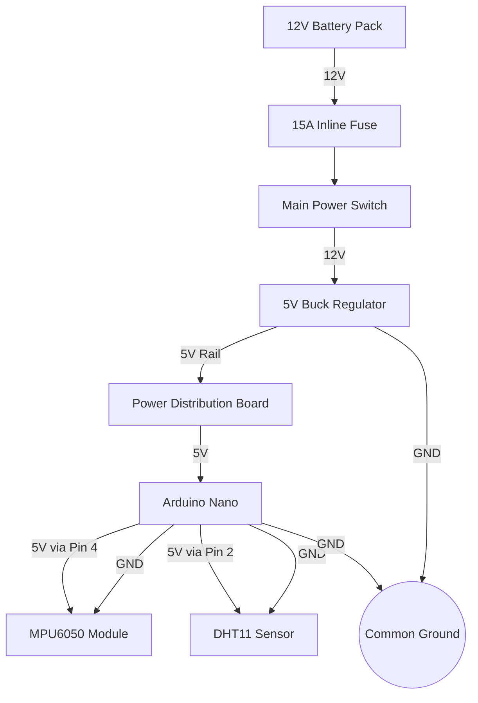
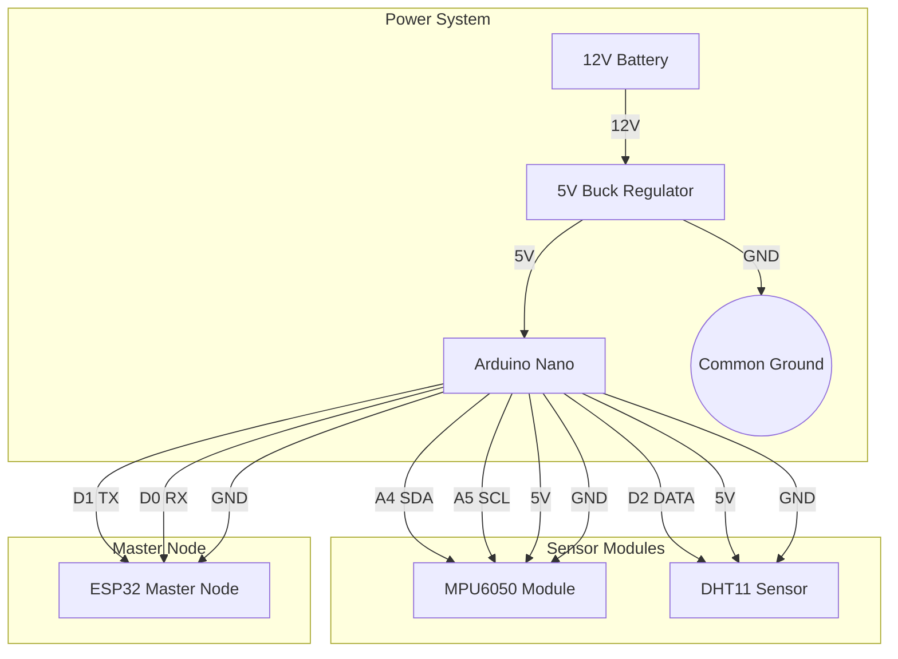

# Sensor Node

## 1. Sensor Node Overview

### Purpose
The Sensor Node is the dedicated hardware subsystem of the PRAYAS robot responsible for collecting real-time environmental, position/navigation, and inertial data. It monitors the robot's physical orientation, detects motion and tilt events, measures ambient temperature and humidity, reads GPS satellite coordinates, and drives an onboard **I2C LCD Display** for local telemetry readout.

### Responsibilities
*   **Motion & Orientation Sensing**: Reads 3-axis accelerometer and 3-axis gyroscope data from the MPU6050 to determine orientation, pitch/roll tilt angles, and fall detection.
*   **Geospatial Positioning**: Reads latitude, longitude, altitude, velocity, and UTC time data from a GPS module (NEO-6M / NEO-M8N).
*   **Environmental Monitoring**: Measures ambient temperature and relative humidity via a digital humidity sensor (DHT11 / DHT22 / SHT30).
*   **Local Telemetry Display**: Formats and outputs live sensor metrics to a 16x2 / 20x4 I2C LCD display mounted on the robot chassis.
*   **Data Packaging & Transmission**: Combines sensor readings into a JSON telemetry packet transmitted to the ESP32 Master Node over UART.

### Inputs
*   **Logic Power**: 5V DC supply from the main Power Distribution Board.
*   **Sensor Signals**: 
    *   GPS NMEA sentences over SoftwareSerial / UART (GPS Module TX).
    *   I2C bus signals (SDA/SCL) from MPU6050 IMU.
    *   Digital pulse data from Humidity Sensor.

### Outputs
*   **I2C LCD Screen Output**: Live 4-row / 2-row readout of GPS fix, Pitch/Roll, and Temp/Humidity.
*   **UART Serial Data**: Packaged telemetry payload transmitted to the Master Node.

### Why a Dedicated Sensor Node is Used
Sensor sampling (specifically NMEA parsing and I2C sensor polling) requires consistent timing intervals. Isolating these tasks to a dedicated Arduino Nano MCU guarantees jitter-free sensor sampling while freeing up the main ESP32 processors for real-time motor kinematics and AI voice streaming.

### Data Collected & Displayed by this Node
| Data Type | Hardware Device | Description |
| :--- | :--- | :--- |
| **GPS Position (Lat, Lon)** | NEO-6M / NEO-M8N GPS | Latitude & Longitude in decimal degrees. |
| **GPS Fix & Satellites** | NEO-6M / NEO-M8N GPS | Number of active satellites locked and 3D fix state. |
| **Acceleration (X, Y, Z)** | MPU6050 IMU | Linear acceleration in m/s². |
| **Gyroscope (X, Y, Z)** | MPU6050 IMU | Angular velocity around X/Y/Z axes in °/s. |
| **Pitch & Roll** | MPU6050 IMU (derived) | Robot forward/backward tilt (Pitch) and side tilt (Roll). |
| **Temperature** | DHT11 / DHT22 / SHT30 | Ambient air temperature in °C. |
| **Humidity** | DHT11 / DHT22 / SHT30 | Ambient relative humidity in %RH. |
| **Local Metrics Screen** | 16x2 / 20x4 I2C LCD | Text screen showing real-time sensor status on the robot body. |

---

## 2. Components Required

The table below lists all components required for the Sensor Node:

| Component Name | Quantity | Specification | Purpose |
| :--- | :---: | :--- | :--- |
| **Arduino Nano** | 1 | ATmega328P, 16 MHz, 32KB Flash, 2KB RAM | Microcontroller reading GPS, MPU6050, Humidity sensor, driving LCD. |
| **GPS Module** | 1 | NEO-6M / NEO-M8N GPS receiver, UART interface, active patch antenna | Reads global positioning coordinates, velocity, and UTC time. |
| **MPU6050 Module** | 1 | InvenSense MPU6050 6-axis IMU (3-axis Accel + 3-axis Gyro), I2C Interface | Measures orientation, pitch/roll, and motion events. |
| **Humidity Sensor** | 1 | DHT11 / DHT22 / SHT30 Digital Temperature & Humidity Sensor | Measures ambient air temperature and relative humidity. |
| **I2C LCD Display** | 1 | 16x2 or 20x4 HD44780 LCD with PCF8574 I2C Adapter (0x27 / 0x3F) | Displays real-time local telemetry readout directly on the robot chassis. |
| **UART & I2C Wiring** | Assorted | 24 AWG Dupont wires (TX, RX, SDA, SCL, GND, 5V) | Connects modules to Arduino Nano. |

---

## 3. Component Description

### Arduino Nano
Acts as the central sensor controller. It initializes the MPU6050 and I2C LCD over I2C (A4/A5), reads GPS NMEA data over serial pins (D2/D3 SoftwareSerial or hardware RX/TX), polls the humidity sensor (D4), updates the LCD screen, and streams packaged JSON telemetry to the Master ESP32 over UART.

### GPS Module (NEO-6M / NEO-M8N)
*   **What it is**: High-sensitivity satellite receiver module operating at 9600 baud.
*   **Why it is used**: Provides outdoor spatial awareness, latitude/longitude positioning, speed over ground, and accurate satellite clock synchronization.
*   **Expected Output**: Latitude, Longitude, Altitude, Speed (km/h), Satellite Count, Fix Quality.

### MPU6050 IMU Module
*   **What it is**: 6-axis motion tracking sensor with 3D accelerometer and 3D gyroscope.
*   **Why it is used**: Monitors robot upright balance, pitch/roll tilt, and detects emergency fall events.

### Humidity & Temperature Sensor (DHT11 / DHT22)
*   **What it is**: Calibrated digital temperature and relative humidity sensor.
*   **Why it is used**: Monitors ambient room conditions and internal chassis thermal environment.

### 16x2 / 20x4 I2C LCD Display
*   **What it is**: High-contrast character LCD driven by a PCF8574 I2C expander.
*   **Why it is used**: Provides human-readable local visual telemetry directly on the robot body without needing an external computer monitor or phone app.

---

*   **How it works inside PRAYAS**: The Arduino Nano transmits JSON-formatted sensor data through its TX pin. The ESP32 Master Node receives this data on its designated RX pin. A shared ground wire ensures a stable reference voltage for clean signal transmission.

---

## 4. Sensor Functions

### MPU6050 Functions

*   **Acceleration Measurement**: The MPU6050's 3-axis accelerometer measures linear force along the X (left-right), Y (forward-backward), and Z (up-down) axes. At rest on a flat surface, the Z-axis reads approximately 9.8 m/s² (1g) due to gravity, while X and Y read near zero.
*   **Gyroscope Measurement**: The 3-axis gyroscope measures rotational velocity around each axis in degrees per second (°/s). A non-zero reading indicates the robot is rotating or tilting.
*   **Pitch Calculation**: Pitch is derived from the accelerometer data by measuring the forward/backward tilt angle relative to the horizontal plane. A positive pitch indicates the robot is leaning forward; a negative pitch indicates it is leaning backward.
*   **Roll Calculation**: Roll is derived from the accelerometer data by measuring the left/right tilt angle relative to the horizontal plane. A positive roll indicates a lean to the right; a negative roll indicates a lean to the left.
*   **Motion Detection**: When the magnitude of acceleration across all axes significantly exceeds 1g, the node detects active motion. This indicates the robot is moving, being pushed, or experiencing vibration.
*   **Tilt Detection**: If the pitch or roll angle exceeds a predefined threshold (e.g., ±15°), the node flags a tilt condition. This serves as an early warning before a potential fall.
*   **Robot Stability Monitoring**: By continuously tracking pitch and roll values over time, the system monitors whether the robot remains stable during locomotion, gesture execution, or when stationary.
*   **Fall Detection**: If the pitch or roll angle exceeds a critical threshold (e.g., ±30°) or if the Z-axis acceleration drops sharply (free-fall condition), the node identifies a fall event and immediately notifies the Master Node.

### DHT11 Functions

*   **Temperature Measurement**: The DHT11 reads the ambient air temperature in degrees Celsius. It provides a measurement range of 0°C to 50°C with an accuracy of ±2°C.
*   **Humidity Measurement**: The DHT11 reads the relative humidity of the surrounding air as a percentage. It provides a measurement range of 20% to 80% RH with an accuracy of ±5%.
*   **Environmental Monitoring**: By combining temperature and humidity data, the node provides a basic environmental profile of the robot's operating space. This data is useful for detecting overheating near electronics and for reporting system health telemetry to the dashboard.

### How Each Sensor Contributes to PRAYAS

| Sensor | Contribution to PRAYAS |
| :--- | :--- |
| **MPU6050 Accelerometer** | Enables the robot to detect if it is being moved, pushed, or vibrated. Provides raw data for tilt and fall detection algorithms. |
| **MPU6050 Gyroscope** | Detects rotational motion such as the robot turning or swaying. Supports balance monitoring during locomotion. |
| **MPU6050 Pitch/Roll** | Derived orientation angles used by the Master Node to trigger corrective actions (e.g., slowing motors, alerting the user) if the robot tilts dangerously. |
| **DHT11 Temperature** | Alerts the system if ambient temperature rises above safe operating limits for electronics (typically 45°C). |
| **DHT11 Humidity** | Provides environmental context; extremely high humidity may affect sensor reliability and PCB longevity. |

---

## 5. Circuit Connection

This section details how to wire the components of the Sensor Node.

### Arduino Nano to MPU6050 (I2C)

The MPU6050 communicates with the Arduino Nano over the I2C bus using two wires (SDA and SCL):

| Arduino Nano Pin | MPU6050 Pin | Wire Color (Suggested) | Description |
| :--- | :--- | :--- | :--- |
| **5V** | VCC | Red | Provides 5V power to the MPU6050 module. |
| **GND** | GND | Black | Common ground reference. |
| **A4 (SDA)** | SDA | Blue | I2C data line — carries sensor register data. |
| **A5 (SCL)** | SCL | Yellow | I2C clock line — synchronizes data transfers. |

> [!IMPORTANT]
> **I2C Pull-Up Resistors**: Most MPU6050 breakout boards include built-in 4.7kΩ pull-up resistors on the SDA and SCL lines. If using a bare MPU6050 chip, external pull-up resistors (4.7kΩ to 10kΩ) must be added between SDA–5V and SCL–5V for reliable communication.

### Arduino Nano to DHT11 (Single-Wire Digital)

The DHT11 uses a proprietary single-wire digital protocol for data transmission:

| Arduino Nano Pin | DHT11 Pin | Wire Color (Suggested) | Description |
| :--- | :--- | :--- | :--- |
| **5V** | VCC (+) | Red | Provides 5V power to the DHT11 sensor. |
| **GND** | GND (−) | Black | Common ground reference. |
| **D2** | DATA | Green | Digital data line — carries temperature and humidity readings. |

> [!NOTE]
> **Pull-Up Resistor**: The DHT11 DATA line requires a 10kΩ pull-up resistor between DATA and VCC. Most DHT11 breakout boards include this resistor onboard. If using a bare DHT11 sensor, add the resistor externally.

### Arduino Nano to ESP32 Master Node (UART)

Serial data is transmitted from the Arduino Nano to the ESP32 Master Node using UART:

| Arduino Nano Pin | ESP32 Pin | Wire Color (Suggested) | Description |
| :--- | :--- | :--- | :--- |
| **D1 (TX)** | GPIO 16 (RX2) | White | Serial transmit — sends sensor data from Nano to ESP32. |
| **D0 (RX)** | GPIO 17 (TX2) | Grey | Serial receive — receives commands from ESP32 to Nano (optional). |
| **GND** | GND | Black | Common ground reference for UART signal integrity. |

> [!IMPORTANT]
> **Cross-Connection Rule**: UART TX on one device must connect to RX on the other. Connecting TX-to-TX or RX-to-RX will result in no communication.

### Power Distribution

Power flows from the main battery through the Power Distribution Board to the Sensor Node:

| From Source | Connection | To Destination | Wire Gauge | Description |
| :--- | :--- | :--- | :---: | :--- |
| **5V Buck Regulator (+)** | Red Wire | Arduino Nano 5V Pin / Vin | 22 AWG | Regulated 5V logic supply. |
| **5V Buck Regulator (−)** | Black Wire | Arduino Nano GND Pin | 22 AWG | Logic ground return path. |
| **Arduino Nano 5V** | Red Jumper | MPU6050 VCC, DHT11 VCC | 24 AWG | Distributes 5V to both sensors. |
| **Arduino Nano GND** | Black Jumper | MPU6050 GND, DHT11 GND | 24 AWG | Distributes common ground to both sensors. |

---

## 6. GPIO Connection Table

The table below lists all Arduino Nano pins used in this node:

| Pin | Connected Device | Pin Mode | Purpose |
| :--- | :--- | :---: | :--- |
| **A4** | MPU6050 SDA | I2C (Output) | I2C data line for reading accelerometer and gyroscope registers. |
| **A5** | MPU6050 SCL | I2C (Output) | I2C clock line for synchronizing data transfers with the MPU6050. |
| **D2** | DHT11 DATA | Digital (Input/Output) | Single-wire data line for reading temperature and humidity values. |
| **D1** | ESP32 GPIO 16 (RX2) | UART (TX) | Serial transmit pin — sends JSON sensor data to the Master Node. |
| **D0** | ESP32 GPIO 17 (TX2) | UART (RX) | Serial receive pin — receives optional commands from the Master Node. |
| **5V** | MPU6050 VCC, DHT11 VCC | Power (Output) | Distributes 5V logic power to both sensor modules. |
| **GND** | MPU6050 GND, DHT11 GND, ESP32 GND | Power (Ground) | Common ground reference for all devices in the Sensor Node. |

---

## 7. Power Distribution

### Power Flow Diagram



### Operating Voltage
*   **System Voltage**: 5.0V DC — the native operating voltage of the Arduino Nano, MPU6050, and DHT11.
*   **Voltage Source**: The 5V is derived from the main 12V battery pack via a step-down buck regulator on the Power Distribution Board.

### Power Consumption

| Component | Operating Voltage | Idle Current | Active Current |
| :--- | :---: | :---: | :---: |
| **Arduino Nano** | 5V | ~15 mA | ~45 mA |
| **MPU6050** | 3.3V–5V | ~3.9 mA | ~5 mA (all axes active) |
| **DHT11** | 3.3V–5V | ~0.5 mA | ~2.5 mA (during measurement) |
| **Total Node** | 5V | ~19.4 mA | ~52.5 mA |

### Current Requirement
The Sensor Node draws a maximum of approximately **52.5 mA** during active sensor reads and UART transmission. This is well within the capacity of the 5V buck regulator (rated for 5A) and does not impose any meaningful load on the power distribution system.

### Ground Connections
All ground wires from the Arduino Nano, MPU6050, DHT11, and ESP32 Master Node must be tied to a single common ground point on the Power Distribution Board. A shared ground reference is critical for:
*   Stable I2C signal levels between the Arduino Nano and MPU6050.
*   Clean UART serial communication between the Arduino Nano and ESP32.
*   Accurate digital readings from the DHT11.

### Power Safety
*   **Reverse Polarity**: The Arduino Nano's onboard regulator includes basic reverse polarity protection, but verify polarity before connecting power to avoid damage.
*   **Voltage Verification**: Always use a multimeter to confirm the buck regulator outputs 5.0V ±0.2V before connecting the Sensor Node.
*   **Current Margin**: At 52.5 mA peak draw, the Sensor Node operates far below any thermal or current limits. No fusing is required at the sensor node level — the main 15A fuse on the battery provides upstream protection.

---

## 8. Working Principle

The step-by-step operation of the Sensor Node is described below:

```
  [ Power ON ]
       │
       ▼
  [ Arduino Nano Boots ]
       │
       ▼
  [ Initialize I2C Bus ] ──> Set SDA (A4) and SCL (A5) to I2C mode
       │
       ▼
  [ Initialize MPU6050 ] ──> Write configuration registers (±2g accel, ±250°/s gyro)
       │
       ▼
  [ Initialize DHT11 ] ──> Set digital pin D2 and begin sensor handshake
       │
       ▼
  [ Wait 2 Seconds ] ──> Allow DHT11 to stabilize after power-on
       │
       ▼
  ┌────────────────────────────────────────────┐
  │           SAMPLING LOOP                     │
  │                                             │
  │  [ Read MPU6050 ] ──> Fetch 14 bytes via I2C│
  │       │                                     │
  │       ▼                                     │
  │  [ Compute Pitch & Roll ] ──> Apply tilt    │
  │       │                   angle formulas    │
  │       ▼                                     │
  │  [ Read DHT11 ] ──> Request data from D2    │
  │       │                                     │
  │       ▼                                     │
  │  [ Validate Readings ] ──> Check for NaN    │
  │       │                   or stale data     │
  │       ▼                                     │
  │  [ Package JSON String ] ──> Build payload  │
  │       │                                     │
  │       ▼                                     │
  │  [ Send via UART TX ] ──> Transmit to ESP32 │
  │       │                                     │
  │       ▼                                     │
  │  [ Delay (200 ms) ] ──> 5 Hz sampling rate  │
  │       │                                     │
  │       └──────────── Loop Back ──────────────┘
  └────────────────────────────────────────────┘
```

1.  **Power ON**: The main power switch activates the 5V buck regulator, supplying power to the Arduino Nano.
2.  **Arduino Nano Boots**: The ATmega328P initializes, sets the system clock, and prepares the hardware interfaces (I2C and UART).
3.  **Initialize I2C Bus**: The Arduino enables its hardware I2C interface on pins A4 (SDA) and A5 (SCL) at 100 kHz standard mode.
4.  **Initialize MPU6050**: The Arduino sends I2C configuration commands to the MPU6050, setting the accelerometer range to ±2g and the gyroscope range to ±250°/s for optimal sensitivity.
5.  **Initialize DHT11**: The Arduino configures digital pin D2 and initiates the DHT11 handshake protocol to prepare for data reads.
6.  **Wait 2 Seconds**: The DHT11 requires a brief stabilization period after power-on before it returns valid readings.
7.  **Read MPU6050**: The Arduino reads 14 bytes of raw data from the MPU6050's internal registers over I2C, containing accelerometer and gyroscope values for all three axes.
8.  **Compute Pitch & Roll**: The raw accelerometer data is converted to pitch and roll angles using trigonometric formulas.
9.  **Read DHT11**: The Arduino sends a start signal on pin D2 and reads back 5 bytes of data containing the humidity integer, humidity decimal, temperature integer, temperature decimal, and a checksum byte.
10. **Validate Readings**: The Arduino checks for invalid readings (NaN values, checksum errors, or stale data) and retains the last valid reading if the current read fails.
11. **Package JSON String**: All sensor values are formatted into a single JSON string for easy parsing by the Master Node.
12. **Send via UART TX**: The JSON string is transmitted bit-by-bit through the D1 (TX) pin at the configured baud rate to the ESP32 Master Node.
13. **Delay (200 ms)**: A short delay maintains a consistent 5 Hz sampling rate, preventing unnecessary data flooding while ensuring responsive updates.

---

## 9. Data Sent to Master Node

### Sensor Values Transmitted

The Arduino Nano transmits the following values to the Master Node in a single JSON payload:

| Field | Unit | Description |
| :--- | :--- | :--- |
| **temperature** | °C | Ambient air temperature read by the DHT11. |
| **humidity** | %RH | Relative humidity read by the DHT11. |
| **pitch** | degrees | Forward/backward tilt angle derived from accelerometer data. |
| **roll** | degrees | Left/right tilt angle derived from accelerometer data. |
| **accelX** | m/s² | Linear acceleration along the X-axis (left-right). |
| **accelY** | m/s² | Linear acceleration along the Y-axis (forward-backward). |
| **accelZ** | m/s² | Linear acceleration along the Z-axis (up-down). |
| **gyroX** | °/s | Angular velocity around the X-axis (roll rate). |
| **gyroY** | °/s | Angular velocity around the Y-axis (pitch rate). |
| **gyroZ** | °/s | Angular velocity around the Z-axis (yaw rate). |

### Sample JSON Payload

```json
{
  "temperature": 28.5,
  "humidity": 61,
  "pitch": 3.2,
  "roll": -1.5,
  "accelX": 0.02,
  "accelY": 0.15,
  "accelZ": 0.98,
  "gyroX": 0.5,
  "gyroY": -0.2,
  "gyroZ": 0.1
}
```

### Data Format Specifications
*   **Baud Rate**: 9600 bps (default, configurable in firmware).
*   **Data Bits**: 8 bits.
*   **Stop Bits**: 1 bit.
*   **Parity**: None.
*   **Line Ending**: Each JSON payload is terminated with a newline character (`\n`) for easy parsing on the receiving end.
*   **Sampling Rate**: 5 Hz (one payload transmitted every 200 ms).

---

## 10. Wiring Diagram

The diagram below shows the complete electrical interconnections of the Sensor Node:



### Signal Flow Summary

```
  [ MPU6050 ] ──(I2C: SDA/SCL)──> [ Arduino Nano ] ──(UART: TX/RX)──> [ ESP32 Master Node ]
  [ DHT11   ] ──(Digital: D2)  ──┘
```

---

## 11. Sensor Placement

### MPU6050 Mounting

*   **Location**: Mount the MPU6050 module as close to the robot's center of gravity (COG) as possible. For PRAYAS, this is approximately at the midpoint of the torso column, near the base deck level.
*   **Orientation**: The MPU6050 board must be mounted flat and level with the robot's reference frame. The X-axis should point forward, the Y-axis should point to the left, and the Z-axis should point upward.
*   **Fastening**: Use M3 screws with nylon standoffs to rigidly secure the module to the chassis. A loose or vibrating sensor will produce noisy, unreliable readings.
*   **Vibration Isolation**: Avoid mounting the MPU6050 directly next to the motor mounts. Motor vibration propagates through the chassis and corrupts accelerometer data. If unavoidable, use rubber grommets or silicone dampeners between the sensor board and the mounting surface.

### DHT11 Mounting

*   **Location**: Mount the DHT11 on the robot's upper torso or chest area, where it is exposed to ambient air and not enclosed in a sealed compartment.
*   **Airflow**: Ensure the sensor's ventilation holes are unobstructed so that ambient air can circulate freely across the sensing element.
*   **Heat Source Avoidance**: Keep the DHT11 at least 10 cm away from voltage regulators, motor drivers, and buck converters. These components generate heat that will produce artificially high temperature readings.
*   **Wire Routing**: Route the DHT11 data wire (D2) away from high-current motor cables to prevent electromagnetic interference from corrupting the single-wire digital signal.

---

## 12. Testing Procedure

Follow these steps systematically during assembly and commissioning:

1.  **Test Arduino Nano**: Connect the Arduino Nano to a PC via USB cable. Open the Arduino IDE Serial Monitor. Verify that the board is detected and the serial port responds at 9600 baud. Upload a basic Blink sketch to confirm the microcontroller is functional.

2.  **Test I2C Bus**: Upload an I2C scanner sketch to the Arduino Nano. With the MPU6050 connected (A4→SDA, A5→SCL, 5V→VCC, GND→GND), open the Serial Monitor. Verify that I2C address `0x68` is detected. If no device is found, check wiring and solder joints.

3.  **Test MPU6050 Raw Readings**: Upload a raw register read sketch that prints acceleration and gyroscope values to the Serial Monitor. Place the sensor flat on a table. Verify that:
    *   **accelX** reads approximately `0.0` m/s².
    *   **accelY** reads approximately `0.0` m/s².
    *   **accelZ** reads approximately `9.8` m/s² (1g).
    *   **gyroX**, **gyroY**, **gyroZ** all read near `0.0` °/s.

4.  **Verify Tilt Readings**: Slowly tilt the MPU6050 board forward and to the side. Verify that:
    *   **Pitch** increases when tilted forward and decreases when tilted backward.
    *   **Roll** increases when tilted right and decreases when tilted left.
    *   Values return to near-zero when the sensor is placed flat again.

5.  **Test DHT11 Sensor**: Connect the DHT11 (VCC→5V, GND→GND, DATA→D2). Upload a DHT11 read sketch. Open the Serial Monitor and verify that:
    *   **Temperature** reads a plausible ambient value (e.g., 20°C–35°C).
    *   **Humidity** reads a plausible ambient value (e.g., 30%–70% RH).
    *   Readings update every 2 seconds.

6.  **Verify DHT11 Response**: Breathe gently on the DHT11 sensor for 3–5 seconds. Verify that the humidity reading rises noticeably (e.g., from 45% to 70%+). This confirms the sensor is actively sampling.

7.  **Test UART Communication**: Connect the Arduino Nano's TX pin (D1) to the ESP32's RX pin (GPIO 16). Connect a common GND wire between both boards. Upload a test sketch that sends a fixed JSON string every second from the Arduino. On the ESP32, open a Serial2 monitor at 9600 baud and verify that the transmitted string is received correctly without garbled characters.

8.  **Verify Data Received on ESP32**: Upload the final Sensor Node firmware to the Arduino Nano and the corresponding receiver firmware to the ESP32 Master Node. Verify that the ESP32 correctly parses the incoming JSON payload and displays all 10 sensor fields (temperature, humidity, pitch, roll, accelX/Y/Z, gyroX/Y/Z) in the correct format and units.

---

## 13. Troubleshooting

Use this table to diagnose common issues during assembly or operation:

| Problem | Possible Cause | Solution |
| :--- | :--- | :--- |
| **MPU6050 Not Detected on I2C** | Incorrect wiring of SDA/SCL pins. SDA or SCL not connected. Pull-up resistors missing. | Verify that Arduino A4 connects to MPU6050 SDA and A5 connects to SCL. Check for loose jumper wires. If using a bare MPU6050 chip, add 4.7kΩ pull-up resistors between SDA–5V and SCL–5V. |
| **MPU6050 Returns All Zeros** | MPU6050 is in sleep mode. I2C address mismatch (0x68 vs 0x69). | Ensure the MPU6050 sleep bit is cleared in the PWR_MGMT_1 register (write 0x00 to register 0x6B). Check the AD0 pin on the MPU6050 — if LOW, address is 0x68; if HIGH, address is 0x69. |
| **DHT11 Returns Invalid Values (NaN)** | Loose DATA wire connection. DHT11 not stabilized after power-on. Checksum error. | Secure the DATA wire connection to pin D2. Add a 2-second delay after power-on before the first DHT11 read. Verify the 10kΩ pull-up resistor is present on the DATA line. |
| **DHT11 Temperature Reading Is Too High** | Sensor mounted near heat source (motor driver, voltage regulator, buck converter). | Relocate the DHT11 at least 10 cm away from any heat-generating component. Ensure adequate airflow around the sensor. |
| **No UART Communication Between Arduino and ESP32** | TX/RX pins are crossed incorrectly. Baud rate mismatch. No common ground. | Verify that Arduino TX (D1) connects to ESP32 RX (GPIO 16) and Arduino RX (D0) connects to ESP32 TX (GPIO 17). Confirm both boards use the same baud rate (9600). Connect a GND wire between both boards. |
| **Garbled or Corrupted UART Data** | Baud rate mismatch between Arduino and ESP32. Electrical noise on signal wires. | Ensure both the Arduino Serial.begin() and ESP32 Serial2.begin() use the same baud rate. Keep the UART wires short (< 30 cm) and route them away from motor cables. |
| **Arduino Nano Not Powering On** | 5V supply not connected. Reverse polarity on power input. Faulty buck regulator. | Verify the 5V buck regulator is powered and outputting 5.0V. Check that the Arduino Nano's 5V pin connects to the regulator's positive output and GND connects to negative output. Measure with a multimeter before connecting. |
| **Inconsistent Tilt Readings** | MPU6050 mounted loosely. Vibration from motors affecting sensor. Board not level. | Tighten the MPU6050 mounting screws. Add rubber dampeners between the sensor board and chassis if motor vibration is present. Re-level the sensor during calibration. |

---

## 14. Engineering Notes

### Wiring Best Practices
*   **Short I2C Wires**: Keep the I2C wires between the Arduino Nano and MPU6050 as short as possible (under 15 cm) to minimize signal degradation and electromagnetic interference.
*   **Separate Signal and Power Wires**: Route the I2C and UART signal wires separately from the 5V power wires. If they must cross, route them perpendicular to each other to reduce crosstalk.
*   **Common Ground**: Always connect all devices (Arduino Nano, MPU6050, DHT11, ESP32) to a single common ground point. A missing ground connection is the most common cause of erratic sensor readings and communication failures.

### Mounting Best Practices
*   **MPU6050 Level Mounting**: The MPU6050 must be mounted perfectly level with the robot's mechanical reference frame. Use a spirit level or calibrate the sensor offsets in firmware to compensate for any mechanical misalignment.
*   **DHT11 Air Exposure**: Ensure the DHT11 is mounted in a location where ambient air can reach the sensing element. Avoid mounting it inside enclosed compartments or behind solid panels.
*   **Secure All Wiring**: Use zip ties or adhesive cable mounts to secure sensor wires to the robot chassis. Loose wires can snag on moving parts or work loose during locomotion, causing intermittent failures.

### Electrical Safety
*   **Voltage Verification**: Always measure the 5V supply with a multimeter before connecting the Arduino Nano or any sensor. An incorrect voltage can permanently damage the components.
*   **No Hot-Plugging Sensors**: Never connect or disconnect the MPU6050 or DHT11 while the system is powered on. Always power down the Sensor Node before making wiring changes.
*   **Common Ground First**: When assembling the wiring, connect the ground wires first before connecting power or signal wires.

### Maintenance
*   **Label All Cables**: Label both ends of every wire with its function (e.g., "MPU6050 SDA", "DHT11 DATA", "UART TX"). This significantly reduces troubleshooting time during assembly and field repairs.
*   **Periodic Inspection**: Every 50 hours of operation, inspect all sensor connections for loose wires, corrosion, or mechanical wear. Re-tighten any mounting hardware that has vibrated loose.
*   **Sensor Calibration**: Recalibrate the MPU6050 pitch and roll offsets if the robot's mechanical structure changes (e.g., new components added, frame modifications). Store calibration offsets in the Arduino's EEPROM for persistence across reboots.
