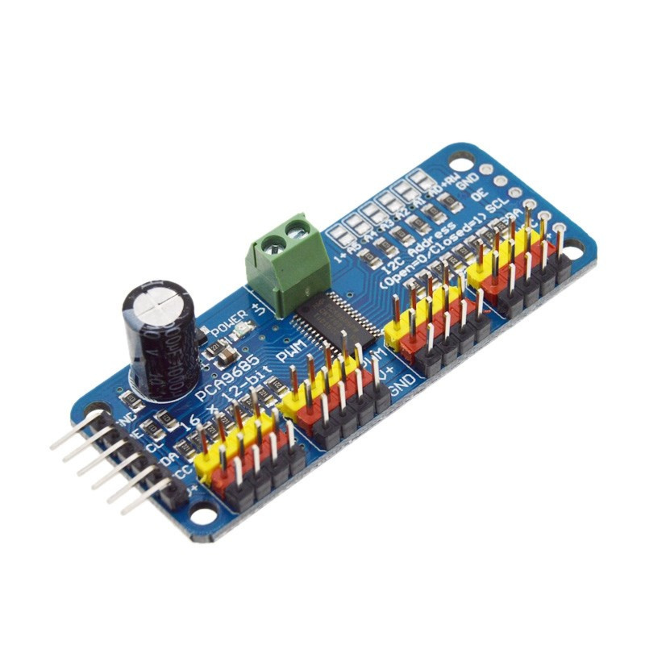
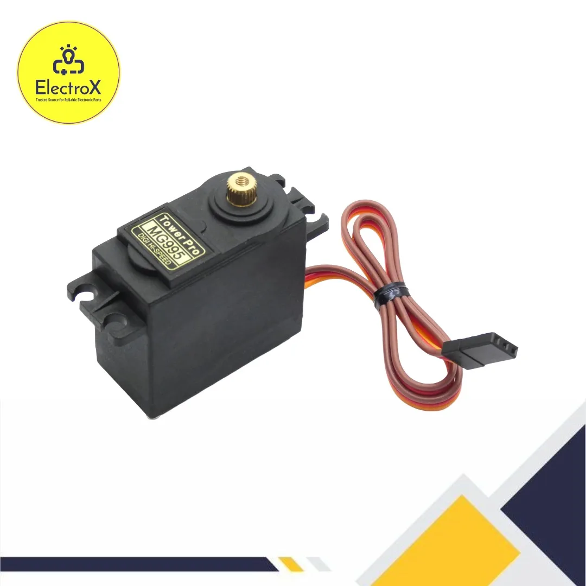
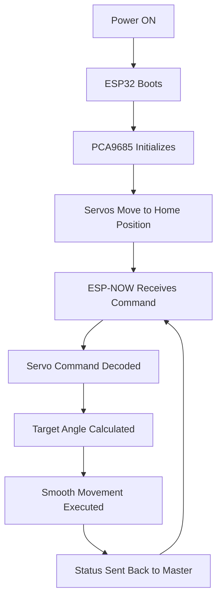
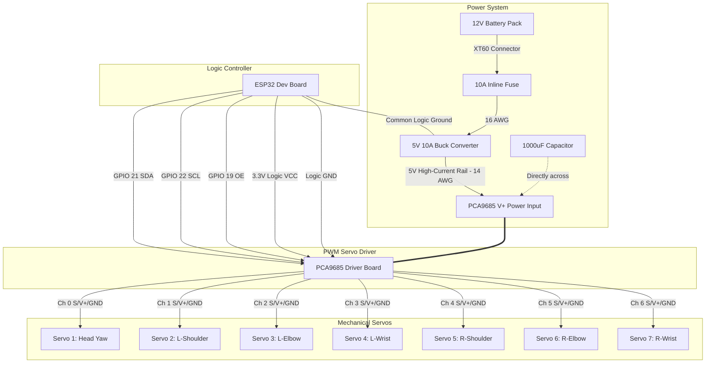

# Servo Controller Node

## 1. Servo Node Overview

### Purpose
The Servo Controller Node is the dedicated hardware subsystem of the PRAYAS robot responsible for managing the high-precision angular positions and trajectories of the physical joints. It coordinates the movement of the robot's head and arms based on directives sent from the Master Node.

### Responsibilities
*   **Command Decoding**: Receives movement instructions wirelessly from the Master Node via ESP-NOW.
*   **PWM Generation**: Drives multiple high-torque servos simultaneously using precise hardware pulse-width modulation (PWM) control signals.
*   **Motion Profiling**: Calculates smooth transition speeds between home and target positions to prevent mechanical wear and jerking.
*   **Fail-Safe Management**: Safely parks joints at startup and shuts off PWM channels during an emergency.

### Inputs
*   **Control Commands**: Digital wireless messages from the Master Node via ESP-NOW.
*   **Logic Power**: 5V DC low-current logic supply.
*   **Servo Power**: 5V DC high-current power rail fed from a dedicated regulator.

### Outputs
*   **PWM Channels**: 7 channels of 50Hz hardware-timed control signals routed to the individual servo motors.

### Why a Dedicated Servo Node is Used
Servo motors draw large, sudden surges of current when accelerating or holding load. If these servos were driven by the Master Node, the electrical noise (EMI) and voltage drops (brownouts) caused by motor load would likely crash the master processor. Isolating the servos to their own node ensures system-wide stability. Additionally, offloading the timing-sensitive PWM calculations preserves Master Node CPU cycles for navigation and communication.

### Why PCA9685 is Used Instead of Driving Servos Directly
*   **Hardware Timers**: The PCA9685 has an onboard 12-bit PWM generator and its own clock. Once the ESP32 sets the target angles over I2C, the PCA9685 maintains the signals continuously, freeing the ESP32's CPU.
*   **Pin Efficiency**: It controls up to 16 servos using only 2 I2C pins on the ESP32.
*   **Electrical Isolation**: It provides dedicated pins to separate high-current servo power from low-power microcontroller logic.

---

## 2. Components Required

The Bill of Materials (BOM) below lists all components required to build and wire the Servo Node:

| Component Name | Quantity | Specification | Purpose |
| :--- | :---: | :--- | :--- |
| **ESP32 Dev Board** | 1 | ESP32-WROOM-32E (38-pin DevKitC) | Logic controller that decodes gestures and handles I2C commands. |
| **PCA9685 Servo Driver** | 1 | 16-Channel 12-bit I2C PWM Controller | Generates precise, hardware-timed PWM signals for the servos. |
| **MG995 Servo Motors** | 7 | TowerPro MG995 Analog Metal Gear Servo | High-torque actuators for head and arm joints. |
| **5V 10A Buck Converter** | 1 | DC-DC Step-Down Regulator (e.g., XL4016) | Steps down 12V battery power to a stable, high-current 5V rail. |
| **XT60 Connector** | 1 | XT60 Male/Female Pair | Provides a secure, low-resistance battery input connection. |
| **Power Distribution Terminal** | 1 | 5.08 mm Pitch PCB Screw Terminal Blocks | Distributes power and ground connections cleanly across the node. |
| **JST Servo Connectors** | 7 | 3-Pin JST-XH Connectors | Ensures secure, vibration-proof servo wire extensions. |
| **Capacitors** | 1 | 1000µF, 16V Electrolytic Capacitor | Placed across the servo power rail to buffer current spikes. |
| **Connecting Wires** | Assorted | 14 AWG (Power Rail) / 24 AWG (Signal Wires) | Directs electricity and control lines throughout the system. |
| **Mounting Hardware** | Assorted | M3 Nylon Standoffs, Screws, and Nuts | Secures the PCBs mechanically to the robot chassis. |

---

## 3. Component Description

### ESP32 Dev Board
*   **What it is**: A dual-core 32-bit microcontroller development board equipped with Wi-Fi and Bluetooth capabilities.
    
    { style="display: block; margin: 0 auto;" width="500" }
*   **Why it is used**: It provides high-speed processing, hardware support for I2C communication, and a built-in antenna for wireless ESP-NOW communication.
*   **How it works inside PRAYAS**: It boots, configures the PCA9685 over I2C, listens for motion commands wirelessly, calculates smooth movement profiles, and instructs the PCA9685 to update servo positions.

### PCA9685 Servo Driver
*   **What it is**: An I2C-controlled 16-channel PWM driver that operates with an internal clock.
    
    { style="display: block; margin: 0 auto;" width="320" }
*   **Why it is used**: It offloads the PWM generation from the ESP32, prevents signal jitter, and simplifies wiring by clustering 16 channels of 3-pin headers.
*   **How it works inside PRAYAS**: It receives joint angle configurations from the ESP32 through the I2C bus and outputs continuous 50Hz PWM signals to the connected servo motors.

### MG995 Servo Motors
*   **What it is**: A high-torque, metal-geared analog servo motor capable of rotating 180 degrees.
    
    { style="display: block; margin: 0 auto;" width="320" }
*   **Why it is used**: Moving mechanical limbs requires high holding torque and durability. Metal gears prevent gear stripping when the arms experience weight load or external resistance.
*   **How it works inside PRAYAS**: 7 servos actuate the joints of the robot (1 for head rotation, 3 per arm) based on the PWM pulse widths sent by the PCA9685.

### 5V 10A Buck Converter
*   **What it is**: An efficiency-focused step-down voltage regulator that converts high DC voltage to lower DC voltage.
*   **Why it is used**: The robot's primary battery runs at 12V, but MG995 servos operate optimally at 5V to 6V. Standard linear regulators would overheat instantly; a 10A buck converter handles high currents efficiently.
*   **How it works inside PRAYAS**: It steps the battery's 12V down to a clean, stable 5.0V output capable of delivering up to 10A of current to the servo power bus.

### XT60 Connector
*   **What it is**: A heavy-duty, polarized nylon connector rated for currents up to 60A.
*   **Why it is used**: Prevents accidental reverse-polarity connections and provides a robust mechanical joint that does not disconnect due to robot vibration.
*   **How it works inside PRAYAS**: Connects the main 12V power supply lines from the battery compartment to the buck converter input safely.

### Capacitors (470µF–1000µF)
*   **What it is**: An energy storage component that can release power rapidly.
*   **Why it is used**: When servos start moving simultaneously, their sudden current draw causes a temporary voltage drop (sag). A capacitor buffers this drop to prevent control board resets.
*   **How it works inside PRAYAS**: A 1000µF capacitor is wired directly across the PCA9685 servo power terminal block to absorb peak current demands.

---

## 4. Servo Layout

The physical joints of the PRAYAS robot are mapped to the 7 servos as follows:

| Servo Identifier | Robot Part | Joint Name | Function |
| :--- | :--- | :--- | :--- |
| **Servo 1** | Head | Head Neck Yaw | Rotates the head left and right. |
| **Servo 2** | Left Arm | Left Shoulder Pitch | Raises and lowers the left arm. |
| **Servo 3** | Left Arm | Left Elbow Pitch | Folds and extends the left forearm. |
| **Servo 4** | Left Arm | Left Wrist Roll | Rotates the left hand / executes hand gestures. |
| **Servo 5** | Right Arm | Right Shoulder Pitch | Raises and lowers the right arm. |
| **Servo 6** | Right Arm | Right Elbow Pitch | Folds and extends the right forearm. |
| **Servo 7** | Right Arm | Right Wrist Roll | Rotates the right hand / executes hand gestures. |

---

## 5. Mechanical Movement

To ensure the robot does not exceed its physical capabilities, joint limits are strictly defined.

### Head Neck Yaw (Servo 1)
*   **Left Rotation**: Rotates the head up to 80° left of center.
*   **Right Rotation**: Rotates the head up to 80° right of center.
*   **Recommended Operating Limit**: 10° to 170° (90° Center).

### Left Shoulder Pitch (Servo 2)
*   **Raise Arm**: Swings the arm forward and up.
*   **Lower Arm**: Swings the arm back down parallel to the torso.
*   **Recommended Operating Limit**: 15° to 165° (90° Center / Standing vertical).

### Left Elbow Pitch (Servo 3)
*   **Fold Forearm**: Bends the elbow up towards the shoulder.
*   **Extend Forearm**: Straightens the arm.
*   **Recommended Operating Limit**: 30° to 150° (90° Center / L-shape).

### Left Wrist Roll (Servo 4)
*   **Rotate/Gesture**: Rotates the hand clockwise or counterclockwise.
*   **Recommended Operating Limit**: 0° to 180° (90° Center / Palm facing inward).

### Right Shoulder Pitch (Servo 5)
*   **Raise Arm**: Swings the arm forward and up.
*   **Lower Arm**: Swings the arm back down parallel to the torso.
*   **Recommended Operating Limit**: 15° to 165° (90° Center / Standing vertical).

### Right Elbow Pitch (Servo 6)
*   **Fold Forearm**: Bends the elbow up towards the shoulder.
*   **Extend Forearm**: Straightens the arm.
*   **Recommended Operating Limit**: 30° to 150° (90° Center / L-shape).

### Right Wrist Roll (Servo 7)
*   **Rotate/Gesture**: Rotates the hand clockwise or counterclockwise.
*   **Recommended Operating Limit**: 0° to 180° (90° Center / Palm facing inward).

---

## 6. Circuit Connection

This section details how to wire the electronics of the Servo Node.

### ESP32 to PCA9685
Control commands are sent from the ESP32 to the PCA9685 logic terminals:

*   **SDA Connection**: Connect ESP32 `GPIO 21` directly to PCA9685 `SDA`.
*   **SCL Connection**: Connect ESP32 `GPIO 22` directly to PCA9685 `SCL`.
*   **VCC Connection**: Connect ESP32 `3.3V` or `5V` output to the PCA9685 logic `VCC` pin.
*   **GND Connection**: Connect ESP32 `GND` to PCA9685 logic `GND` pin.
*   **OE Pin (Optional)**: Connect ESP32 `GPIO 19` to PCA9685 `OE` (Output Enable). Pulling this pin HIGH disables all PWM outputs instantly, serving as an emergency shut-off.

### PCA9685 to MG995 Servos
Connect the servos to the 3-pin headers of the PCA9685 driver channels:

*   **Signal (Yellow/Orange)**: Connects to the top row (PWM signal pin) of the channel.
*   **Power (Red)**: Connects to the middle row (V+ power pin) of the channel.
*   **Ground (Brown/Black)**: Connects to the bottom row (GND pin) of the channel.

### Buck Converter Connections
*   **Battery to Buck Converter**: Connect the 12V battery output via the XT60 connector directly to the input terminal blocks of the 5V Buck Converter, respecting polarity (`IN+` and `IN-`).
*   **Buck Converter to PCA9685 Power Rail**: Connect the output of the 5V Buck Converter (`OUT+` and `OUT-`) to the green screw terminals of the PCA9685 (`V+` and `GND`). Use thick wires (14 AWG) to carry the current.

### Ground Sharing
For the control signals to remain stable and clean, a common ground must exist. Ensure that:
1.  The ESP32 `GND` is connected to the PCA9685 logic `GND`.
2.  The PCA9685 logic `GND` is connected to the PCA9685 power `GND` (green terminal block).
3.  The Buck Converter `OUT-` is connected to the PCA9685 power `GND`.

> [!IMPORTANT]
> **Why Servo Power Must NEVER Come From the ESP32**
> Microcontroller boards like the ESP32 are delicate logic devices. Their on-board voltage regulators can only supply small currents (typically under 500mA). A single MG995 servo under mechanical load can draw up to 2.5A of stall current. Attempting to power even one servo directly from the ESP32 will trigger an immediate brownout, reset the processor, and risk permanently burning out the ESP32 voltage regulator.

---

## 7. GPIO Connection Table

The GPIO configurations for the ESP32 logic controller are assigned as follows:

| ESP32 Pin | Connected To | Device / Pin | Purpose |
| :--- | :--- | :--- | :--- |
| **GPIO 21** | PCA9685 SDA | PCA9685 Logic Board | I2C Serial Data line for configuring PWM width. |
| **GPIO 22** | PCA9685 SCL | PCA9685 Logic Board | I2C Serial Clock line for synchronizing transfers. |
| **GPIO 19** | PCA9685 OE | PCA9685 Output Enable | Hardware disable control (Active LOW, pull HIGH for emergency stop). |
| **3.3V** | PCA9685 VCC | PCA9685 Logic Power | Powers the logic gates inside the PCA9685 chip. |
| **GND** | PCA9685 GND | PCA9685 Logic Ground | Common logic ground reference. |

---

## 8. Power Distribution

### Power Flow Diagram
```
12V Battery Pack
      │
      ▼ (XT60 Connector)
10A Inline Fuse
      │
      ▼ (16 AWG Wire)
5V 10A Buck Converter
      │
      ▼ (14 AWG Wire) ─── [ 1000µF Capacitor ]
PCA9685 V+ Power Rail
      │
      ▼ (22 AWG Wire)
7 × MG995 Servos
```

### Voltage and Current Parameters
*   **System Voltage**: 5.0V DC (optimum voltage for MG995 servos to balance high torque and cool operating temperatures).
*   **Idle Current**: ~10mA per servo (~70mA total for the node).
*   **Operating Current**: ~500mA to 800mA per servo during normal limb movement.
*   **Stall/Peak Current**: Up to 2.5A per servo under heavy loads.
*   **Total Current Estimation**: Since all 7 joints rarely stall simultaneously, the peak load during a complex dual-arm gesture is estimated at **6A to 8A**. The dedicated 10A buck converter provides a safe current headroom of 20%.

### Cable & Safety Recommendations
*   **Battery to Buck Converter (12V Input)**: Use **16 AWG** silicon wires.
*   **Buck Converter to PCA9685 (5V High-Current Rail)**: Use **14 AWG** wires to prevent voltage drop over the line.
*   **Ground Distribution**: Establish a star-ground configuration at the output terminal of the Buck Converter to minimize ground loops and reduce logic noise.
*   **Capacitor Placement**: Install a **1000µF (16V minimum)** electrolytic capacitor directly into the PCA9685's green power terminals. Place it as close to the driver input as possible.
*   **Fuse Recommendation**: Install a **10A fast-acting blade fuse** in series between the buck converter's positive output and the PCA9685 input terminal.

---

## 9. Servo Driver Channel Mapping

Servos must be plugged into the exact channels configured on the PCA9685 driver:

| Driver Channel | Servo Name | Robot Part | Physical Location |
| :--- | :--- | :--- | :--- |
| **Channel 0** | Servo 1 | Head Neck Yaw | Base of the neck assembly. |
| **Channel 1** | Servo 2 | Left Shoulder Pitch | Left shoulder actuator. |
| **Channel 2** | Servo 3 | Left Elbow Pitch | Left elbow actuator. |
| **Channel 3** | Servo 4 | Left Wrist Roll | Left wrist rotation assembly. |
| **Channel 4** | Servo 5 | Right Shoulder Pitch | Right shoulder actuator. |
| **Channel 5** | Servo 6 | Right Elbow Pitch | Right elbow actuator. |
| **Channel 6** | Servo 7 | Right Wrist Roll | Right wrist rotation assembly. |
| **Channels 7–15** | Reserved | Unassigned | Reserved for future upgrades (e.g., neck tilt, grippers). |

---

## 10. Working Principle

The step-by-step operational pipeline of the Servo Node is detailed below:



1.  **Power ON**: The robot's main power switch is turned on, routing 12V to the buck converter and booting the system.
2.  **ESP32 Boots**: The ESP32 firmware initializes and establishes standard I2C communications with the PCA9685 driver.
3.  **PCA9685 Initializes**: The I2C registers of the PCA9685 are configured, setting the internal PWM frequency to 50Hz (20ms refresh period).
4.  **Servos Move to Home Position**: The ESP32 commands all 7 channels to move slowly to their designated startup angles (90°). To avoid current surges, channels are moved one by one with a 100ms startup delay between them.
5.  **ESP-NOW Command Reception**: The ESP32 listens for incoming wireless gesture commands sent from the Master Node.
6.  **Servo Command Decoded**: Upon receiving a message, the ESP32 decodes the packet to identify target angles and speed profiles for the joints.
7.  **Target Angle Calculation**: The target angles are processed. The step increments are calculated based on the requested motion profiles.
8.  **Smooth Movement Execution**: The intermediate servo positions are updated over I2C to execute smooth movement transitions.
9.  **Status Sent Back**: Once the movement completes, the ESP32 sends a status confirmation back to the Master Node over ESP-NOW, waiting for the next action.

---

## 11. Home Position

To prevent physical collisions with the robot's torso at startup, the initial home positions and safe operating ranges are defined below:

| Servo | Joint Name | Home Angle | Min Safe Angle | Max Safe Angle | Safe Operating Range |
| :--- | :--- | :---: | :---: | :---: | :---: |
| **Servo 1** | Head Neck Yaw | 90° (Center) | 10° | 170° | 160° total rotation |
| **Servo 2** | Left Shoulder Pitch | 90° (Down) | 15° | 165° | 150° total swing |
| **Servo 3** | Left Elbow Pitch | 90° (L-Shape) | 30° | 150° | 120° fold capacity |
| **Servo 4** | Left Wrist Roll | 90° (Neutral)| 0° | 180° | 180° rotation |
| **Servo 5** | Right Shoulder Pitch| 90° (Down) | 15° | 165° | 150° total swing |
| **Servo 6** | Right Elbow Pitch | 90° (L-Shape) | 30° | 150° | 120° fold capacity |
| **Servo 7** | Right Wrist Roll | 90° (Neutral)| 0° | 180° | 180° rotation |

---

## 12. Motion Profiles

Directly commanding a servo to jump from one position to another creates abrupt acceleration, resulting in high mechanical torque, structural vibration, and severe power spikes. The ESP32 prevents this by executing motion profiling.

### Speed Profiles
*   **Slow Profile (15°/sec)**: Used for head scanning, slow idle behaviors, and alignment adjustments.
*   **Normal Profile (60°/sec)**: Default speed used for standard communicative gestures (waving, gesturing).
*   **Fast Profile (120°/sec)**: Used for quick reactions or immediate obstacle retraction.

### Acceleration and Deceleration Profiling
The controller applies a trapezoidal velocity curve to joint movements:
*   **Smooth Acceleration**: The movement starts slowly and ramps up speed to match the profile limits.
*   **Constant Speed**: The joint rotates at the profile's speed limit.
*   **Smooth Deceleration**: As the joint nears the target angle, the step size decreases, bringing the servo to a smooth, vibration-free halt.

---

## 13. Wiring Diagram

The structural interconnections of the Servo Node are represented in the schematic flow below:



---

## 14. Testing Procedure

Follow these steps systematically during assembly to verify the Servo Node:

1.  **Test ESP32**: Connect the ESP32 to a PC via USB. Flash an I2C scanner sketch. Open the Serial Monitor to verify that the ESP32 boots and runs successfully.
2.  **Test PCA9685 Logic**: Connect the PCA9685 I2C lines (`SDA`, `SCL`, `VCC`, `GND`) to the ESP32. With the ESP32 still powered via USB, run the I2C scanner. Verify that device address `0x40` is successfully detected.
3.  **Check Buck Converter Output**: Connect the 12V battery pack to the buck converter. Use a multimeter to measure the DC output voltage of the buck converter. Adjust the converter pot until it reads exactly **5.0V to 5.2V**. Disconnect the battery.
4.  **Connect Servo Power**: Connect the buck converter output to the PCA9685 green screw terminals, checking that positive and negative match correctly. Reconnect the battery.
5.  **Test a Single Servo**: Connect one MG995 servo to PCA9685 Channel 0. Upload a basic sweep program to the ESP32. Verify that the servo sweeps smoothly from 10° to 170° without causing the ESP32 logic controller to reset.
6.  **Test All Servos**: Plug all 7 servos into their respective channels (0 to 6). Execute a test sweep sequence that moves each joint individually. Ensure that each servo is operating independently.
7.  **Calibration and Configuration**: Command the servos to the home angle of 90°. Mount the mechanical joint horns so they are physically centered. Adjust your software pulse limits if necessary to align with physical structural limits.

---

## 15. Troubleshooting

Use this table to diagnose common issues during assembly or operation:

| Problem | Possible Cause | Solution |
| :--- | :--- | :--- |
| **Servo Jitter or Buzzing** | Voltage drops caused by high resistance or current spikes; logic signal interference. | Check that the 1000µF capacitor is installed at the PCA9685 power terminal. Ensure the buck converter is set to 5.0V and can supply up to 10A. Keep signal wires short. |
| **Servo Doesn't Move** | Missing high-current power supply; incorrect I2C signals; OE pin is pulled high. | Verify that the Buck Converter is powered and outputting 5V. Ensure that the OE pin (GPIO 19) is pulled LOW by the ESP32. Check that I2C address `0x40` is detected in scanner. |
| **Servo Moves in Wrong Direction** | The physical servo mounting direction is inverted relative to expectations. | Invert the mapping algorithm in software (e.g., replace `target_angle` with `180 - target_angle` for that joint). |
| **ESP32 Resets/Crashes** | High-current power surges are leaking into the logic lines; missing common ground. | Ensure that you are not powering the servos from the ESP32. Check that the ESP32 ground is connected directly to the PCA9685 logic ground. |
| **Servo Overheating** | Mechanical joint binding or servo stalled trying to reach an unreachable target angle. | Power down the system immediately. Manually rotate the joint to verify there is no friction or blockage. Adjust software angle limits. |
| **Erratic Servo Motion** | Ground loop or missing common ground connection. | Ensure the logic ground of the ESP32 and the power ground of the buck converter share a secure connection. |

---

## 16. Engineering Notes

*   **Logic Isolation**: Never draw servo power from the ESP32's onboard regulator. Use a dedicated high-current 5V buck converter.
*   **Buffer Capacitors**: Always place a 1000µF electrolytic capacitor directly across the PCA9685 servo power terminal block to absorb peak current demands.
*   **Heavy Duty Power Lines**: Use thick wires (14 AWG) for the 5V power and Ground rails leading from the buck converter to the PCA9685.
*   **Logic Signal Cleanliness**: Keep all digital signal lines (I2C, PWM signals) bundled separately from the high-current DC power cables to prevent electromagnetic noise coupling.
*   **Star Grounding**: Connect all ground lines (microcontroller GND, logic GND, power GND) to a single point at the buck converter output terminal to avoid ground loops.
*   **Secure Connections**: Use locking JST connectors for servo extension cords to prevent wires from shaking loose during arm and head movements.
*   **Cable Labeling**: Label both ends of every servo cable with its joint name and channel ID (e.g., "L-Elbow (Ch 2)") to simplify troubleshooting and assembly.
