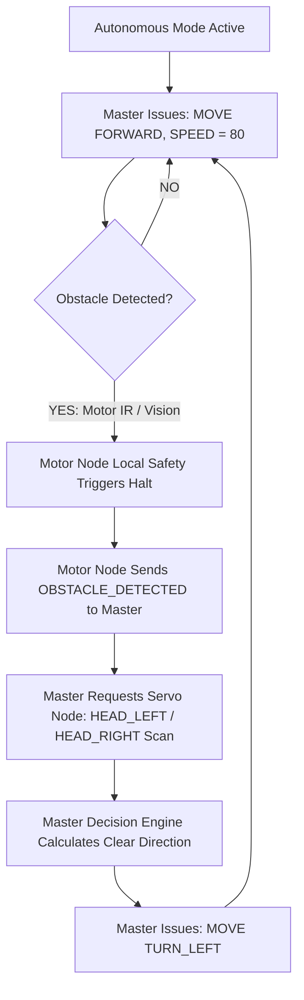

# Autonomous Control System

## Purpose
This document specifies the autonomous decision routines, sensor integration pipelines, and local safety interlocks of the **PRAYAS V1 Humanoid Robot**.

---

## 1. Autonomous Control Architecture

Autonomous routines (obstacle avoidance, environmental monitoring, wander behaviors) execute inside the **Master Control Manager** on the Master ESP32 Node:

```
  SENSORS (IMU / Temp / IR)       VISION SNAPSHOTS
             │                           │
             ▼                           ▼
        SENSOR NODE                   AI NODE
       (Arduino Nano)              (ESP32-S3-CAM)
             │                           │
             └─────────────┬─────────────┘
                           │
                           v
                +---------------------+
                |    PRAYAS MASTER    |
                |  DECISION ENGINE    |
                +----------+----------+
                           │
                        ESP-NOW
                           │
         +-----------------+-----------------+
         │                                   │
         v                                   v
    MOTOR NODE                          SERVO NODE
  (Checks Safety)                    (Head/Arm Trajectories)
```

---

## 2. Sensor Integration Pipeline

| Sensor Hardware | Node | Data Streamed | Purpose in Autonomous Mode |
| :--- | :--- | :--- | :--- |
| **MPU6050 IMU** | Sensor Node (`0x04`) | Pitch, Roll, Yaw rate ($10 \text{ Hz}$) | Tilting/tip-over detection & inclination compensation |
| **DHT11 Sensor** | Sensor Node (`0x04`) | Enclosure Temp & Humidity ($1 \text{ Hz}$) | Thermal protection monitoring |
| **4x E18-D80NK IR** | Motor Node (`0x02`) | Digital Obstacle Trip Flags | Zero-latency local hardware collision prevention |
| **OV2640 Camera** | AI Node (`0x05`) | Visual Q&A / Object Frames | Visual obstacle classification & human detection |

---

## 3. Autonomous Obstacle Avoidance Workflow



---

## 4. Priority & Safety Rules

1. **Lowest Priority Tier**: Autonomous directives operate at **Tier 7 (Lowest)**. Any manual input (Gamepad, Remote, Local Web, or Voice AI) instantly overrides autonomous movement.
2. **Local Safety Enforcement**: Even in autonomous mode, the **Motor Node retains local authority** to halt BTS7960 motor outputs instantly if an IR proximity sensor trips, bypassing any Master decision delays.
