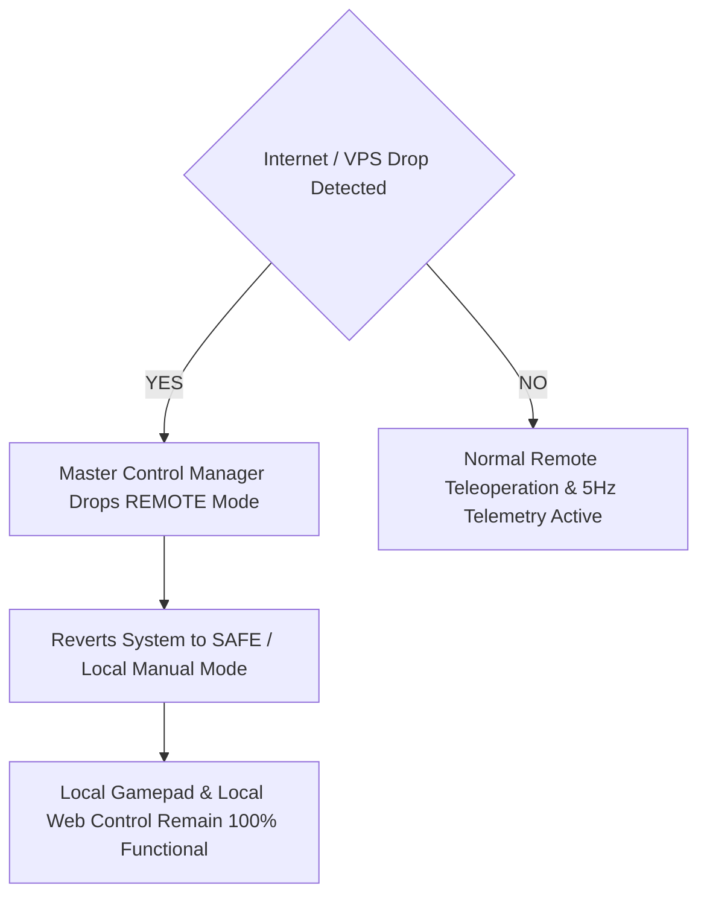

# Remote Internet Control System

## Purpose
This document specifies the remote teleoperation architecture, cloud relay endpoints, command sets, and internet fault isolation mechanisms of the **PRAYAS V1 Humanoid Robot**.

---

## 1. Remote Teleoperation Architecture

Remote internet control allows operators to control PRAYAS from any location globally using an off-robot **Virtual Private Server (VPS)** as a central messaging bridge.

```
REMOTE OPERATOR  --->  INTERNET  --->  VPS BROKER (MQTT)  --->  MASTER ESP32  --->  ESP-NOW  --->  ROBOT NODES
```

### Infrastructure Components
* **Virtual Private Server (VPS)**: Hosts the Mosquitto MQTT Broker (`mqtt.prayas-robotics.org`).
* **MQTTS Protocol**: Port `8883` encrypted via TLS 1.3 to prevent command tampering over public networks.
* **Master Gateway Task**: `vMQTTPoolingTask` running on Core 0 of the Master ESP32.

---

## 2. Remote Command Set

Remote operators issue standardized commands over the `prayas/command/*` MQTT topic namespace:

| Category | Remote Command ID | JSON Payload | Description |
| :--- | :--- | :--- | :--- |
| **Locomotion** | `MOVE` | `{"cmd":"MOVE","dir":"FORWARD","speed":120}` | Base differential drive motion |
| **Locomotion** | `STOP` | `{"cmd":"MOVE","dir":"STOP","speed":0}` | Smooth base deceleration stop |
| **Speed Cap** | `SET_SPEED` | `{"cmd":"SPEED","max_pwm":180}` | Caps max linear speed (default 80% remote max) |
| **Kinematics** | `HEAD_LEFT` | `{"cmd":"GESTURE","action":"HEAD_LEFT"}` | Triggers 2-DOF head pan sequence |
| **Kinematics** | `HEAD_RIGHT`| `{"cmd":"GESTURE","action":"HEAD_RIGHT"}`| Triggers 2-DOF head pan sequence |
| **Kinematics** | `HAND_UP` | `{"cmd":"GESTURE","action":"HAND_UP"}` | Articulates arm raise sequence |
| **Kinematics** | `HAND_DOWN` | `{"cmd":"GESTURE","action":"HAND_DOWN"}` | Articulates arm lower sequence |
| **Safety** | `ESTOP` | `{"cmd":"ESTOP","source":"REMOTE_USER"}` | Instantly cuts motor PWM to 0% |

---

## 3. Disconnection & Offline Fault Isolation

> [!IMPORTANT]
> **Cloud Decoupling Principle**: The VPS/MQTT layer is strictly isolated from critical motor safety loops. If internet access drops or packet latency exceeds $500 \text{ ms}$:



1. **Master Keep-Alive Timeout**: If Master loses MQTT broker heartbeat for $> 15 \text{ seconds}$, it drops `REMOTE` mode.
2. **Local Safety Continues**: Local IR obstacle sensors and Motor Node watchdog timers operate at 100% capacity without internet connection.
