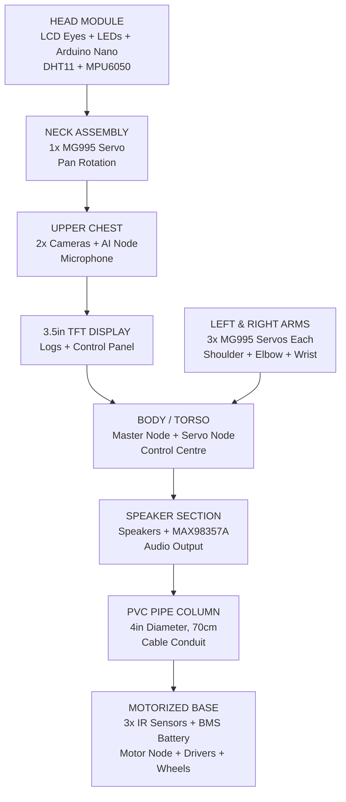
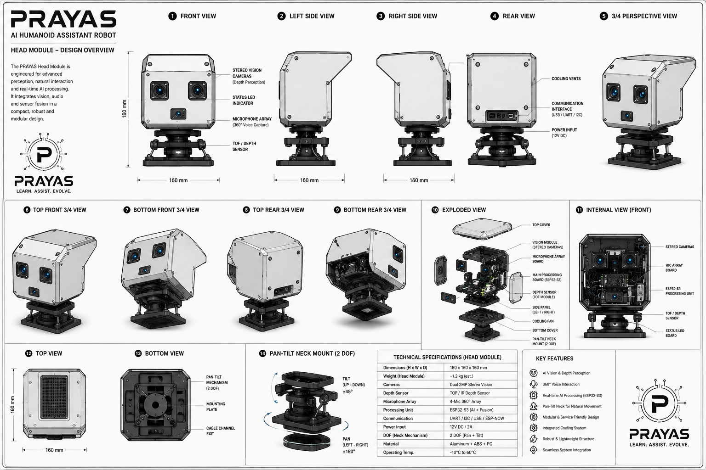
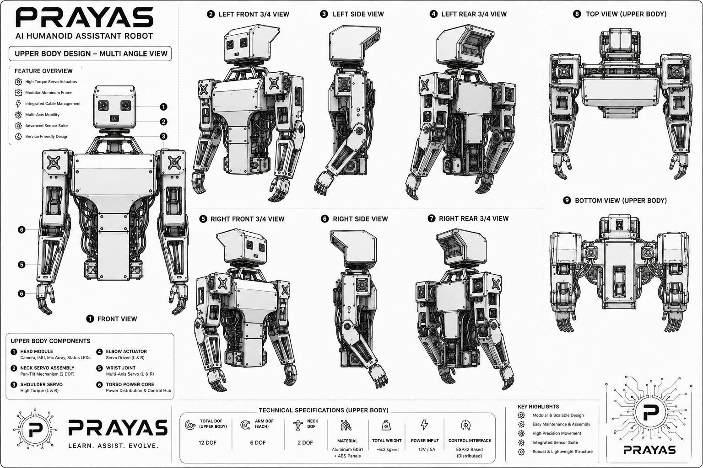
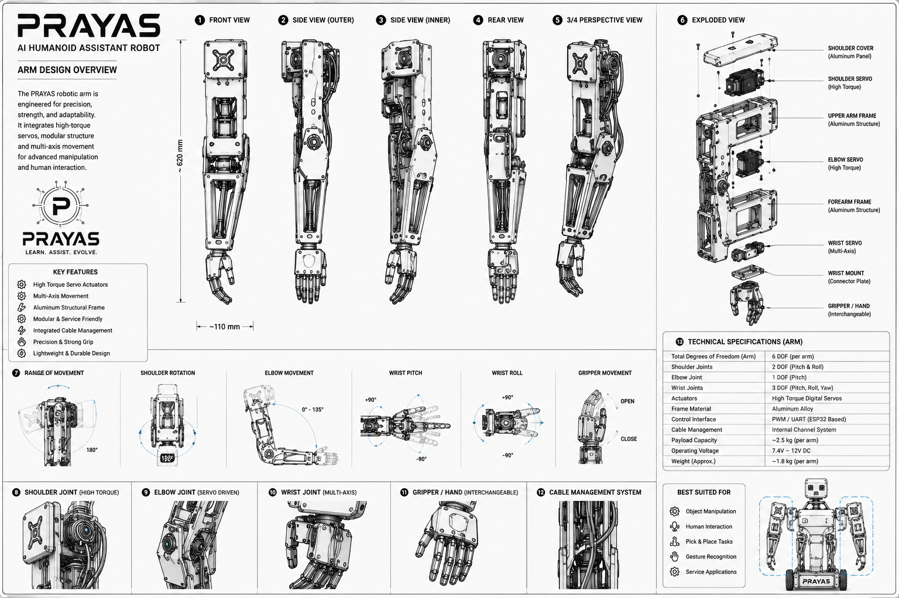
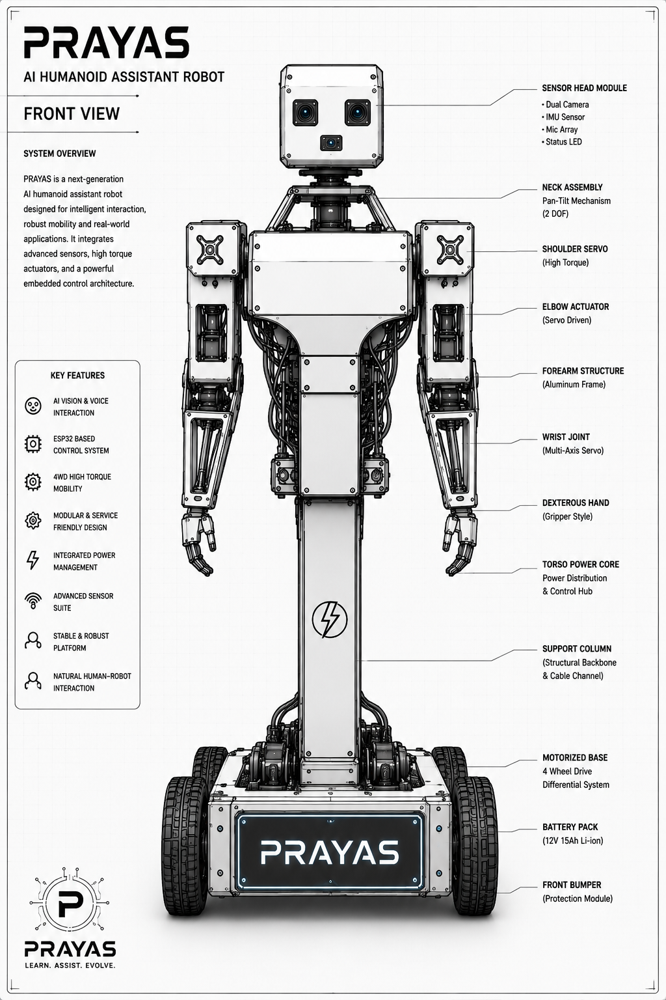
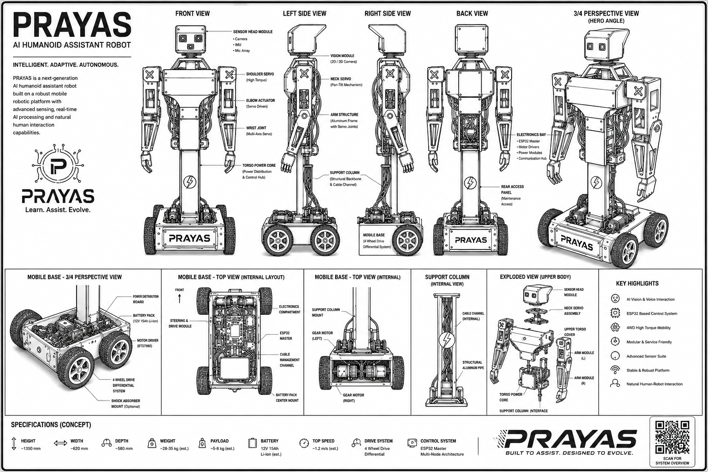

# Robot Layout & Component Placement

## Purpose
This document presents the complete physical layout of the PRAYAS V1 robot, showing where every component, sensor, node, and module is placed within the robot's body. It serves as the primary reference for mechanical assembly, wiring routing, and component installation.

---

## 1. Complete Robot Overview

The PRAYAS robot is divided into three major sections: the **Head**, the **Upper Body** (torso + arms), and the **Motorized Base**. These sections are physically connected by a 4-inch PVC pipe column that also serves as the internal cable conduit.



---

## 2. Head Module

The head module is the topmost section of the robot. It houses the visual expression system, environmental sensors, and the sensor node microcontroller.

{ style="display: block; margin: 0 auto;" width="800" }

### Component Placement

```
┌─────────────────────────────────────────┐
│              HEAD MODULE                 │
│                                          │
│  ┌──────────────────────────────────┐   │
│  │     16x2 LCD DISPLAY (Eyes)      │   │
│  │  ┌──────┐        ┌──────┐       │   │
│  │  │ LEFT │        │RIGHT│        │   │
│  │  │ EYE  │        │ EYE │        │   │
│  │  └──────┘        └──────┘       │   │
│  │  Expressions: Normal, Happy,     │   │
│  │  Surprised, Blinking, Talking    │   │
│  └──────────────────────────────────┘   │
│                                          │
│  ┌──────┐                    ┌──────┐   │
│  │ LEFT │                    │RIGHT│   │
│  │ EAR  │                    │ EAR │   │
│  │ LEDs │                    │ LEDs│   │
│  └──────┘                    └──────┘   │
│                                          │
│  ┌──────────────────────────────────┐   │
│  │       Arduino Nano (Sensor Node) │   │
│  │       MPU6050 (6-axis IMU)       │   │
│  │       DHT11 (Temp + Humidity)    │   │
│  └──────────────────────────────────┘   │
│                                          │
│  ┌──────────────────────────────────┐   │
│  │     Neck Servo Mount (MG995)     │   │
│  └──────────────────────────────────┘   │
└─────────────────────────────────────────┘
```

### Head Components

| Component | Location | Purpose |
| :--- | :--- | :--- |
| **16x2 LCD Display** | Front face | Displays animated eyes with expressions (normal, happy, surprised, blink, talk) |
| **Blinking LEDs (Left Ear)** | Left side | Status indicators, decorative lighting, attention effects |
| **Blinking LEDs (Right Ear)** | Right side | Status indicators, decorative lighting, attention effects |
| **Arduino Nano** | Internal center | Sensor Node MCU — reads IMU and environmental data |
| **MPU6050** | Internal, near COG | 6-axis IMU for tilt detection, stability monitoring, fall detection |
| **DHT11** | Internal, exposed to air | Temperature and humidity monitoring |

### LCD Eye Expressions

| Expression | Display Pattern | When Used |
| :--- | :--- | :--- |
| **Normal** | Two open circles `O O` | Idle state, default |
| **Happy** | Two curved arcs `^ ^` | After successful task completion |
| **Surprised** | Two large circles `@ @` | Obstacle detected, new object in view |
| **Blinking** | Two dashes `- -` | Periodic blink animation (every 3–5 seconds) |
| **Talking** | Animated mouth pattern | During TTS audio playback |
| **Sleepy** | Half-closed eyes `− −` | Low battery or idle timeout |
| **Alert** | Star pattern `* *` | Emergency stop or critical event |

### Ear LED Behavior

| LED State | Pattern | Meaning |
| :--- | :--- | :--- |
| **Solid Blue** | Continuous | Wi-Fi connected, system normal |
| **Blinking Blue** | 1 Hz blink | Connecting to network |
| **Solid Green** | Continuous | AI voice assistant active |
| **Blinking Green** | 2 Hz blink | Listening for wake word |
| **Solid Red** | Continuous | Error or fault detected |
| **Blinking Red** | Fast blink | Emergency stop triggered |
| **Off** | No light | Power off or standby |

---

## 3. Neck Assembly

The neck assembly connects the head to the upper chest and provides pan (left-right) rotation.

```
         HEAD MODULE
              │
    ┌─────────┴─────────┐
    │   Neck Servo      │
    │   MG995 (Pan)     │
    │   Range: ±90°      │
    │   Pan Left/Right   │
    └─────────┬─────────┘
              │
       UPPER CHEST
```

| Component | Specification | Function |
| :--- | :--- | :--- |
| **Neck Servo** | MG995, 180° rotation | Rotates the head left and right for scanning, tracking, and gesturing |

---

## 4. Upper Chest Section

The upper chest houses the vision system, AI processing node, and voice input system. This section has separated internal compartments for thermal isolation and cable management.

{ style="display: block; margin: 0 auto;" width="800" }

### Component Placement

```
┌──────────────────────────────────────────────────┐
│                UPPER CHEST                        │
│                                                   │
│  ┌────────────────┐    ┌────────────────┐        │
│  │  ESP32-CAM     │    │ ESP32-S3 CAM   │        │
│  │  (Camera Node) │    │  (AI Node)     │        │
│  │  OV2640 Sensor │    │  OV2640 Camera │        │
│  │                │    │  SPI TFT Disp  │        │
│  │  Purpose:      │    │  Purpose:      │        │
│  │  Live Video    │    │  Xiaozhi AI &  │        │
│  │  Streaming     │    │  Face Screen UI│        │
│  └────────────────┘    └────────────────┘        │
│                                                   │
│  ┌──────────────────────────────────────────┐    │
│  │         SPI TFT Display (2.4" ST7789)    │    │
│  │   [Face Expressions & Voice AI UI]       │    │
│  └──────────────────────────────────────────┘    │
│                                                   │
│  ┌──────────────────────────────────────────┐    │
│  │         Sensor Node I2C LCD (20x4)       │    │
│  │   [GPS Coordinates, IMU, Temp & Humid]   │    │
│  └──────────────────────────────────────────┘    │
└──────────────────────────────────────────────────┘
```

### Upper Chest Components

| Component | Location | Purpose |
| :--- | :--- | :--- |
| **ESP32-CAM** | Left chest compartment | Dedicated live video streaming to web dashboard (12–15 fps MJPEG) |
| **ESP32-S3 CAM** | Right chest compartment | AI Node — Xiaozhi AI voice processing, SPI display driver, snapshot vision |
| **2.4" SPI TFT Display** | Upper head/chest center | Renders animated facial expressions, speech visualizer, and connection UI |
| **20x4 I2C LCD Display** | Lower chest / chassis | Local character LCD showing real-time GPS position, pitch/roll, and temp/humidity |
| **GPS Module (NEO-6M)** | Top neck / upper deck | Active patch antenna mounted for clear sky line-of-sight satellite reception |
| **MPU6050 IMU** | Center of Gravity (COG) | 6-axis accelerometer/gyroscope for tilt and fall detection |
| **Humidity Sensor** | Front chassis, ventilated | Measures ambient air temperature and relative humidity |

### AI Status LED Behavior

The three LEDs provide immediate visual feedback about the AI Node's current state during a voice interaction cycle:

```
  User Says Wake Word
         │
         ▼
  ┌──────────────┐
  │  LED 1: BLUE │  ◄── LISTENING (Active)
  │  LED 2: OFF  │
  │  LED 3: OFF  │
  └──────┬───────┘
         │  AI is capturing voice audio
         ▼
  ┌──────────────┐
  │  LED 1: OFF  │
  │  LED 2: AMBER│  ◄── THINKING (Active)
  │  LED 3: OFF  │
  └──────┬───────┘
         │  LLM is generating response
         ▼
  ┌──────────────┐
  │  LED 1: OFF  │
  │  LED 2: OFF  │
  │  LED 3: GREEN│  ◄── SPEAKING (Active)
  └──────┬───────┘
         │  TTS audio is playing
         ▼
  ┌──────────────┐
  │  LED 1: OFF  │
  │  LED 2: OFF  │
  │  LED 3: OFF  │  ◄── IDLE (All Off)
  └──────────────┘
```

| LED | Color | Active State | GPIO Pin | Meaning |
| :--- | :--- | :--- | :--- | :--- |
| **AI LED 1** | Blue | Solid ON | GPIO D0 | AI is listening — wake word detected, microphone streaming active |
| **AI LED 2** | Amber | Solid ON | GPIO D1 | AI is thinking — speech sent to cloud, waiting for LLM response |
| **AI LED 3** | Green | Pulsing ON | GPIO D2 | AI is speaking — TTS audio streaming back through speaker |

> [!NOTE]
> **LED Wiring**: Each LED is wired with a 220Ω current-limiting resistor in series. The anode (+) connects to the ESP32-S3 CAM GPIO pin, and the cathode (−) connects to GND. When the GPIO pin is set HIGH, the LED glows; when LOW, the LED turns off.

> [!IMPORTANT]
> **Thermal Isolation**: The ESP32-CAM and ESP32-S3 CAM are placed in separate compartments to prevent combined heat buildup. Each compartment should have ventilation slots on the rear panel.

---

## 5. Display Section (Below Upper Chest)

A 3.5-inch TFT display is mounted below the upper chest, facing sideways, providing real-time logs and manual control interface.

```
       UPPER CHEST
            │
  ┌─────────┴─────────┐
  │                   │
  │  3.5in TFT        │
  │  DISPLAY          │
  │  (Side-Facing)    │
  │                   │
  │  Shows:           │
  │  - System Logs    │
  │  - Sensor Data    │
  │  - Battery Status │
  │  - Manual Controls│
  │  - Mode Selector  │
  │                   │
  └─────────┬─────────┘
            │
       BODY / TORSO
```

| Component | Location | Purpose |
| :--- | :--- | :--- |
| **3.5" TFT Display** | Side-facing, below upper chest | Real-time system logs, sensor telemetry, manual control buttons, battery status, mode selection |

---

## 6. Arms (Left & Right)

Each arm has 3 MG995 servos providing shoulder pitch, shoulder roll/abduction, and elbow pitch articulation. The servos are mounted at three key joints along the arm, extending downward from the body.

{ style="display: block; margin: 0 auto;" width="800" }

### Arm Layout (Front View)

```
                        -------------------
                        |     BODY        |
                        |    (Torso)      |
                        |                 |
          J1 (Body) |---| 1             1 |---| J1 (Body)
                    │                         │
          J2 (Roll) 2                         2 J2 (Roll)
                    │                         │
                    │                         │
                    │ Upper Arm               │ Upper Arm
                    │ (250mm)                 │ (250mm)
                    │                         │
                    │                         │
         J3 (Elbow) 3                         3 J3 (Elbow)
                    │                         │
                    │ Forearm                 │ Forearm
                    │ (220mm)                 │ (220mm)
                    │                         │
                    ▼                         ▼
                  Hand                      Hand
```

### Servo Mounting PositionsP

| Position | Servo | Joint | Mounted On | Connects To |
| :--- | :--- | :--- | :--- | :--- |
| **1** | Servo 1 / 4 | Shoulder Pitch (J1) | Inside body torso | Shoulder Outer Bracket |
| **2** | Servo 2 / 5 | Shoulder Roll (J2) | Shoulder Outer Bracket | Upper Arm |
| **3** | Servo 3 / 6 | Elbow Pitch (J3) | Upper Arm end | Forearm |

### Arm Servo Allocation

| Servo | Joint | Range | Function |
| :--- | :--- | :--- | :--- |
| **Left Servo 1** | Left Shoulder Pitch (J1) | $-45^\circ$ to $+180^\circ$ | Rotates arm forward and backward |
| **Left Servo 2** | Left Shoulder Roll (J2) | $0^\circ$ to $+90^\circ$ | Rotates arm outward (abduction) |
| **Left Servo 3** | Left Elbow Pitch (J3) | $0^\circ$ to $+135^\circ$ | Bends and extends the forearm |
| **Right Servo 4** | Right Shoulder Pitch (J1) | $-45^\circ$ to $+180^\circ$ | Rotates arm forward and backward |
| **Right Servo 5** | Right Shoulder Roll (J2) | $0^\circ$ to $+90^\circ$ | Rotates arm outward (abduction) |
| **Right Servo 6** | Right Elbow Pitch (J3) | $0^\circ$ to $+135^\circ$ | Bends and extends the forearm |


---

## 7. Body / Torso (Control Centre)

The main torso body houses the control centre — the Master Node and Servo Node that coordinate all robot operations.

```
┌──────────────────────────────────────────┐
│           BODY / TORSO                    │
│                                           │
│  ┌────────────────────────────────────┐  │
│  │         MASTER NODE                │  │
│  │    ESP32-WROOM-32E                 │  │
│  │    - MQTT Command Processing       │  │
│  │    - ESP-NOW Routing               │  │
│  │    - Heartbeat Broadcast           │  │
│  │    - Wi-Fi / Dashboard Connection  │  │
│  └────────────────────────────────────┘  │
│                                           │
│  ┌────────────────────────────────────┐  │
│  │         SERVO NODE                 │  │
│  │    ESP32-WROOM-32E                 │  │
│  │    PCA9685 I2C PWM Driver          │  │
│  │    - 7x Servo Control              │  │
│  │    - Gesture Engine                │  │
│  │    - Motion Profiling              │  │
│  └────────────────────────────────────┘  │
│                                           │
│  ┌────────────────────────────────────┐  │
│  │      Power Distribution Board      │  │
│  │    - 6V Buck (Servo Rail)          │  │
│  │    - 5V Buck (Logic Rail)          │  │
│  │    - Fuse Block                    │  │
│  └────────────────────────────────────┘  │
└──────────────────────────────────────────┘
```

### Control Centre Components

| Component | Location | Purpose |
| :--- | :--- | :--- |
| **Master Node (ESP32)** | Upper torso, center | Central coordinator — connects to all sub-nodes via ESP-NOW, cloud via MQTT |
| **Servo Node (ESP32)** | Upper torso, center | Joint controller — drives PCA9685 for all 7 servos via I2C |
| **PCA9685** | Upper torso, near servos | 16-channel I2C PWM driver for servo control |
| **Power Distribution Board** | Lower torso | Voltage regulation, fuse protection, power routing |

---

## 8. Speaker Section (Below Chest)

The speaker section is mounted below the main chest area, providing audio output for the voice assistant.

```
       BODY / TORSO
            │
  ┌─────────┴─────────┐
  │   SPEAKER SECTION  │
  │                    │
  │  ┌──────────────┐ │
  │  │ MAX98357A    │ │
  │  │ I2S DAC +    │ │
  │  │ Class-D Amp  │ │
  │  └──────┬───────┘ │
  │         │          │
  │  ┌──────┴───────┐ │
  │  │  Speaker 1   │ │
  │  │  (8ohm, 3W)  │ │
  │  └──────────────┘ │
  │  ┌──────────────┐ │
  │  │  Speaker 2   │ │
  │  │  (8ohm, 3W)  │ │
  │  └──────────────┘ │
  └─────────┬─────────┘
            │
       PVC PIPE
```

| Component | Location | Purpose |
| :--- | :--- | :--- |
| **MAX98357A** | Internal, below chest | I2S DAC + Class-D amplifier — converts digital audio to analog speaker output |
| **Speaker (Left)** | Front-left, below chest | Audio output for TTS responses and voice assistant feedback |
| **Speaker (Right)** | Front-right, below chest | Stereo audio output |

---

## 9. PVC Pipe Column

The 4-inch PVC pipe connects the upper body to the motorized base and serves as the structural backbone and internal cable conduit.

```
     SPEAKER SECTION
          │
  ┌───────┴───────┐
  │               │
  │   4-inch PVC  │
  │   Pipe        │
  │   70cm tall   │
  │               │
  │   Internal:   │
  │   - Power     │
  │     Wiring    │
  │   - Signal    │
  │     Cables    │
  │   - UART      │
  │     (Nano→ESP)│
  │   - I2C Bus   │
  │               │
  │               │
  └───────┬───────┘
          │
    MOTORIZED BASE
```

| Parameter | Specification |
| :--- | :--- |
| **Material** | Schedule 40 PVC |
| **Diameter** | 4 inches (100 mm) |
| **Height** | 70 cm |
| **Internal Space** | Cable routing, airflow |
| **Connection (Top)** | 3D-printed shoulder adapter, bolted |
| **Connection (Bottom)** | PVC floor flange, M5 bolts to plywood base |

---

## 10. Motorized Base

The motorized base houses the drivetrain, battery system, obstacle avoidance sensors, and the Motor Node.

{ style="display: block; margin: 0 auto;" width="800" }

### Base Layout (Top View)

```
┌──────────────────────────────────────────────────┐
│                 MOTORIZED BASE                    │
│                   (Top View)                      │
│                                                   │
│   FRONT                                           │
│   ┌──────────────────────────────────────────┐   │
│   │  [IR-L]        [IR-C]        [IR-R]     │   │
│   │  Front-Left    Front-Center  Front-Right │   │
│   │  IR Sensor     IR Sensor     IR Sensor   │   │
│   └──────────────────────────────────────────┘   │
│                                                   │
│   ┌────────────┐                ┌────────────┐   │
│   │   MOTOR    │                │   MOTOR    │   │
│   │   NODE     │                │   DRIVER   │   │
│   │   ESP32    │                │  BTS7960   │   │
│   │            │                │  (Left)    │   │
│   └────────────┘                └────────────┘   │
│                                                   │
│   ┌────────────┐                ┌────────────┐   │
│   │   MOTOR    │                │   MOTOR    │   │
│   │   DRIVER   │                │   BATTERY  │   │
│   │  BTS7960   │                │   PACK     │   │
│   │  (Right)   │                │   3S 6800  │   │
│   └────────────┘                │   mAh      │   │
│                                  └────────────┘   │
│   ┌──────────────────────────────────────────┐   │
│   │         Power Distribution Board          │   │
│   │    Buck 6V (Servo)  |  Buck 5V (Logic)  │   │
│   │    Fuse Block       |  Power Switch      │   │
│   └──────────────────────────────────────────┘   │
│                                                   │
│   ┌──────┐                        ┌──────┐      │
│   │LEFT  │                        │RIGHT │      │
│   │MOTOR │                        │MOTOR │      │
│   │(Front│                        │(Front│      │
│   │+Rear)│                        │+Rear)│      │
│   └──────┘                        └──────┘      │
│                                                   │
│   ┌──────────────────────────────────────────┐   │
│   │         REAR ACCESS PANEL                 │   │
│   │    (Maintenance & Battery Access)         │   │
│   └──────────────────────────────────────────┘   │
└──────────────────────────────────────────────────┘
```

### Base Components

| Component | Location | Purpose |
| :--- | :--- | :--- |
| **Motor Node (ESP32)** | Front-left, internal | Differential drive control, reads IR sensors, manages motor PWM |
| **BTS7960 Driver (Left)** | Left side, internal | Drives left front + left rear motors |
| **BTS7960 Driver (Right)** | Right side, internal | Drives right front + right rear motors |
| **IR Sensor (Front-Left)** | Front bumper, angled -30° | Obstacle detection — left zone |
| **IR Sensor (Front-Center)** | Front bumper, center | Obstacle detection — center zone |
| **IR Sensor (Front-Right)** | Front bumper, angled +30° | Obstacle detection — right zone |
| **3S Battery Pack** | Center-low, internal | 12V power source (6800mAh Li-ion) |
| **BMS** | On battery pack | Over-charge, over-discharge, over-current protection |
| **Power Distribution Board** | Rear, internal | Voltage regulation and power routing |

### Base Motor Layout (Differential Drive)

```
        FRONT
    ┌──────────────┐
    │  [IR-L] [IR-C] [IR-R]  │
    │                          │
    │  ┌──────┐    ┌──────┐  │
    │  │MOTOR │    │MOTOR │  │
    │  │ L-FR │    │ R-FR │  │
    │  └──────┘    └──────┘  │
    │                          │
    │       [BATTERY]         │
    │       [MOTOR NODE]      │
    │       [BTS7960 L/R]     │
    │                          │
    │  ┌──────┐    ┌──────┐  │
    │  │MOTOR │    │MOTOR │  │
    │  │ L-RR │    │ R-RR │  │
    │  └──────┘    └──────┘  │
    │                          │
    └──────────────┘
        REAR

    Left Group: L-FR + L-RR (parallel)
    Right Group: R-FR + R-RR (parallel)
    Steering: Differential (left/right speed difference)
```

---

## 11. Complete Assembly Stack (Side View)

```
┌─────────────────────────────┐
│      HEAD MODULE             │  ← LCD Eyes, LEDs, Arduino Nano
│      (16x2 LCD + LEDs)      │     MPU6050, DHT11
├─────────────────────────────┤
│      NECK SERVO              │  ← MG995 (Pan ±90°)
├─────────────────────────────┤
│      UPPER CHEST             │  ← ESP32-CAM, ESP32-S3 CAM
│      (2 Cameras + AI + Mic) │     INMP441 Microphone
├─────────────────────────────┤
│      TFT DISPLAY             │  ← 3.5" TFT (Logs + Controls)
├─────────────────────────────┤
│      LEFT ARM    │ RIGHT ARM │  ← 3x MG995 each
│      (S+E+W)     │ (S+E+W)  │     Shoulder + Elbow + Wrist
├─────────────────────────────┤
│      BODY / TORSO            │  ← Master Node (ESP32)
│      (Control Centre)        │     Servo Node (ESP32)
│                             │     PCA9685
├─────────────────────────────┤
│      SPEAKER SECTION         │  ← MAX98357A + 2x Speakers
├─────────────────────────────┤
│      PVC PIPE COLUMN         │  ← 4" PVC, 70cm
│      (Cable Conduit)         │     Internal wiring
├─────────────────────────────┤
│      MOTORIZED BASE          │  ← 3x IR Sensors
│      (Drivetrain)            │     Motor Node (ESP32)
│                             │     2x BTS7960 Drivers
│                             │     Battery + BMS
│                             │     4x Motors + Wheels
└─────────────────────────────┘
```

---

## 12. Component Count Summary

| Section | Key Components | Total Items |
| :--- | :--- | :---: |
| **Head** | Arduino Nano, GPS, MPU6050, Humidity, LCD Display | 6 |
| **Neck** | MG995 Servo | 1 |
| **Upper Chest** | ESP32-CAM, ESP32-S3 CAM, SPI TFT, INMP441 Mic | 6 |
| **Display** | 3.5" TFT Display | 1 |
| **Arms** | 6x MG995 Servos | 6 |
| **Torso** | Master ESP32, Servo ESP32, PCA9685 | 3 |
| **Speakers** | MAX98357A, 2x Speakers | 3 |
| **Base** | Motor ESP32, 2x BTS7960, 3x IR, Battery, 4x Motors | 11 |
| | | |
| **Total** | | **37** |

---

## 13. Illustration Gallery

### Full Robot Views

{ style="display: block; margin: 0 auto;" width="800" }

*PRAYAS V1 — Front View, Left Side, Back View, and 3/4 Perspective*

### Front View

{ style="display: block; margin: 0 auto;" width="800" }

*PRAYAS V1 — Front View with all component labels and key features*

### Head Module

{ style="display: block; margin: 0 auto;" width="800" }

*Head Module — Front, Side, Rear, Exploded, and Internal Views*

### Upper Body

{ style="display: block; margin: 0 auto;" width="800" }

*Upper Body — 9 views including front, sides, rear, top, and bottom*

### Combined Assembly

{ style="display: block; margin: 0 auto;" width="800" }

*PRAYAS V1 — Complete assembly from all angles with base and support column*
