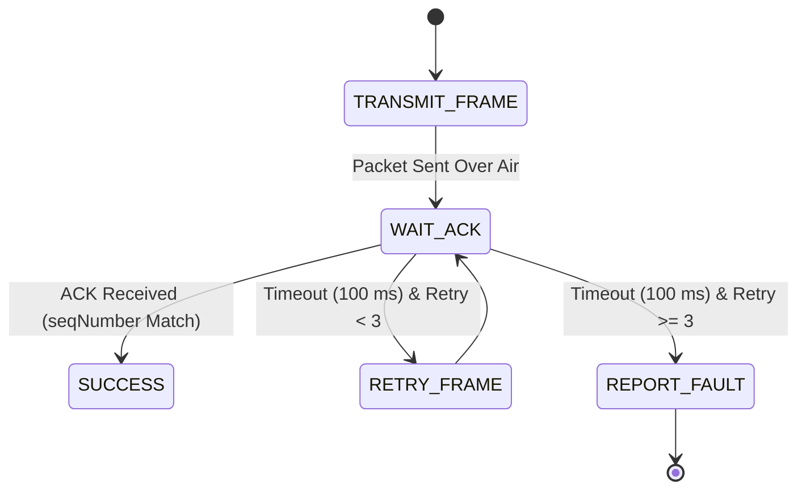

# ESP-NOW Direct Peer-to-Peer Protocol

## Purpose
This document specifies the implementation, packet frame structure, node addressing, and operational parameters of the **ESP-NOW communication protocol** used as the primary low-latency internal network for the **PRAYAS V1 Humanoid Robot**.

---

## 1. Protocol Architecture & Characteristics

ESP-NOW is a connectionless, peer-to-peer 2.4 GHz wireless communication protocol developed by Espressif, operating directly on the IEEE 802.11 MAC/physical layer without requiring Wi-Fi access point association or internet connectivity.

| Parameter | Specification | Engineering Rationale |
| :--- | :--- | :--- |
| **Protocol Type** | Direct 802.11 Action Frame MAC Layer | Eliminates TCP/IP handshake overhead and routing delays |
| **Operating Frequency** | 2.4 GHz ISM Band | Fixed Wi-Fi Channel 6 ($2437 \text{ MHz}$) to prevent channel hopping |
| **Transmission Latency** | $< 5 \text{ ms}$ (Master $\leftrightarrow$ Node) | Guarantees deterministic real-time motor and servo control loops |
| **Max Payload Size** | $250 \text{ Bytes}$ per packet frame | Fits all `PRAYAS_Packet_t` control and telemetry payloads |
| **Security / Encryption** | Primary Master key CCMP encryption | Prevents unauthorized spoofing of motor/servo drive signals |
| **Router Dependency** | **NONE** (Zero Cloud / AP Dependency) | Robot remains 100% operational during internet/Wi-Fi outages |

---

## 2. Target Peer Links

ESP-NOW forms the internal "nervous system" linking the **PRAYAS Master ESP32** to all subsystem controllers:

```
                         +-----------------------+
                         |     PRAYAS MASTER     |
                         |        (0x01)         |
                         +-----------+-----------+
                                     |
                                  ESP-NOW
                    (Fixed Ch 6 / Latency < 5ms)
                                     |
          +--------------------------+--------------------------+
          |                          |                          |
          v                          v                          v
  +---------------+          +---------------+          +---------------+
  |  MOTOR NODE   |          |  SERVO NODE   |          |    AI NODE    |
  |    (0x02)     |          |    (0x03)     |          |    (0x05)     |
  +---------------+          +---------------+          +---------------+
```

* **Master Node (`0x01`) $\leftrightarrow$ Motor Node (`0x02`)**: Drives 4WD locomotion, speed targets, and obstacle statuses.
* **Master Node (`0x01`) $\leftrightarrow$ Servo Node (`0x03`)**: Transmits pose IDs and multi-step workflow execution commands.
* **Master Node (`0x01`) $\leftrightarrow$ AI Node (`0x05`)**: Receives natural language intent commands parsed by Xiaozhi AI framework.

---

## 3. Node Identification Mapping

Every ESP-NOW packet contains explicit source and destination identifiers to ensure deterministic routing:

| Node Name | Controller Hardware | Unique Node ID | MAC Address Filter |
| :--- | :--- | :--- | :--- |
| **MASTER** | ESP32 DevKitC v4 | `0x01` | `24:6F:28:XX:XX:01` |
| **MOTOR** | ESP32 DevKitC v4 | `0x02` | `24:6F:28:XX:XX:02` |
| **SERVO** | ESP32 DevKitC v4 | `0x03` | `24:6F:28:XX:XX:03` |
| **SENSOR** | Arduino Nano (via Serial Bridge) | `0x04` | Routed via Master UART |
| **AI** | ESP32-S3-CAM | `0x05` | `24:6F:28:XX:XX:05` |
| **DISPLAY** | Master Integrated Status OLED | `0x06` | Internal Master I2C |

---

## 4. Shared Binary C-Struct Frame Layout

All ESP-NOW nodes utilize a packed, standardized C-struct byte layout to prevent memory alignment padding and minimize processing overhead:

```c
#ifndef PRAYAS_ESP_NOW_PROTOCOL_H
#define PRAYAS_ESP_NOW_PROTOCOL_H

#include <stdint.h>

// Standard Node Identifiers
#define NODE_ID_MASTER   0x01
#define NODE_ID_MOTOR    0x02
#define NODE_ID_SERVO    0x03
#define NODE_ID_SENSOR   0x04
#define NODE_ID_AI       0x05
#define NODE_ID_DISPLAY  0x06

// Command Identifiers
typedef enum {
    CMD_HEARTBEAT       = 0x01,
    CMD_MOVE            = 0x02,
    CMD_SERVO_POSE      = 0x03,
    CMD_SERVO_WORKFLOW  = 0x04,
    CMD_SENSOR_TELEMETRY= 0x05,
    CMD_MODE_CHANGE     = 0x06,
    CMD_ESTOP           = 0xFF
} PrayasCommand_t;

// ESP-NOW Shared Binary Packet Layout
typedef struct __attribute__((packed)) {
    uint8_t  sourceID;       // Sender Node ID (0x01 - 0x06)
    uint8_t  destID;         // Target Node ID (0x01 - 0x06)
    uint8_t  commandID;      // Command Enumeration (PrayasCommand_t)
    uint8_t  modeID;         // Active System Mode (MANUAL, VOICE, etc.)
    uint8_t  seqNumber;      // Monotonically increasing sequence counter
    uint8_t  payloadLen;     // Byte length of active payload (0–64)
    uint8_t  payload[64];    // Raw Command / Sensor Data Payload
    uint16_t checksum;       // CRC16 Data Integrity Checksum
} PRAYAS_Packet_t;

#endif // PRAYAS_ESP_NOW_PROTOCOL_H
```

---

## 5. Transmission Verification & Retry Logic

ESP-NOW operates without persistent connections. To ensure reliable packet delivery for critical commands (e.g. gesture triggers, mode switches), the Master Node employs a confirmation and retry sequence:



* **ACK Timeout**: $100 \text{ ms}$.
* **Max Retry Attempts**: $3$ attempts before marking peer node `OFFLINE`.

---

## 6. Watchdog & Fail-Safe Interlocks

1. **Periodic Heartbeat**: Every node broadcasts a $10 \text{ Hz}$ (`CMD_HEARTBEAT`) frame to the Master Node.
2. **Master Timeout**: If Master loses heartbeat packets from a node for $> 500 \text{ ms}$, the node state transitions to `OFFLINE`.
3. **Local Motor Watchdog**: The Motor Node runs a hardware timer that automatically halts all BTS7960 motor outputs if valid commands/heartbeats are absent for $> 300 \text{ ms}$.
