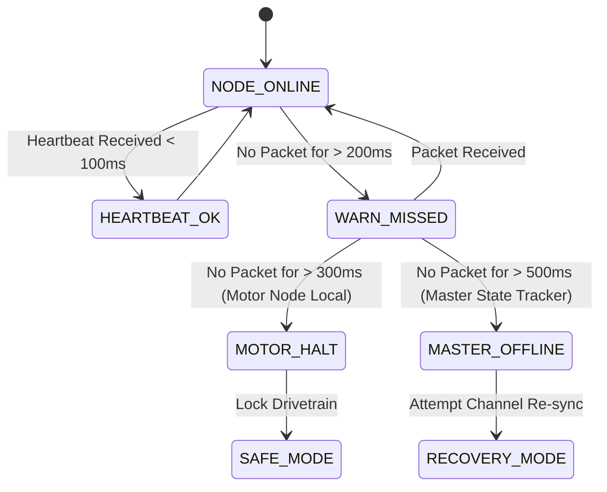

# Heartbeat & Safety Watchdog Timers

## Purpose
This document details the periodic heartbeat signalling mechanism, timeout thresholds, and local hardware watchdog timers used to detect communication loss and automatically trigger safety halts across the **PRAYAS V1 Humanoid Robot**.

---

## 1. Multi-Tier Watchdog Architecture

To prevent runaway robot conditions caused by radio interference, firmware hangs, or lost wireless frames, PRAYAS enforces safety watchdogs at two distinct system levels:

```
[MASTER ESP32 NODE]  <---(10Hz Heartbeats)--->  [SUBSYSTEM NODES (Motor, Servo, AI)]
        |                                                 |
  Monitors Node Health                             Independent Local
  (Timeout: 500 ms)                                Hardware Watchdog
        |                                          (Timeout: 300 ms)
        v                                                 v
Mark Node OFFLINE                                 Instant Motor Halt (PWM 0%)
```

---

## 2. Heartbeat Specifications

| Parameter | Specification | Rationale |
| :--- | :--- | :--- |
| **Heartbeat Frequency** | $10 \text{ Hz}$ ($100 \text{ ms}$ interval) | Provides rapid connection state feedback without saturating 2.4 GHz channel |
| **Packet Command ID** | `CMD_HEARTBEAT` (`0x01`) | Light-weight 8-byte payload frame |
| **Master Node Timeout** | $500 \text{ ms}$ (5 missed heartbeats) | Master flags target node `OFFLINE` and notifies web telemetry |
| **Motor Node Watchdog** | $300 \text{ ms}$ (3 missed heartbeats) | **Local Hardware Halt**: Instantly disables BTS7960 motor drivers |

---

## 3. Motor Node Local Hardware Watchdog

> [!CAUTION]
> The Motor Node's safety watchdog executes locally on Core 1 of the Motor ESP32. It operates independently of Wi-Fi routers, cloud VPS servers, or Master Node processing state.

```c
// Motor Node FreeRTOS Watchdog Task Execution
void vSafetyWatchdogTask(void *pvParameters) {
    TickType_t lastValidPacketTime = xTaskGetTickCount();
    
    for (;;) {
        // Check time elapsed since last valid ESP-NOW command or heartbeat
        if ((xTaskGetTickCount() - lastValidPacketTime) > pdMS_TO_TICKS(300)) {
            // EMERGENCY SAFETY HALT
            ledcWrite(PWM_LEFT_CHANNEL, 0);
            ledcWrite(PWM_RIGHT_CHANNEL, 0);
            digitalWrite(BTS7960_R_EN, LOW);
            digitalWrite(BTS7960_L_EN, LOW);
            
            systemState = STATE_SAFE_HALT;
        }
        vTaskDelay(pdMS_TO_TICKS(50)); // Poll at 20 Hz
    }
}
```

---

## 4. Heartbeat State Machine



---

## 5. Fail-Safe Recovery Behavior

When a disconnected node re-establishes communication:
1. Node sends 3 consecutive `CMD_HEARTBEAT` frames with valid CRC16 checksums.
2. Master Node clears `OFFLINE` flag and updates telemetry dashboard.
3. Node state transitions from `SAFE` to `MANUAL` only after explicit command clearance from Master Control Manager.
