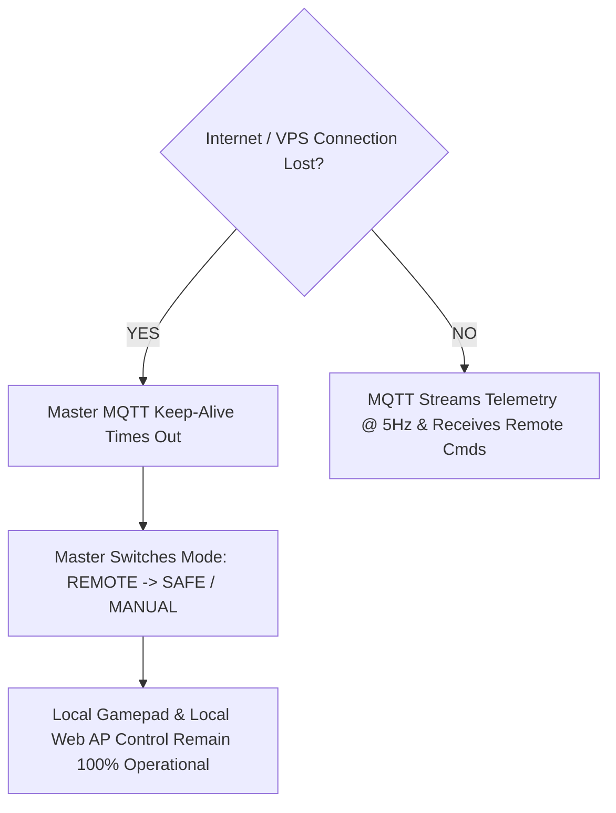

# MQTT Broker & Cloud Integration

## Purpose
This document specifies the cloud infrastructure, publish/subscribe topic structure, Quality of Service (QoS) mappings, and remote messaging paradigms for the **MQTT (Message Queuing Telemetry Transport)** communication layer in the **PRAYAS V1 Humanoid Robot**.

---

## 1. Role in Architecture

MQTT serves as the internet-facing messaging layer bridging off-robot cloud services, web applications, and remote operators with the **PRAYAS Master ESP32**.

```
REMOTE BROWSER / APP  --->  HTTPS / WSS  --->  CLOUD VPS SERVER  --->  MQTT BROKER  --->  MASTER ESP32  --->  ESP-NOW  ---> NODES
```

> [!IMPORTANT]
> **Safety Loop Decoupling**: The MQTT broker and Cloud VPS are explicitly excluded from the robot's real-time motor safety loop. If internet connectivity drops or latency spikes, the Master ESP32 and Motor Node local hardware safety mechanisms continue operating without interruption.

---

## 2. Infrastructure & Broker Parameters

| Parameter | Configuration / Specification | Description |
| :--- | :--- | :--- |
| **Broker Endpoint** | `mqtt.prayas-robotics.org` | Virtual Private Server (VPS) hosted Mosquitto MQTT Broker |
| **Non-TLS Port** | `1883` | Unencrypted TCP (restricted to local testing) |
| **TLS/SSL Port** | `8883` | MQTTS encrypted via TLS 1.3 for secure internet teleoperation |
| **Keep-Alive Interval**| $15 \text{ seconds}$ | Maximum allowed silence threshold before LWT trigger |
| **Last Will & Testament**| Topic: `prayas/status/master` | Payload: `{"status":"OFFLINE","reason":"Connection Lost"}` |

---

## 3. Topic Hierarchy & Payload Schemas

PRAYAS organizes remote telemetry and command channels into a structured, namespaced topic tree:

| MQTT Topic | Direction | QoS | Payload Type | Description |
| :--- | :---: | :---: | :--- | :--- |
| `prayas/telemetry/state` | Publish | QoS 0 | JSON | Real-time battery, IMU, enclosure temp, and node health ($5 \text{ Hz}$) |
| `prayas/command/move` | Subscribe | QoS 1 | JSON | Base locomotion directional requests (`FORWARD`, `LEFT`, `SPEED`) |
| `prayas/command/gesture` | Subscribe | QoS 1 | JSON | Kinematic pose & workflow triggers (`HAND_DOWN`, `WAVE`, `GREETING`) |
| `prayas/command/estop` | Subscribe | QoS 1 | JSON | Supreme emergency stop override command |
| `prayas/status/alerts` | Publish | QoS 1 | JSON | Asynchronous system warnings (Obstacle Trip, Over-Current, Low Battery) |
| `prayas/config/update` | Subscribe | QoS 1 | JSON | Remote configuration updates and parameter tuning |

---

## 4. End-to-End Control Flow Example

When a remote user presses "Forward" on a web dashboard located across the internet:

```
[REMOTE WEB APP] User presses Joystick "FORWARD"
       |
       v  (HTTPS / WSS Payload)
[CLOUD VPS] Translates event to JSON
       |
       v  (Publish to MQTT Topic: prayas/command/move, Payload: {"cmd":"MOVE","dir":"FORWARD","speed":120})
[MQTT BROKER] Relays packet to subscribed client
       |
       v
[PRAYAS MASTER ESP32] MQTTPoolingTask receives payload -> Normalizes into PRAYAS_Command_t
       |
       v
[MASTER CONTROL MANAGER] Validates Operating Mode (REMOTE) & Priority -> Transmits ESP-NOW Packet
       |
       v  (ESP-NOW Packet, Latency < 5ms)
[MOTOR NODE ESP32] Checks local IR obstacle sensors -> Drives BTS7960 PWM duty cycles
```

---

## 5. Internet Disconnection & Fallback Behavior



* **Local Resilience**: Disconnection from the cloud VPS has **zero impact** on local physical controller (Gamepad) or local Wi-Fi web dashboard operation.
