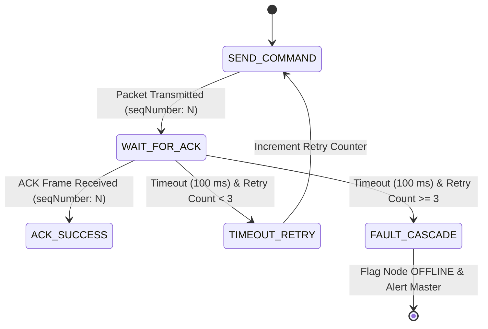

# Transmission Retry System

## Purpose
This document specifies the sequence-numbered ACK/NACK confirmation protocol, timeout parameters, and retry logic used to ensure reliable packet delivery across the wireless ESP-NOW internal network.

---

## 1. Transmission Verification Protocol

Standard ESP-NOW is a connectionless physical layer protocol. To ensure critical configuration changes, pose triggers, and locomotion requests are not lost due to transient radio interference, the **PRAYAS Master ESP32** implements an explicit **Sequence-Numbered ACK/NACK Protocol**.



---

## 2. Retry Operational Parameters

| Parameter | Specification | Rationale |
| :--- | :--- | :--- |
| **ACK Timeout Window** | $100 \text{ ms}$ | Accounts for maximum peer processing time + round-trip propagation |
| **Max Retry Attempts** | $3 \text{ Retries}$ (Total 4 Transmissions) | Prevents blocking the Master Control Manager loop |
| **Sequence Counter** | $0 \text{ to } 255$ (`uint8_t` rolling counter) | Associates specific ACK/NACK responses with original command frames |
| **Packet Target Types** | `CMD_MOVE`, `CMD_SERVO_POSE`, `CMD_SERVO_WORKFLOW`, `CMD_MODE_CHANGE` | High-frequency telemetry packets (`CMD_HEARTBEAT`) do not require retries |

---

## 3. Communication Frame Exchange Example

```
MASTER ESP32 (0x01)                                              SERVO NODE (0x03)
      |                                                                 |
      |--- (PRAYAS_Packet: CMD_SERVO_WORKFLOW, VAL: HAND_DOWN, seq: 42) ->|
      |                                                                 |  [Validates CRC16]
      |<-- (PRAYAS_Packet: ACK_RECEIVED, seq: 42) -----------------------|
      |                                                                 |  [Executes Trajectory]
      |                                                                 |
      |<-- (PRAYAS_Packet: STATUS_WORKFLOW_COMPLETE, seq: 42) ----------|
```

---

## 4. Failure Degradation Rules

If all 3 retry attempts fail:
1. **Node State Update**: Master Control Manager marks node `OFFLINE`.
2. **Safety Interlock**: If the target was the **Motor Node**, Master halts any active locomotion routines.
3. **Telemetry Alert**: Asynchronous fault message is published to `prayas/status/alerts` over MQTT.
