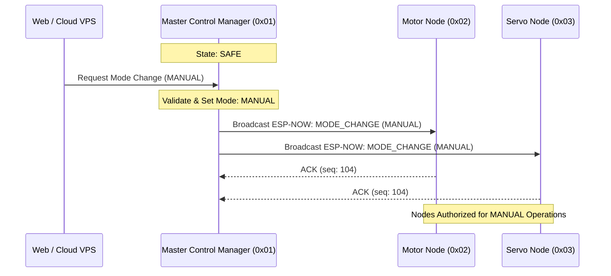

# State Synchronization

## Purpose
This document details the state synchronization protocol used to maintain a consistent global state across all specialized microcontroller nodes in the **PRAYAS V1 Humanoid Robot**.

---

## 1. Centralized State Authority

To prevent state conflicts (e.g. the AI Node attempting motion gestures while the Motor Node is executing an emergency stop), the **Master ESP32 Node** acts as the single source of truth for global robot state and operating mode.



---

## 2. Operating Modes Matrix

The Master Node synchronizes 9 discrete operating modes across all nodes:

| Operating Mode | Master Authorization | Drivetrain Status | Kinematic Gesture Status |
| :--- | :--- | :--- | :--- |
| `SAFE` | System Diagnostics Only | Motors Disabled (0% PWM) | Servos Paralyzed in Neutral Pose |
| `MANUAL` | Physical Gamepad Direct | Full Velocity Authority | Manual Joystick / Preset Poses |
| `REMOTE` | Cloud VPS / MQTT Broker | Speed Capped at 80% Max | Preset Remote Gesture Triggers |
| `VOICE` | Xiaozhi AI Intent Parser | Voice Action Locomotion | Voice-Correlated Gestures & Head Yaw |
| `WEB` | Local Wi-Fi Web Dashboard | Full Manual Authority | Full Individual Joint Angle Sliders |
| `AUTONOMOUS` | Internal Pathing Logic | Autonomous Obstacle Navigation | Head Scanning Trajectories |
| `EMERGENCY_STOP` | **NONE** (Hardware Halt) | Instant Duty Cutoff (0%) | Servos Abort Trajectories & Lock |
| `FAULT` | Subsystem Error Active | Drivetrain Disabled | Kinematics Locked |
| `OTA_UPDATE` | Flashing Subsystem Only | Actuators Disabled | Actuators Disabled |

---

## 3. Sequence Counter Synchronization

To guarantee that duplicate or delayed wireless packets are discarded, every packet frame contains an 8-bit monotonically increasing sequence counter (`seqNumber`):

```c
// Subsystem Node Packet Reception Rule
void process_incoming_packet(PRAYAS_Packet_t *pkt) {
    static uint8_t lastSeqNumber[7] = {0};
    
    // Check for duplicate or out-of-order packet
    if (pkt->seqNumber <= lastSeqNumber[pkt->sourceID] && 
       (lastSeqNumber[pkt->sourceID] - pkt->seqNumber) < 200) {
        // Drop duplicate packet frame
        return; 
    }
    
    lastSeqNumber[pkt->sourceID] = pkt->seqNumber;
    execute_command(pkt);
}
```

---

## 4. Multi-Step Workflow State Sync

For long-running kinematic actions (e.g. `HAND_DOWN`, `GREETING`, `WAVE`), the Servo Node streams progress notifications back to Master:

1. **Trigger**: Master $\rightarrow$ Servo Node: `CMD_SERVO_WORKFLOW` (`HAND_DOWN`).
2. **ACK**: Servo Node $\rightarrow$ Master: `ACK_RECEIVED`.
3. **Execution**: Servo Node interpolates trajectory steps locally.
4. **Completion**: Servo Node $\rightarrow$ Master: `STATUS_WORKFLOW_COMPLETE`.
