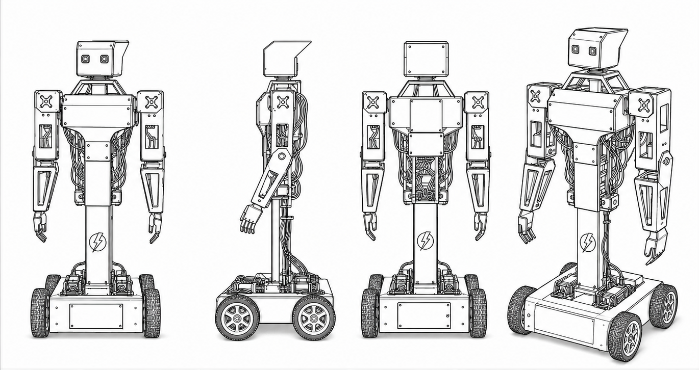
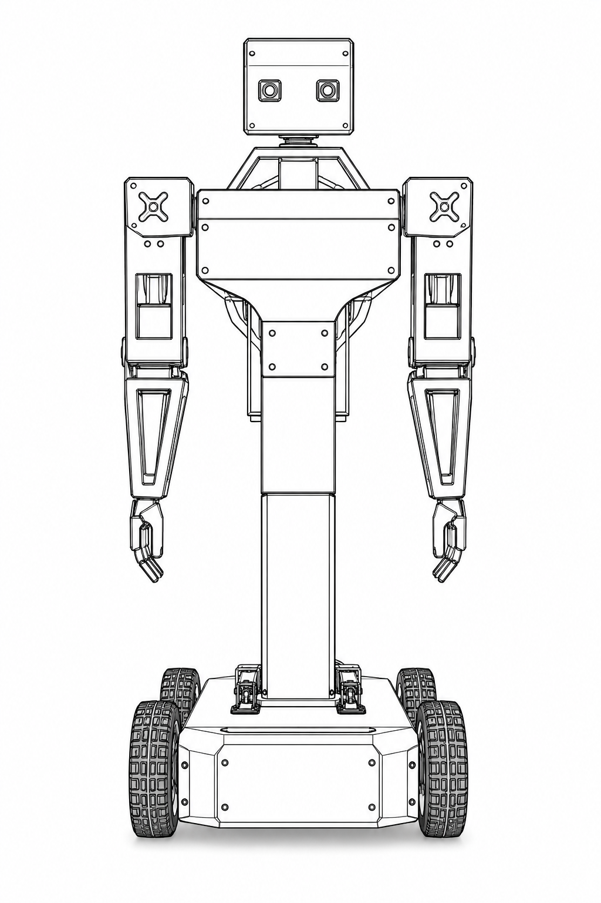

# PRAYAS V1 Humanoid Robot: Engineering Knowledge Base

Welcome to the official, production-grade engineering documentation for **PRAYAS V1** (*Personal Robotic Assistant for Your Active Support*).

PRAYAS V1 is an open-source, modular humanoid upper-body robot mounted on a heavy-duty motorized differential drive base deck. Designed for indoor assistance, research, human-robot interaction (HRI), and teleoperation, the platform utilizes a **Distributed ESP32 Node Architecture** linked via low-latency ESP-NOW and MQTT wireless protocols, integrated with an AI Node running the Xiaozhi Voice Framework and Model Context Protocol (MCP).

---

## 📷 PRAYAS Humanoid Reference Models

<div style="display: flex; flex-wrap: wrap; gap: 20px; justify-content: center; margin: 25px 0;">

  <div style="flex: 1 1 420px; background: rgba(255,255,255,0.03); border: 1px solid rgba(128,128,128,0.2); border-radius: 12px; padding: 16px; text-align: center; box-shadow: 0 4px 12px rgba(0,0,0,0.15);">
    <h3 style="margin-top: 0; margin-bottom: 12px; color: #3f51b5;">Overall Physical Assembly & Frame Layout</h3>
    <a href="assets/img/overall.png" target="_blank">
      
    </a>
    <p style="font-size: 0.9em; margin-top: 12px; color: #888; text-align: left; line-height: 1.5;">
      <strong>Figure 1: Full System View (<code>overall.png</code>)</strong><br/>
      Shows the complete physical assembly of PRAYAS V1 including the 12mm plywood base deck, 4-motor differential drive base, 70cm PVC column torso, dual 3-DOF articulated arms, 2-DOF neck assembly, and isolated electrical enclosure.
    </p>
  </div>

  <div style="flex: 1 1 420px; background: rgba(255,255,255,0.03); border: 1px solid rgba(128,128,128,0.2); border-radius: 12px; padding: 16px; text-align: center; box-shadow: 0 4px 12px rgba(0,0,0,0.15);">
    <h3 style="margin-top: 0; margin-bottom: 12px; color: #ff5722;">Humanoid Upper-Body Kinematics & Node CAD</h3>
    <a href="assets/img/prayas(2).png" target="_blank">
      
    </a>
    <p style="font-size: 0.9em; margin-top: 12px; color: #888; text-align: left; line-height: 1.5;">
      <strong>Figure 2: Humanoid Structural & CAD Model (<code>prayas(2).png</code>)</strong><br/>
      Close-up reference model highlighting the 7x MG995 high-torque servo actuator joint placements (shoulder pitch/roll, elbow flex, neck pan/tilt), Seeed XIAO ESP32-S3 AI Node, head camera, and internal wiring channels.
    </p>

</div>

---

## ⚡ Key System Capabilities

* **🤖 Modular Distributed Architecture**: System responsibilities are decentralized across dedicated microcontrollers (Master, Motor, Servo, AI, Camera, Sensor) to guarantee deterministic real-time motion control without CPU contention.
* **🗣️ Real-Time Conversational AI**: Xiaozhi AI Voice framework integration operating on a dedicated ESP32-S3 Sense node with I2S audio, cloud LLM bidirectional streaming, low-latency Speech-to-Text (STT), and Text-to-Speech (TTS).
* **💪 Multi-DOF Expressive Gestures**: 7 × High-torque MG995 metal gear servos managed via PCA9685 I2C driver for smooth trajectory-planned gestures (greeting, pointing, node status signals).
* **🏎️ High-Torque 4WD Differential Drivetrain**: 4 × Johnson 12V 200 RPM metal DC gear motors driven by dual 43A BTS7960 H-Bridge drivers for high payload capacity and indoor maneuverability.
* **📡 Dual-Protocol Wireless Communications**: ESP-NOW peer-to-peer mesh for sub-10ms inter-node real-time control commands, paired with Wi-Fi / MQTT for web dashboard telemetry and remote override.
* **🔋 Isolated Dual Power System**: High-efficiency buck converters separating 12V motor power, 6V high-current servo power, and 5V/3.3V noise-sensitive logic power rails.

---

## 📊 Technical Specifications At-a-Glance

| Feature / Parameter | Engineering Specification | Notes / Details |
| :--- | :--- | :--- |
| **Height & Base Area** | 95 cm total height (Base: 40 cm x 40 cm) | 70 cm torso column on 12mm plywood base |
| **Total Weight** | ~8.5 kg (including 3S Li battery) | Modular structural breakdown |
| **Drivetrain** | 4-Motor Differential Drive (4WD) | 4x Johnson 12V 200 RPM DC Gear Motors |
| **Motor Drivers** | 2x BTS7960 43A High-Power H-Bridges | Optocoupler isolated PWM inputs |
| **Upper Body Actuation** | 7x MG995 Metal Gear Servos (13 kg-cm) | 3-DOF Left Arm, 3-DOF Right Arm, 1-DOF Neck Yaw |
| **Servo PWM Controller** | PCA9685 16-Channel 12-bit I2C Module | Connected to Servo Node (ESP32) |
| **Primary Master Controller** | ESP32 DevKitC v4 (Dual-Core 240 MHz) | ESP-NOW hub, command arbitration, MQTT gateway |
| **Voice & AI Processor** | Seeed Studio XIAO ESP32-S3 Sense | Built-in PSRAM, I2S Mic, MAX98357A I2S Amplifier |
| **Camera Vision** | ESP32-CAM (OV2640 2MP) | MJPEG streaming @ 15-30 fps over HTTP |
| **Telemetry Sensor Controller** | Arduino Nano v3 (ATmega328P) | HC-SR04 ultrasonic, IR sensors, battery sense |
| **Power Source** | 3S 6800 mAh Li-Ion Battery (~11.1V - 12.6V) | Dual heavy-duty XT60 disconnect switch |
| **Voltage Regulators** | LM2596 / XL4015 Buck Converters | 6V @ 10A (Servos), 5V @ 5A (Logic & Sensors) |

---

## 🌐 System Architecture Topology

```mermaid
graph TD
    User([👤 User / Operator]) <--> Voice[🗣️ Xiaozhi Voice AI Assistant]
    User <--> Web[💻 Web Dashboard / Teleoperation Panel]
    
    subgraph AI_Layer ["AI & Vision Nodes"]
        Voice <--> AI_Node[🧠 AI Node: XIAO ESP32-S3 Sense]
        Cam_Node[📷 Camera Node: ESP32-CAM] --> Web
    end

    subgraph Core_Control ["Central Processing"]
        Master[⚡ Master Node: ESP32 DevKitC]
    end

    subgraph Hardware_Nodes ["Real-Time Hardware Controllers"]
        Motor_Node[🏎️ Motor Node: ESP32]
        Servo_Node[🦾 Servo Node: ESP32]
        Sensor_Node[📡 Sensor Node: Arduino Nano]
    end

    AI_Node <-->|MQTT / Wi-Fi| Master
    Web <-->|MQTT / WebSocket| Master
    
    Master <-->|ESP-NOW (<10ms)| Motor_Node
    Master <-->|ESP-NOW (<10ms)| Servo_Node
    Master <-->|UART / I2C| Sensor_Node

    Motor_Node -->|Dual PWM| BTS7960[BTS7960 43A H-Bridges] -->|12V High Current| Motors[4x Johnson 12V DC Motors]
    Servo_Node -->|I2C Bus| PCA[PCA9685 16-Ch PWM] -->|6V High Current| Servos[7x MG995 Metal Servos]
    Sensor_Node -->|Digital / Analog| Distance[Ultrasonic & Voltage Sensors]
```

---

## 🧩 Distributed Node Breakdown

### 1. ⚡ Master Node (ESP32)
* **Role**: Primary central gateway and command arbiter.
* **Responsibilities**: Handles ESP-NOW peer synchronization, processes incoming MQTT commands from the web dashboard, performs control arbitration (Safety/E-Stop > Gamepad > Voice AI > Auto Idle), and broadcasts target velocity/pose states to execution nodes.

### 2. 🏎️ Motor Control Node (ESP32)
* **Role**: High-speed locomotion controller.
* **Responsibilities**: Executes differential drive kinematics calculations, converts linear/angular velocity targets ($v, \omega$) into 4-wheel PWM duty cycles, manages acceleration acceleration/deceleration curves, and controls 2x BTS7960 H-bridges.

### 3. 🦾 Servo Motion Node (ESP32)
* **Role**: Expressive kinematic gesture manager.
* **Responsibilities**: Communicates over I2C with the PCA9685 16-channel PWM generator, calculates smooth multi-joint cubic spline trajectories for 7x MG995 servos, and triggers predefined motion presets (wave, bow, point, idle breathing).

### 4. 🧠 AI & Voice Node (XIAO ESP32-S3)
* **Role**: Natural language interface and smart assistant.
* **Responsibilities**: Captures digital audio via I2S microphone, runs Xiaozhi framework wake-word detection, streams audio frames to cloud LLM endpoint over WebSocket, plays incoming TTS audio through MAX98357A I2S DAC amp, and parses Model Context Protocol (MCP) tool calls into robot actions.

### 5. 📷 Camera Node (ESP32-CAM)
* **Role**: Visual awareness & live streaming.
* **Responsibilities**: Captures video frames from OV2640 camera sensor, serves high-performance MJPEG video feed on dedicated HTTP port for web teleoperation, and supports optional face/object detection frames.

### 6. 📡 Sensor Node (Arduino Nano)
* **Role**: Low-level telemetry and obstacle sensing.
* **Responsibilities**: Reads front/rear HC-SR04 ultrasonic distance sensors, measures battery voltage divider levels, monitors internal enclosure temperature, and reports status packets to Master Node over UART/I2C.

---

## 📚 Complete Documentation Index

Click any section below to jump directly into detailed schematics, source code, and assembly instructions:

<div style="display: grid; grid-template-columns: repeat(auto-fit, minmax(280px, 1fr)); gap: 16px; margin-top: 20px;">

  <div style="border: 1px solid rgba(128,128,128,0.2); border-radius: 8px; padding: 14px; background: rgba(255,255,255,0.02);">
    <h4 style="margin:0 0 8px 0; color: #3f51b5;"><a href="01_Project/Project_Overview/">01. Project Overview</a></h4>
    <p style="font-size:0.85em; margin:0; color: #aaa;">Vision, design philosophy, system roadmap, and core architectural principles.</p>
  </div>

  <div style="border: 1px solid rgba(128,128,128,0.2); border-radius: 8px; padding: 14px; background: rgba(255,255,255,0.02);">
    <h4 style="margin:0 0 8px 0; color: #3f51b5;"><a href="02_System_Architecture/System_Architecture/">02. System Architecture</a></h4>
    <p style="font-size:0.85em; margin:0; color: #aaa;">High-level block diagrams, node coordination, wireless protocols, and power distribution.</p>
  </div>

  <div style="border: 1px solid rgba(128,128,128,0.2); border-radius: 8px; padding: 14px; background: rgba(255,255,255,0.02);">
    <h4 style="margin:0 0 8px 0; color: #3f51b5;"><a href="03_Hardware/Controllers/">03. Hardware Architecture</a></h4>
    <p style="font-size:0.85em; margin:0; color: #aaa;">Detailed pinouts, microcontroller specs, node schematics, and full Bill of Materials (BOM).</p>
  </div>

  <div style="border: 1px solid rgba(128,128,128,0.2); border-radius: 8px; padding: 14px; background: rgba(255,255,255,0.02);">
    <h4 style="margin:0 0 8px 0; color: #3f51b5;"><a href="04_Software/Architecture/">04. Software & Firmware</a></h4>
    <p style="font-size:0.85em; margin:0; color: #aaa;">FreeRTOS task schedules, library dependencies, OTA update pipeline, and error recovery policies.</p>
  </div>

  <div style="border: 1px solid rgba(128,128,128,0.2); border-radius: 8px; padding: 14px; background: rgba(255,255,255,0.02);">
    <h4 style="margin:0 0 8px 0; color: #3f51b5;"><a href="05_AI/Xiaozhi_Framework/">05. AI & Voice System</a></h4>
    <p style="font-size:0.85em; margin:0; color: #aaa;">Xiaozhi Voice Framework setup, MCP integration, STT/TTS audio pipeline, and computer vision.</p>
  </div>

  <div style="border: 1px solid rgba(128,128,128,0.2); border-radius: 8px; padding: 14px; background: rgba(255,255,255,0.02);">
    <h4 style="margin:0 0 8px 0; color: #3f51b5;"><a href="06_Control/Control_Arbitration/">06. Control System</a></h4>
    <p style="font-size:0.85em; margin:0; color: #aaa;">Control priority arbitration, gamepad teleoperation, voice triggers, and motor PID tuning.</p>
  </div>

  <div style="border: 1px solid rgba(128,128,128,0.2); border-radius: 8px; padding: 14px; background: rgba(255,255,255,0.02);">
    <h4 style="margin:0 0 8px 0; color: #3f51b5;"><a href="07_Mechanical/Robot_Layout/">07. Mechanical Design</a></h4>
    <p style="font-size:0.85em; margin:0; color: #aaa;">Physical dimensions, joint range of motion, forward kinematics, and structural CAD layout.</p>
  </div>

  <div style="border: 1px solid rgba(128,128,128,0.2); border-radius: 8px; padding: 14px; background: rgba(255,255,255,0.02);">
    <h4 style="margin:0 0 8px 0; color: #3f51b5;"><a href="08_Electrical/Power_Rails/">08. Electrical System</a></h4>
    <p style="font-size:0.85em; margin:0; color: #aaa;">Wiring schematics, power budgets, wire gauge selection, fuses, and electrical isolation.</p>
  </div>

  <div style="border: 1px solid rgba(128,128,128,0.2); border-radius: 8px; padding: 14px; background: rgba(255,255,255,0.02);">
    <h4 style="margin:0 0 8px 0; color: #3f51b5;"><a href="09_Communication/ESP_NOW/">09. Communication Protocols</a></h4>
    <p style="font-size:0.85em; margin:0; color: #aaa;">ESP-NOW direct frame format, MQTT topic hierarchy, and JSON payload schemas.</p>
  </div>

  <div style="border: 1px solid rgba(128,128,128,0.2); border-radius: 8px; padding: 14px; background: rgba(255,255,255,0.02);">
    <h4 style="margin:0 0 8px 0; color: #3f51b5;"><a href="10_Web_Dashboard/Dashboard/">10. Web Dashboard</a></h4>
    <p style="font-size:0.85em; margin:0; color: #aaa;">Real-time telemetry UI, remote joystick control, live video streaming, and system logs.</p>
  </div>

  <div style="border: 1px solid rgba(128,128,128,0.2); border-radius: 8px; padding: 14px; background: rgba(255,255,255,0.02);">
    <h4 style="margin:0 0 8px 0; color: #3f51b5;"><a href="11_Testing/Motor_Test/">11. Testing & Diagnostics</a></h4>
    <p style="font-size:0.85em; margin:0; color: #aaa;">Automated test procedures for motor drivers, servo PWM response, battery life, and stress testing.</p>
  </div>

  <div style="border: 1px solid rgba(128,128,128,0.2); border-radius: 8px; padding: 14px; background: rgba(255,255,255,0.02);">
    <h4 style="margin:0 0 8px 0; color: #3f51b5;"><a href="12_Manufacturing/3D_Printing/">12. Manufacturing & Upgrades</a></h4>
    <p style="font-size:0.85em; margin:0; color: #aaa;">3D print slicer settings, step-by-step mechanical assembly sequence, calibration, and future roadmap.</p>
  </div>

</div>
